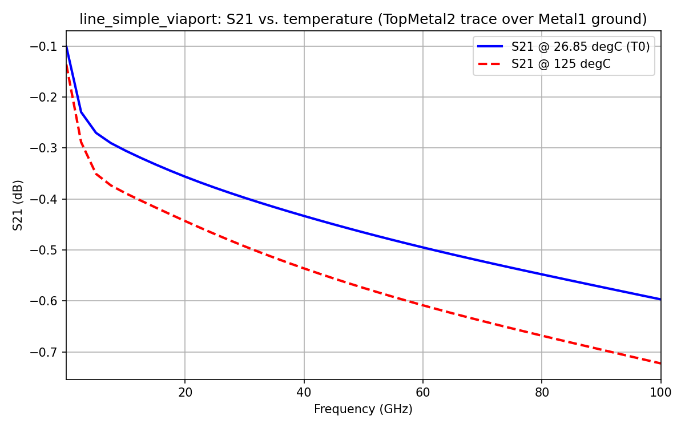

# EM Temperature Coefficient

Demonstrates temperature-dependent metal conductivity in a real gds2palace
S-parameter model: `Metal1`-`Metal5`, `TopMetal1` and `TopMetal2` all get a
`Conductivity` that is an expression of the operating temperature
`Temp_Celsius`, instead of a fixed number, using the XML stackup format's
`<Variables>`/`"="`-expressions (see
[`../../doc/XML_stackup_format/XML_stackup_format.md`](../../doc/XML_stackup_format/XML_stackup_format.md)).

## The physics

Sheet resistance of a metal scales with temperature as:

```
R(T) = R(T0) * [ 1 + TC1 * (T - T0) ]         TC1 in 1/K
```

Conductivity is `1/resistivity`, and thickness doesn't change with
temperature in this model, so at constant thickness:

```
sigma(T) = sigma(T0) / [ 1 + TC1 * (T - T0) ]
```

The stackup file takes the operating temperature as **`Temp_Celsius`**
(degrees Celsius) rather than Kelvin. `T0 = 300 K = 26.85 degC` is the
reference temperature the existing `sigma(T0)` conductivity values in every
other stackup file in this repo are already specified at, so every
expression uses `(Temp_Celsius - 26.85)` in place of `(T - T0)` - a Celsius
degree is the same size as a Kelvin, so no other conversion is needed, and
`Temp_Celsius = 26.85` reproduces the untouched `sigma(T0)` values exactly.
`TC1` is given in **ppm/K**, so every expression below multiplies it by
`1e-6` to get `1/K`:

| Metal | TC1 [ppm/K] |
|---|---|
| Metal1 | 3400 |
| Metal2 | 3500 |
| Metal3 | 3500 |
| Metal4 | 3500 |
| Metal5 | 3500 |
| TopMetal1 | 3700 |
| TopMetal2 | 3800 |

## The stackup file

[`SG13G2_100um_tcoef.xml`](SG13G2_100um_tcoef.xml) is the same full IHP
SG13G2 metal/via stack (Reference-relative positioning, same as
`core_transistor_3port_bce`'s stackup), with a single `Temp_Celsius`
`<Variable>` referenced directly in each temperature-dependent material's
`Conductivity` - `sigma(T0)` and `TC1` are inlined as plain numbers in the
expression itself rather than their own named `<Variable>`s, to keep the
file short:

```xml
<Variable Name="Temp_Celsius" Value="26.85" />
...
<Material Name="Metal1" Type="Conductor" Conductivity="=21640000.0 / (1 + 3400 / 1000000.0 * (Temp_Celsius - 26.85))" Color="39bfff" />
```

Every other temperature-dependent material (`Metal2`..`Metal5`,
`TopMetal1`, `TopMetal2`) follows the same pattern with its own `sigma(T0)`
and `TC1` value from the table above.

## The test layout

[`line_simple_viaport.gds`](line_simple_viaport.gds) is the **standard**
line-over-ground test structure used elsewhere in this repo
(`../../workflow/line_simple_viaport.py` / `palace_line_viaport.py`): a
single straight trace on `TopMetal2` (~15 µm wide, 880 µm long) over a solid
`Metal1` ground plane, with a via port at each end (`Metal1` → `TopMetal2`,
layers 201/202) - `Metal1` is a real, physically-modeled ground plane here,
not an artificial reference.

An earlier version of this example instead used 7 narrow (2 µm wide) lines
drawn directly on `Metal1`..`TopMetal2`, referenced to an artificial ground
plane. That hit a known Palace limitation: its thin-metal surface-impedance
boundary condition is a skin-effect/high-frequency approximation, and for a
trace whose width is only on the order of its own thickness, the side-wall
contribution it can't resolve becomes a large fraction of the cross-section,
giving an inaccurate DC/low-frequency resistance. Not an issue in the
skin-effect regime at high frequency, or for a normally-proportioned trace
like this one (~15 µm wide vs. `TopMetal2`'s 3 µm thickness, a ~5:1 ratio).

## Valid temperature range

The TC1 coefficients are only valid from **-40 degC to 125 degC**, per the
IHP process specification. `palace_tcoef.py` builds a model at room
temperature (26.85 degC, the `sigma(T0)` reference point) and at 125 degC
(the top of that range), each into its own output directory.

## Expected resistance vs. temperature

`TopMetal2`'s trace is 880/15 ≈ 58.7 squares; `Metal1`'s ground plane is
wide enough that its own contribution to loop resistance is comparatively
small. Computed directly from the equation above, using `TopMetal2`'s
actual thickness (3 µm) from the stackup:

| Temperature | sigma(TopMetal2) [S/m] | Rsheet [Ω/sq] | R(trace) [Ω] |
|---|---|---|---|
| -40 °C | 40,618,255 | 0.0082 | 0.48 |
| 26.85 °C (T0) | 30,300,000 | 0.0110 | 0.65 |
| 125 °C | 22,068,945 | 0.0151 | 0.89 |

The trace's simulated resistance can be recovered from its own
low-frequency S21 via `R = 2*Z0*(1-S21)/S21` (Z0 = 50 Ω here), for
comparison against this table - expect roughly a 37% increase in trace
resistance (and insertion loss) going from room temperature to 125 degC,
matching TopMetal2's 3800 ppm/K coefficient over that ~98 K span.



Simulated on Palace (both temperatures, de-embedded S-parameters): S21 at
125 degC is consistently lower (more loss) than at 26.85 degC across the
whole band, e.g. -0.60 dB vs. -0.72 dB at 100 GHz and -0.10 dB vs. -0.14 dB
at 1 GHz - the same direction and rough proportion as the resistance
increase in the table above.

## Usage

`palace_tcoef.py` loops over `temperatures_C = [26.85, 125.0]`, building a
separate Palace model for each - `model_basename` includes the temperature,
so the two runs land in their own `palace_model/..._T<value>C_data/` folder
instead of overwriting each other:

```bash
source /d/venv/palace/Scripts/activate
python palace_tcoef.py
```

Each temperature is passed to `stackup_reader.read_substrate()` via
`variable_overrides`, no XML edit needed - the same mechanism
[`../derived_layers_and_resistors/palace_resistors_rsil.py`](../derived_layers_and_resistors/palace_resistors_rsil.py)
already uses for `total_thickness`/`air_thickness`:

```python
materials_list, dielectrics_list, metals_list = stackup_reader.read_substrate(
    XML_filename, variable_overrides={'Temp_Celsius': Temp_Celsius})
```

## See also

- [`../../doc/XML_stackup_format/XML_stackup_format.md`](../../doc/XML_stackup_format/XML_stackup_format.md) -
  full `<Variables>`/`"="`-expression reference.
- `../../workflow/palace_line_viaport.py` - the standard line_simple_viaport
  example this one's test layout and port definition are taken from.
- [`../derived_layers_and_resistors`](../derived_layers_and_resistors) -
  the `variable_overrides` mechanism, as used for chip thickness there.
