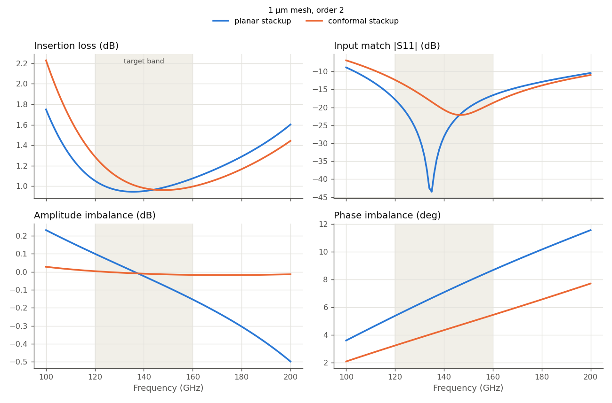
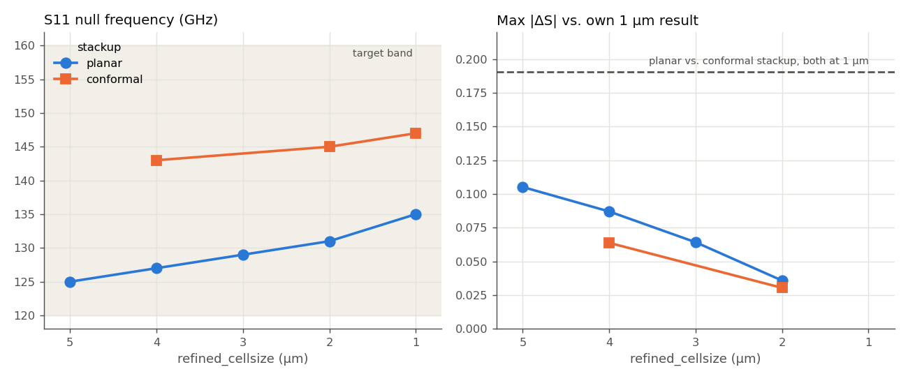

# Does conformal passivation change this D-band balun? (IHP SG13G2)

This study follows up on the [D-band balun mesh study](../mesh_convergence/mesh_convergence_D-band_balun/README.md). That study found the balun sensitive to the capacitance between its closely spaced TopMetal2 lines. Here we ask how much the modelling of the dielectrics over TopMetal2 matters for the same layout: the usual planar dielectric block, or passivation that follows the metal step, as in the real process. And does the extra geometry change how fine the mesh must be?

We answer this in three steps:

1. **Compare planar and conformal passivation** at the same fine mesh.
2. **Refine the mesh with the conformal stackup** and see how quickly it settles.
3. **Compare the size of both effects**: stackup choice vs. mesh size.

The findings apply to this balun, with these stackups, in this frequency range. The [L6n2 inductor study](../measured_vs_simulated/more_accurate_models_L6n2/README.md) explains the conformal stackup in more detail and compares it against measurement for an inductor.

## The details of this study

- **Model:** `Balun_140-170G_RupokDas_with_ports.gds`, the same layout as the planar study. Despite the file name, the target band is 120–160 GHz.
- **Stackups:** conformal `SG13G2_200um_3D_passivation.xml` here vs. planar `SG13G2_nosub.xml` in the mesh study. In the planar stackup, a flat SiO2 block covers TopMetal2 completely. In the conformal stackup, the gaps between TopMetal2 lines hold only the nominal SiO2 + passivation thickness, and derived layers add a 1.5 µm SiO2 cover on top and 0.6 µm on the sides of every TopMetal2 shape. The conformal file also contains the silicon substrate, which the planar file omits. This doesn't affect the comparison, because the Metal3 ground plane under the whole balun shields the substrate.
- **Ports:** 3 via ports (Metal3 → TopMetal2), Z0 = 50 Ω, de-embedded. Port 1 is the input, ports 2 and 3 are the balanced outputs.
- **Solver:** AWS Palace (FEM), order 2, ABC boundaries, 50 µm air margin; Metal3 kept at 5 µm (`refined_cellsize_override`), as in the planar study
- **Sweep:** 100–200 GHz in 1 GHz steps (adaptive frequency sweep)
- **Execution:** `hpz2`, 16 of 32 cores

## 0. Layout


A folded pair of edge-coupled lines on TopMetal2, 6–7 µm wide with a 2 µm gap, over a Metal3 ground plane. See the [planar study](../mesh_convergence/mesh_convergence_D-band_balun/README.md#0-layout) for details. We use the same balun figures of merit as there: insertion loss −10·log(|S21|² + |S31|²), input match |S11|, and amplitude and phase imbalance between the two outputs.

## 1. Planar vs. conformal passivation

Both stackups simulated at the same 1 µm mesh, the finest of both studies:



- **The whole response moves up by about 12 GHz.** The S11 null shifts from 135 to 147 GHz and the insertion-loss minimum from 136 to 148 GHz. This fits the change in geometry: the conformal stackup puts less SiO2 in the gaps between the TopMetal2 lines, so the coupling capacitance drops and resonances move up. The L6n2 inductor study saw its self-resonance rise for the same reason. This study doesn't isolate the mechanism.
- **Balance gets better.** In the target band, amplitude imbalance drops from up to 0.15 dB to 0.02 dB, and phase imbalance from 5.4–8.7° to 3.2–5.4°.
- **The weak point moves to the lower band edge.** At 120 GHz, the conformal model predicts 1.29 dB insertion loss and −12.3 dB match, compared with 1.05 dB and −17.8 dB for the planar model. At 160 GHz, it's the other way around (1.00 vs. 1.08 dB, −18.8 vs. −16.6 dB). The S11 null is also much shallower (−22 vs. −44 dB), but, as in the planar study, the depth of such a sharp null matters less than its position.

So the two stackups tell a different design story. The planar model says the balun is centered in the band. The conformal model says it is tuned about 7 GHz above the band center and is weakest at 120 GHz.

## 2. Mesh refinement with the conformal stackup

We ran the conformal stackup at `refined_cellsize` = 4, 2 and 1 µm. The left plot tracks the S11 null frequency, the right one the distance of each run to its own 1 µm result (Max|ΔS|, linear):



- **The conformal response still moves up with refinement**: 143 → 145 → 147 GHz. That's about 2 GHz per step, similar to the planar study (131 → 135 GHz from 2 to 1 µm). Neither stackup has fully settled at 1 µm.
- **Mesh sensitivity is slightly lower with the conformal stackup**: at 2 µm, Max|ΔS| to its own 1 µm result is 0.030, compared with 0.036 for the planar stackup, and at 4 µm 0.064 vs. 0.087. The extra dielectric shapes around TopMetal2 add mesh cells there even at a coarse `refined_cellsize`.
- **That extra mesh has a price.** At the same `refined_cellsize`, the conformal model has 27–40% more unknowns and takes 1.3–1.8× longer. At about equal time (3 minutes), the planar 2 µm run is closer to its own 1 µm result than the conformal 4 µm run is to its own. So the conformal stackup doesn't make a converged result cheaper. It makes the model more realistic.

| Mesh | Stackup | DOF | Solve time | Peak RAM |
|---|---|---:|---:|---:|
| 2 µm | planar | 340,226 | 3m 14s | 4.17 GB |
| 4 µm | conformal | 287,732 | 3m 2s | 3.75 GB |
| 2 µm | conformal | 475,966 | 5m 53s | 6.00 GB |
| 1 µm | planar | 665,874 | 7m 11s | 7.22 GB |
| 1 µm | conformal | 847,248 | 9m 5s | 9.39 GB |

## 3. Which matters more: stackup or mesh?

The dashed line in the right plot above is the difference between the planar and conformal results at 1 µm: Max|ΔS| = 0.19. It's the same at 2 µm and 4 µm (0.19–0.20). That is almost twice the largest mesh effect in either study (0.105, planar 5 µm vs. 1 µm), and 5–6× the difference between a 2 µm and a 1 µm mesh.

In frequency terms, the stackup moves the S11 null by 12 GHz, while refining from 2 to 1 µm moves it by 2–4 GHz.

## Summary for this balun

- **How the passivation over TopMetal2 is modelled matters more than the mesh size.** The conformal stackup shifts the response about 12 GHz up and changes which band edge is critical. No mesh refinement of the planar model would show that.
- **The conformal stackup predicts better balance** (amplitude within 0.02 dB, phase imbalance 3–5°) **but a weaker lower band edge** (1.3 dB loss, −12 dB match at 120 GHz).
- **Mesh:** 2 µm with the conformal stackup (about 6 minutes) for design iterations, and 1 µm for final numbers. Expect the response to move up by another couple of GHz with further refinement.
- **Which stackup is right can only be settled by measurement.** For the L6n2 inductor, the conformal model matched the measured self-resonance better than the planar one. That supports the conformal model, but doesn't prove it for this balun.

## Files

```
conformal_3D_passivation/
├── Balun_140-170G_RupokDas_with_ports.gds
├── SG13G2_200um_3D_passivation.xml             # conformal stackup
├── palace_balun_mesh{4,2,1}.py                 # uniform mesh, order 2
├── palace_model/palace_balun_mesh{4,2,1}_data/ # mesh, config and full Palace output per run
└── results/
    ├── story_plots.py            # the story_*.png plots and numbers in this report
    ├── analyze_convergence.py    # detailed ΔS tables (CSV) and per-S-parameter overlays
    ├── delta_S_table.csv, delta_S_vs_finest.csv, delta_S_vs_planar.csv
    ├── snp/                      # Touchstone files, one per run (_raw = without port de-embedding)
    └── plots/
```

Both scripts also read the planar study's Touchstone files from `../mesh_convergence/mesh_convergence_D-band_balun/results/snp/`. Run them from this folder in the `d:\venv\palace` venv.
