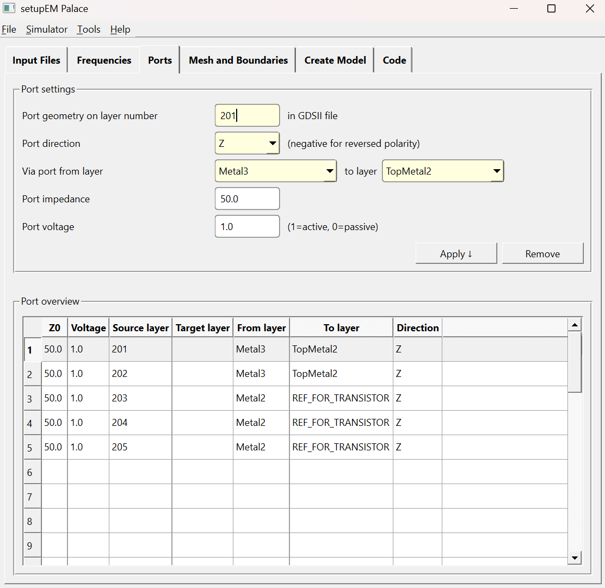
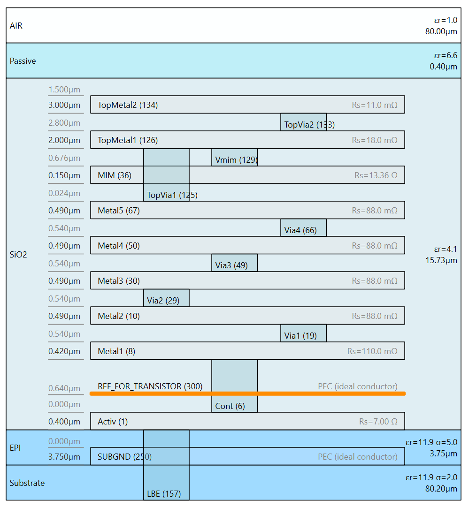

# Transistor core with 3 via ports at Base/Collector/Emitter (gds2palace)

This example extracts a 5-port S-parameter network for an SiGe HBT transistor
core cell (`50_ghz_mpa_core`), so that the parasitic interconnect between the
RF pads and the transistor's Base/Collector/Emitter terminals can be
characterized separately from the intrinsic device (e.g. for compact-model
correlation, or for building a parasitic de-embedding network around a
foundry transistor model).

It is a modified version of the `palace_core.py` example in `workflow/`,
which uses the same transistor test cell but only 4 ports: 2 via ports on the
outer RF pads (`Metal3`→`TopMetal2`), plus 2 **in-plane** ports directly on
`Metal2` to access the transistor. In-plane ports need a physical gap between
two conductor edges and only give you 2 usable terminals this way, which is
not enough to access all 3 terminals (Base, Collector, Emitter) of a
transistor independently.


## What changed vs. the baseline example

**Ports:** the 2 in-plane ports at `Metal2` are replaced with 3 vertical via
ports (`direction='Z'`), each going from `Metal2` down to a new artificial
reference plane `REF_FOR_TRANSISTOR` instead of to another real metal layer:

```python
simulation_ports.add_port(simulation_setup.simulation_port(portnumber=1, voltage=1.0, port_Z0=50.0, source_layernum=201, from_layername='Metal3', to_layername='TopMetal2', direction='Z'))
simulation_ports.add_port(simulation_setup.simulation_port(portnumber=2, voltage=1.0, port_Z0=50.0, source_layernum=202, from_layername='Metal3', to_layername='TopMetal2', direction='Z'))
simulation_ports.add_port(simulation_setup.simulation_port(portnumber=3, voltage=1.0, port_Z0=50.0, source_layernum=203, from_layername='Metal2', to_layername='REF_FOR_TRANSISTOR', direction='Z'))
simulation_ports.add_port(simulation_setup.simulation_port(portnumber=4, voltage=1.0, port_Z0=50.0, source_layernum=204, from_layername='Metal2', to_layername='REF_FOR_TRANSISTOR', direction='Z'))
simulation_ports.add_port(simulation_setup.simulation_port(portnumber=5, voltage=1.0, port_Z0=50.0, source_layernum=205, from_layername='Metal2', to_layername='REF_FOR_TRANSISTOR', direction='Z'))
```

| Port | Layer | From → To | Purpose |
|---|---|---|---|
| 1 | 201 | Metal3 → TopMetal2 | outer RF pad |
| 2 | 202 | Metal3 → TopMetal2 | outer RF pad |
| 3 | 203 | Metal2 → REF_FOR_TRANSISTOR | transistor Base |
| 4 | 204 | Metal2 → REF_FOR_TRANSISTOR | transistor Collector |
| 5 | 205 | Metal2 → REF_FOR_TRANSISTOR | transistor Emitter |

(Ports 3/4/5 = Base/Collector/Emitter, per this example's "bce" naming.)

Because all 3 transistor-terminal ports reference the *same* artificial
ground plane, they behave like ordinary lumped ports referenced to a common
node — there is no need for a physical gap between conductors the way an
in-plane port requires, so a true 3-terminal (or n-terminal) port network can
be built directly at the device, independent of how the pad-level ports are
defined.



## GDSII changes

Compared to the baseline `50_ghz_mpa_core_no_BJT.gds`, this layout
(`50_ghz_mpa_core_bce_ports.gds`, same cell `50_ghz_mpa_core`) adds:

- **Layers 203 and 204** — in the baseline layout these already existed as
  in-plane port polygons (a gap edge on `Metal2`, used with
  `target_layername='Metal2'` + `direction='-x'`/`'x'`). Here they are
  redrawn as zero-width lines spanning the full height of the `Metal2`
  region under the transistor, for use as via ports instead.
- **Layer 205** — a new port polygon, same style as 203/204, adding the third
  (previously missing) transistor terminal.
- **Layer 300** — a new rectangle (~13.5 µm × 15.5 µm) marking the footprint
  of the `REF_FOR_TRANSISTOR` reference sheet. It is deliberately sized to
  just cover the transistor's local Metal2 area, not the whole chip, so the
  artificial ground plane only exists directly under the device and cannot
  short or interact with anything else in the model (e.g. the Metal3/TopMetal2
  RF pad routing on either side).

Layers 201/202 (outer pad ports) are unchanged from the baseline.

## Stackup changes (`SG13G2_100um_bce_ports.xml`)

The stackup adds one new layer:

```xml
<Layer Name="REF_FOR_TRANSISTOR" Type="sheet" Reference="SiO2" ReferenceEdge="Bottom" Material="PEC" Layer="300" Zmin="0.4" Zmax="0.4" />
```

- **`Type="sheet"`** (`Zmin == Zmax`) makes it a zero-thickness surface
  rather than a 3D conductor volume.
- **`Material="PEC"`** uses the newly-added reserved PEC material name
  (`util_stackup_reader.py` 1.8.0+) — an ideal-conductor surface with no
  entry needed in `<Materials>`. Because this is a `sheet` (zero-thickness)
  layer, it never becomes a 3D volume — it goes straight into Palace's
  native `Boundaries.PEC` construct, an exact, lossless ideal-conductor
  boundary condition, not an approximation. (Palace only has to approximate
  `Material="PEC"` with a very high but finite conductivity when it's used
  on an actual 3D conductor/via volume, since Palace has no literal
  ideal-conductor volume — that's the case for `SUBGND`/`BACKSIDEGND` below,
  which are real-thickness conductor layers.)
- **`Reference="SiO2" ReferenceEdge="Bottom"` with `Zmin="0.4"`** places the
  sheet exactly 0.4 µm above the bottom of `SiO2`, i.e. 0.4 µm above the top
  of `EPI` — the same z-position as the top of the `Activ` layer. In other
  words, this is an artificial "virtual ground" placed right where the real
  device (Activ/EPI) begins, purely so the 3 transistor-terminal ports have
  something to terminate on. It does **not** represent any real conductor in
  the IHP stackup.

The 3 transistor-terminal via ports (3/4/5) therefore each span the ~1.6 µm
gap between the bottom of `Metal2` and this virtual ground — the region that
would otherwise contain the (undrawn, in this simplified layout) `Cont`,
`Metal1` and `Via1` layers connecting down to the real device.



The stackup file was also regenerated with the current setupEM XML editor, so
it additionally picked up the modern `Reference`/`ReferenceEdge` +
`<Variables>` format (`schemaVersion="3.1"`) and uses `Material="PEC"` for
`SUBGND`/`BACKSIDEGND` instead of the old `LOWLOSS` high-conductivity
workaround — neither of those is required for the 3-port approach itself,
they're just carried over from the editor's current default template.

