# Stackup and Conductor Model Study: L6n2 Inductor vs. Measurement (IHP SG13G2)

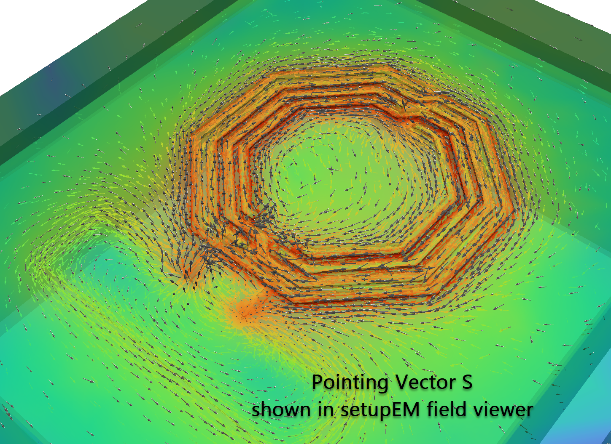

This study looks for the best possible model with highest accuracy for an inductor example, including comparison to measured data. It evaluates the effect of three potential error sources:

## Conductors model: surface vs. filled volumes ("mesh inside") 
In the User's Guide, there is a detailed analysis on the limitations of the "surface impedance sheet" loss model that gds2palace uses for modelling conductor layers. Here, we investigate the benefit of using a volume mesh ("solve inside") with conductivity for such cases. Be aware that this is not a universal solution, because it becomes inaccurate when skin effect is much smaller than mesh cell size. Both loss models have their use cases.

## Over-estimate of via cross section due to via array merging
In most models, we want to merge via arrays into bigger blocks, to speed up simulation. Leaving all individual vias would be more accurate, causing much more complex mesh and increase simulation time. Via array merging replaces the individual vias by their outer bounding box, and here's the problem: the effective total cross section is now much larger than before, so this under-estimates the resulting via resistance. Only a minor error in many models, because the relative impact of via resistance is small. However, in this model investigated here, it does show up in results, and we will use a new option in gds2palace to restore the correct via resistance by applying a correction factor internally.

NOTE: There was an earlier version of this study that showed great agreement to measured, but for the wrong reason. That model had used via array merging with no correction (under-estimated resistance) and a lossy common ground plane for the ports in Metal1 (adding series resistance), and both errors had compensated by pure conincidence. Looked great, but wasn't correct. Fixed now.

## True conformal passivation
The stackup used so far covers TopMetal2 with another thick **flat** layer of SiO2 plus Passivation. This is efficient for simulation, but we can do better now, if we are willing to spend additional simulation time for a more detailed model. A recent extension of the stackup file format now offers "derived layers", so that we can now create a stackup that models the true **conformal** shape of dielectrics above TopMetal2. We will see that this is indeed useful to match the measured fSRF of the testcase, with more accurate prediction of the true capacitance between the sidewalls of closely spaced TopMetal2 traces.

## The details of this study:

- **Model:** `L6n2_with_ports.gds` (cell `L_6n2`), 2 via ports from a common PEC ground plane to TopMetal1, Z0 = 50 Ω
- **gds2palace:** version 0.7.0
- **EM stackups:** SG13G2_200um plus individual modifications (reported below)
- **Solver:** AWS Palace (FEM), order 2, ABC boundaries, 100 µm margin, 50 µm air around
- **Sweep:** 0–14 GHz in 0.1 GHz steps, using Palace's adaptive frequency sweep. 14 GHz is about 1.2x the measured self-resonant frequency (SRF).  
- **Port de-embedding:** not used here, calculated 1.6 pH port parasitic per side is negligible here
- **Measurement:** `meas_L5_6n2_THRU_deemb.S2P`, already de-embedded, 100 MHz–50 GHz. The measured differential SRF is **11.07 GHz**.
- **Execution:** Simulated on `hpz2` with Palace v0.18, using 16 of 32 cores and up to 109 GB RAM. 

## 0. Layout

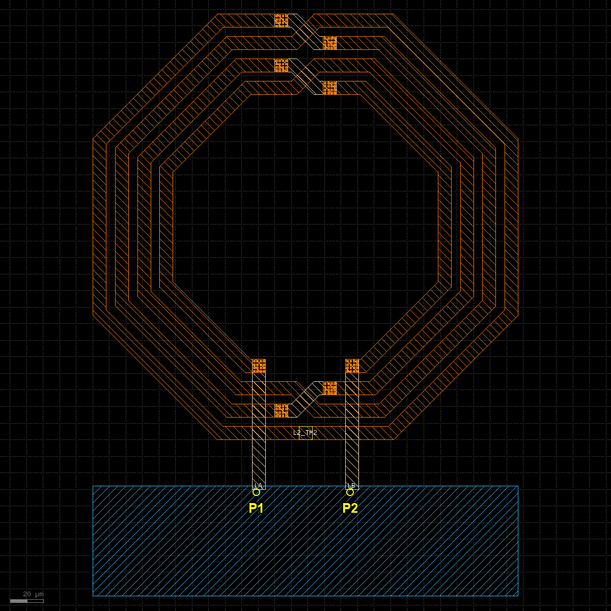

The inductor is a 4-turn octagonal spiral on TopMetal2. It is about 257 × 352 µm in size. Where the turns cross each other, the path drops down to TopMetal1 through TopVia2. Each crossing uses an array of vias, 128 vias in total. The two leads (`L_A` and `L_B` in the GDS) end at the via ports **P1** and **P2** at the bottom.

Different from the initial version of this study, the **common ground plane** for ports is on the SUB_GND layer. This is (almost) perfect conductor and does not introduce extra series resistance.

## 1. Via array merging and effective via array cross section

The effect of via array merging was investigated for this inductor because we have several via arrays, and the 8 μm line width requires small via arrays with only 4x4 vias.  

With 8 via arrays and 16 vias each, we have a total of 8/16*1.1 Ohm nominal resistance from the vias = 0.55 Ohm. Via array merging replaces the individual vias by the overall bounding box, roughly a 4x increase in effective cross section. We expect to see a difference of ~ 0.4 Ohm, which sounds like a small effect only, but that is already ~10% of the total inductor resistance in this case (looking at DC values).

The plot below shows 4 curves:
- baseline: measurement results 
- simulation result **with** via array merging, **no** fill factor correction
- simulation result **without** via array merging
- simulation result **with** via array merging, **with** fill factor correction

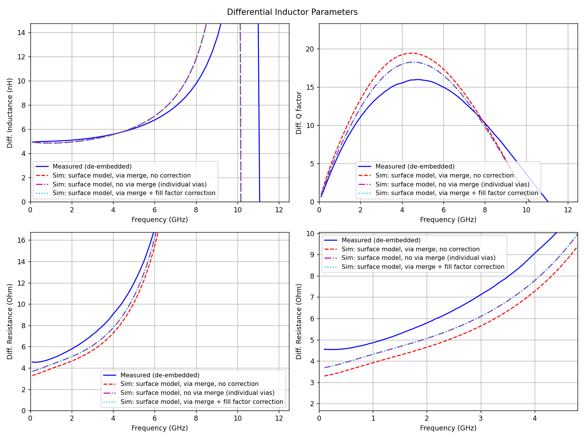

The measurement does **not** agree yet with our simulation in multiple aspects, including peak Q and SRF, and in this study we will adress (and improve) all of this. For now, focus on the **series resistance** on the bottom right side. 

Conclusion: The ~0.4 Ohm offset from simple via array merging (no correction for fill factor) is confirmed. This error source can be removed, without falling back to the slow individual via simulation: Results with via array merging **plus** the new `settings['fill_factor_correction']=True` option are **visually identical** to the data with no via array merging, but at **lower simulation cost**:

| Via array handling | Conductor model | Mesh | DOF | Mesh elements | Solve time | Peak RAM |
|---|---|---:|---:|---:|---:|---:|
| no merge | Surface | 2 µm | 1,041,542 | 148,897 | 22m 34s | 14.15 GB |
| merge | Surface | 2 µm | 961,766 | 137,384 | 18m 15s | 13.17 GB |
| merge + correction | Surface | 2 µm | 961,766 | 137,384 | 15m 31s | 13.20 GB |

The correction factor for effective cross section is calculated by gds2palace as 28% and that value can be seen in the physical volume name for that merged via group also.  

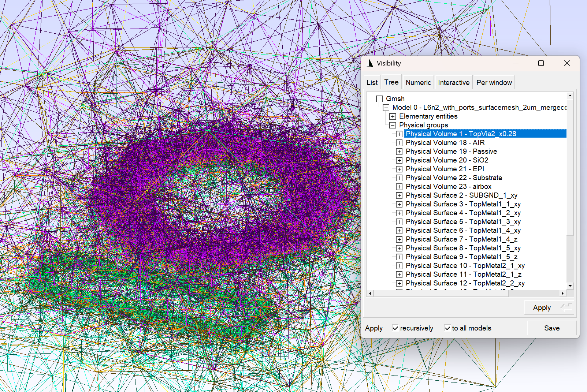

Internally, gds2palace groups correction factors in buckets where the value agrees within 20%, to avoid creating excessive number of via groups for larger designs.

## 2. Conductor loss: surface impedance vs. filled volumes 
Simulations above used the **surface impedance sheet** conductor loss model, where the conductor is represented by a hollow volume with surface impedance mapped to all sides of that conductor shell. Skin effect and a low frequency limit resulting from "thickness" are built into each surface. Until September 2026, there was no other option for conductor layer loss modelling in gds2palace.  

In the User's Guide, there is a detailed analysis on the limitations of that surface sheet loss model. Here in this study, we investigate the benefit of using a new **filled metal volume mesh ** option for such cases.

    settings['filled_metals'] = True

**Be aware that this is not a universal solution, because it becomes inaccurate when skin effect is much smaller than mesh cell size. You would need to mesh into skin effect then, which is numerically expensive. Both loss models have their use cases.**

The next plot compares the two different conductor loss models. Blue is the measured baseline, red is the surface loss model and purple is the new volume mesh ("fill inside") model. Both models use refined_cellzize=2 µm with via array merging plus fill factor correct.  

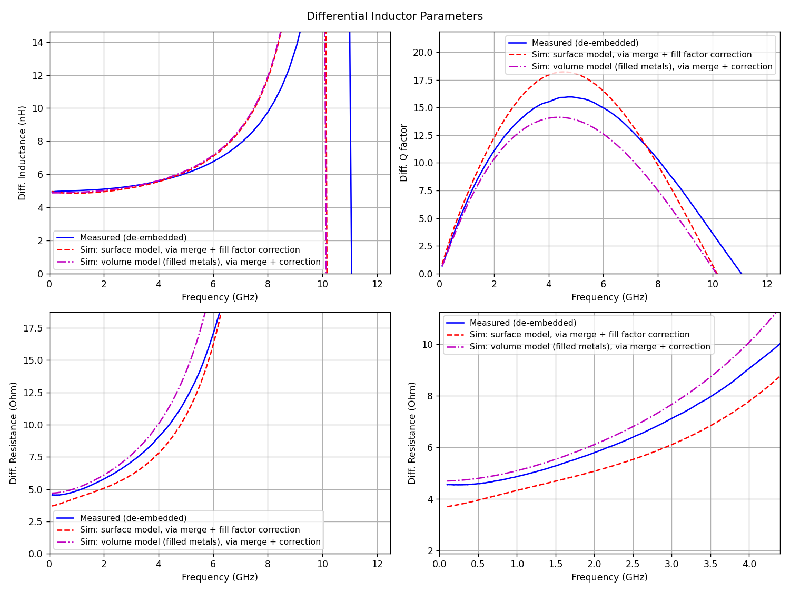

Series resistance for the "filled" volume mesh model (purple) is now closer to the measured values across the entire frequency band. Q factor has changed from optimistic (predicted peak Q too large for surface model) to pessimistic for the filled volume mesh, and the SRF is lower than measurement, as before. Series L is very robust, as before, and agress well except for the SRF difference.

Volume meshing of filled conductors means more mesh cells and more numerical effort:

| Via array handling | Conductor model | Mesh | DOF | Mesh elements | Solve time | Peak RAM |
|---|---|---:|---:|---:|---:|---:|
| merge + correction | Surface | 2 µm | 961,766 | 137,384 | 15m 31s | 13.20 GB |
| merge + correction | Volume | 2 µm | 1,163,958 | 183,440 | 18m 33s | 15.67 GB |

What is not shown in this table: Palace also calculates internal "quality" metrics from the FEM solution. These error indicator values are approximately twice as much for the volume mesh model. This indicates that we might need a smaller refined_cellsize value for the volume mesh model. We will come back to that later, for the "ultimate" final model with best accuracy.

**IMPORTANT NOTE:  For accurate loss calculation, volume mesh requires to mesh into skin effect! In this frequency range here, δ = 0.91µm @ 10 GHz, so we might be already on the edge: mesh refined along the edges is enforced by settings['refined_cellsize']=2 micron here. This gets even harder at higher frequencies where the skin depth becomes much smaller than 1 µm, e.g. 0.41µm @ 50 GHz and 0.2 µm @ 200 GHz.**

## 3. Conformal passivation over TopMetal2

We will continue from the best case so far, volume mesh model with via array merging + correction factor, and explore another error source: the conformal passivation above TopMetal2.  

According to the SG13G2 process specification, we have a conformal coating on top of TopMetal2 with 1.5µm of SiO2 and 0.4µm passivation layer.

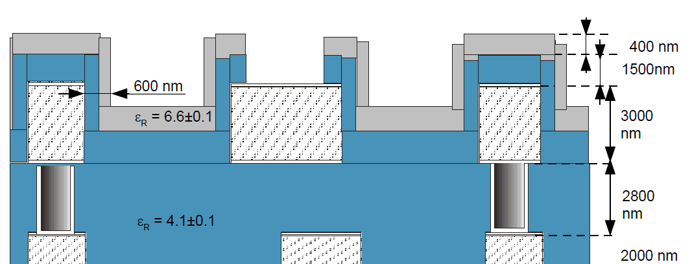

For simplicity and simulation efficiency and due to tool restrictions, all SG13G2 EM stackups so far had used a planarized model, with those 1.5µm + 0.4µm modelled as a solid block that extends from the bottom of TopMetal2 to well above it. There is no "valley" on the sides of the conductors, it is all filled up with SiO2 dielectric.

Simple planarized stackup used so far:
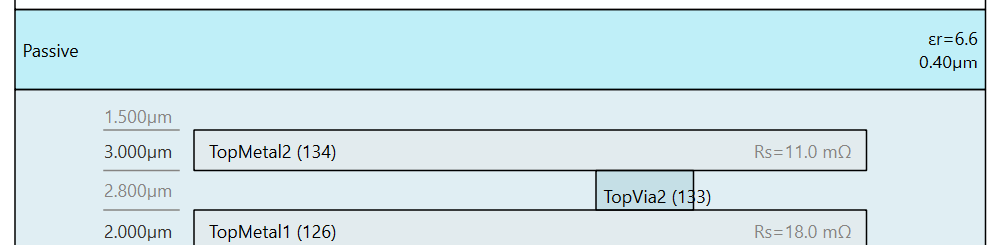

It is obvious that this will over-estimate capacitance between sidewalls of close spaced TopMetal2 traces: that metal is 3µm thick and there would be a good fraction of air above the dielectrics in the valleys, but that is all filled with SiO2 in the EM model.

Utilizing the **derived layers** introduced recently in gds2palace XML file format, we can now do better, and create an XML stackup file that 
- provides correct SiO2 and Passivation thickness in the valleys and 
- adds conformal SiO2 around all TopMetal2 polygons (on top + hanging on sides)

There is still one simplification built into that "3D conformal" stackup: IHP only provides a combined thickness value for the dielectrics hanging on the side walls, and we model that as SiO2 here, not a mixture of mostly 4.4 (SiO2) with a little 6.6 (Passivation). No details in the Process Spec, so this is an approximation.

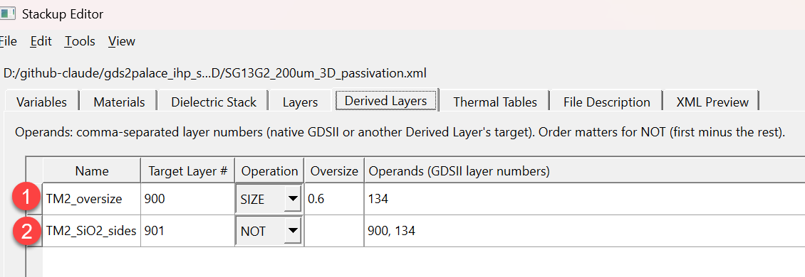

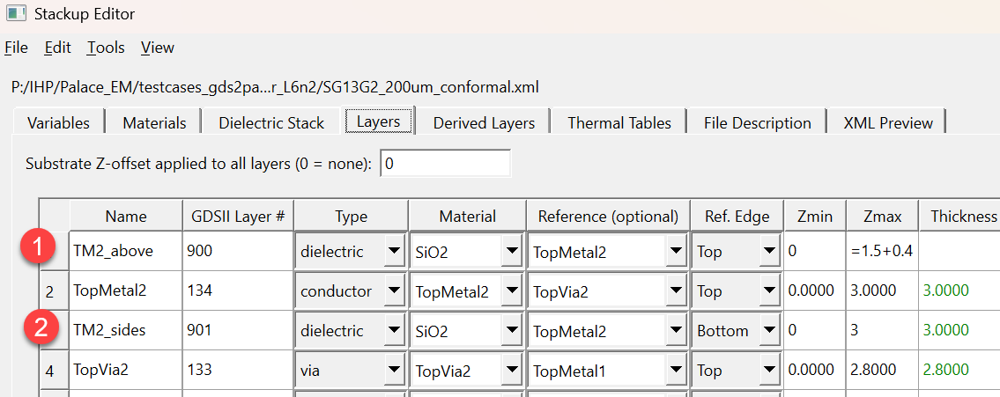

The stackup preview in setupEM (the GUII for gds2palace) is somewhat limited to show the result, but maybe you get the idea. TopMetal2 is drawn there inside SiO2 because the bottom side starts inside that dielectric. The top side of TopMetal2 is actually 1.5µm **above** the SiO2 dielectric, shown here as negative distance to the dielectric above.

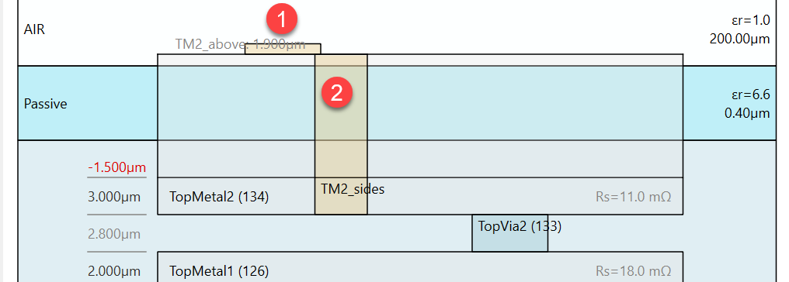

In mesh preview, you can find two more groups: the cover above TopMetal2 shapes and the side wall cover. Both are identified by the layer names used when mapping derived layers to their stackup position.

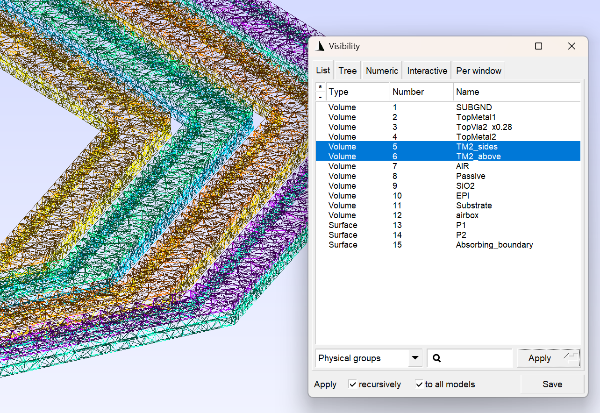

Simulation results agree nicely with measurement on SRF now, and the higher SRF also brings the peak Q factor closer to measurement. It is indeed a combination of multiple improvements to the model that enabled this more accurate result:
- correction factor for effective cross section in via array merging
- volume meshing with filled conductor at these low frequencies (no surface mesh here)
- more accurate modelling of conformal coating above TopMetal2

When all this comes together, simulation and measurement agree nicely.

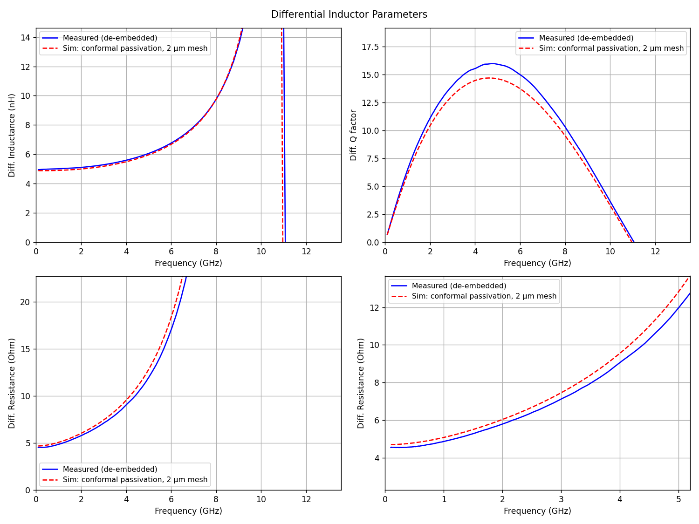

This model is numerically more expensive because we now create additional mesh cells for that conformal passivation, but it also has a nice side effect: even with rather large values of mesh refinement specified by the user, this adds some extra mesh cells around TopMetal2 trace, which can possibly help to capture the field gradients there.  

 Stackup | Via array handling | Conductor model | Mesh | DOF | Mesh elements | Solve time | Peak RAM |
|---|---|---|---:|---:|---:|---:|---:|
| Planar | merge + correction | Volume | 2 µm | 1,163,958 | 183,440 | 18m 33s | 15.67 GB |
| Conformal | merge + correction | Volume | 2 µm | 1,442,856 | 227,614 | 34m 29s | 21.17 GB |

From here, we can now go two directions: 
- investigate a "cheaper" model with that places the SiO2 + Passivation correct for the valleys, but skips the dielectrics on top and sides of TopMetal2 
- investigate a "ultimate accuracy" model with refined_cellsize=1 µm to see how much closer this brings us to measurement (hopefully).

## 4. Cheaper model for TopMetal2 dielectrics

The "cheaper" model leaves out the conformal cover over TopMetal2, and just places the correct thickness of SiO2 and Passivation in the valleys between TopMetal2 shapes. This avoids the over-estimate of sidewall capacitance from the original stackup, and avoids the extra effort of dielectrics conformal around TopMetal2. At least that's the idea here ...

In reality, it turns out that the dielectrics hitting TopMetal2 half way on the sides create a rather similar effort, as shown in the comparison table below. At least for filled metals (volume mesh), this cheaper model isn't cheaper.

 Stackup | Via array handling | Conductor model | Mesh | DOF | Mesh elements | Solve time | Peak RAM |
|---|---|---|---:|---:|---:|---:|---:|
| Conformal | merge + correction | Volume | 2 µm | 1,442,856 | 227,614 | 34m 29s | 21.17 GB |
| PassiCut | merge + correction | Volume | 2 µm | 1,463,206 | 230,506 | 29m 4s | 21.81 GB |

Results are very similar to the full 3D conformal simulation, both in effort and results.

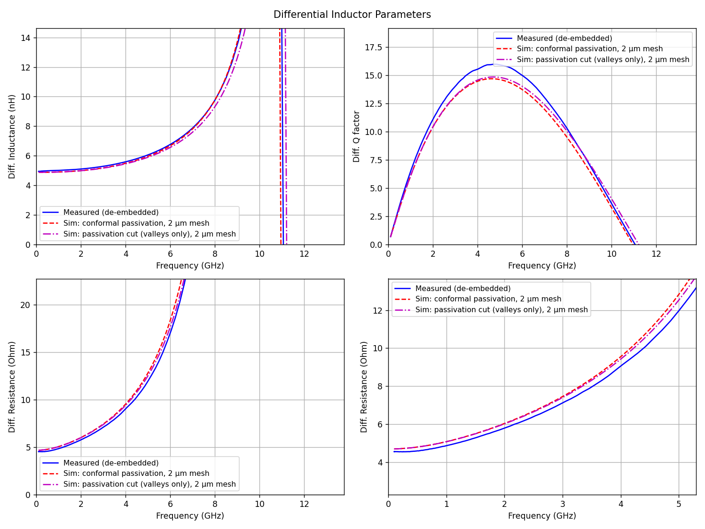

Below is a comparison of the resulting mesh, cutting plane near the middle of the model, fdump=6 GHz.

Top view of overall mesh:  
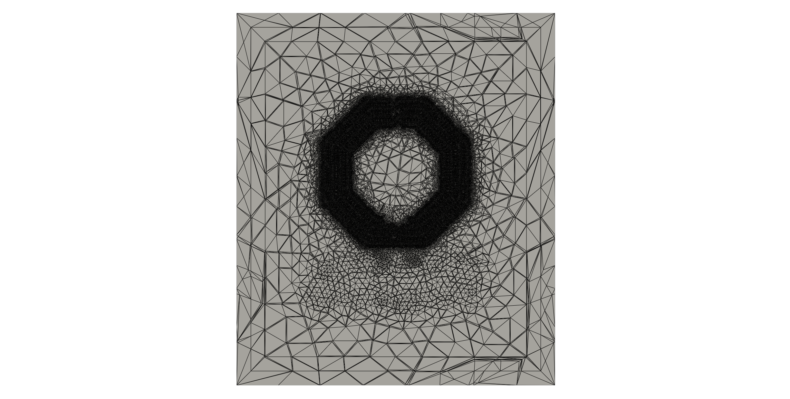

Side view of the overall mesh, the "tilted" mesh lines on the periphery are from airbox surrounding the SG13G2 stackup:  
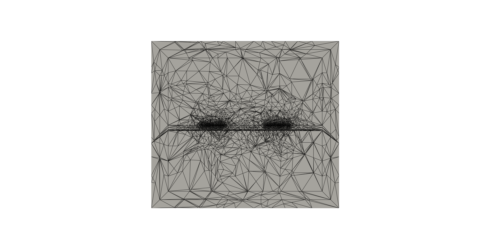

Detail view cut at y=40 µm plane, E field  with mesh overlay, stackup "3D conformal". We can clearly see the dielectric top cover and side walls in the mesh lines:  
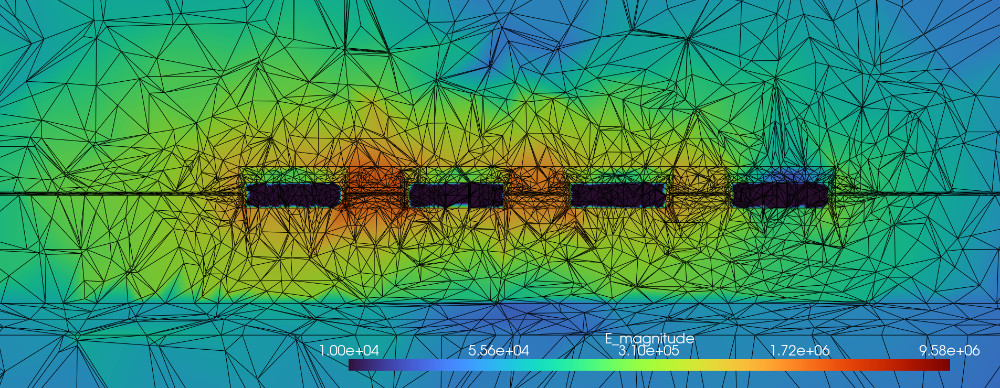

Detail view cut at y=40 µm plane, E field  with mesh overlay, stackup "passicut" which was meant to be "cheaper" alternative to true 3D conformal passivation. Note the passivation at approximately half the TopMetal2 height, with air above:  
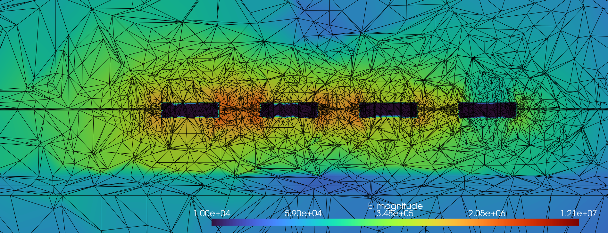

Detail view cut at y=40 µm plane, E field  with mesh overlay, stackup "SG13G2_200um" which is the present default, with thick planar layer of dielectric. We can clearly identify the big SiO2 block extending further up, with the thin Passivation layer on top. Due to the log scale used in this plot, we can't really see much difference in fields above/around TopMetal2.
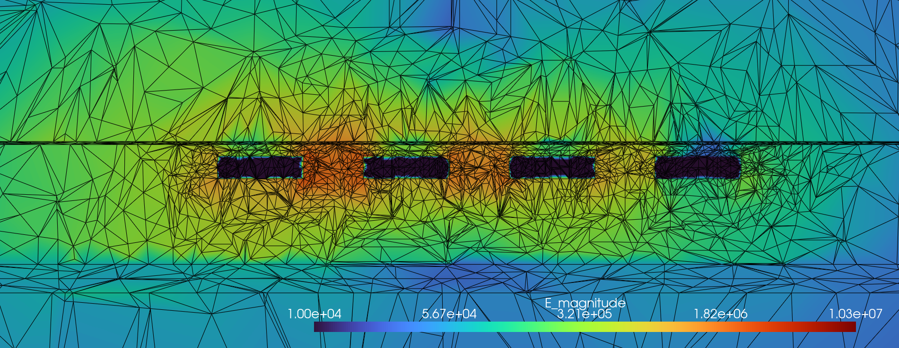

For the sake of completeness, we can also compare the mesh and fields resulting for that "SG13G2_200um" stackup with hollow conductors using the default "surface impedance" model. 
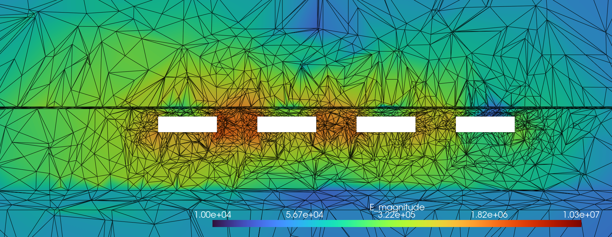
This surface impedance model took 15m 31s and 961,766 DOF, the more accurate 3D conformal passivation model took 34m 29s and 1,442,856 DOF.  

## 5. Cheaper model, revisited

We have seen that all models create really dense mesh in the gap between conductors, and also on the conductor edges, much finer than the 2 µm refined cellsize value enforced in the model. So here is another idea to get a "cheap" model: can we use refined_cellsize = 5 micron, for less  mesh vertices along the conductors (where fields changes only slowly) and get dense mesh in the critical region (perpendicular to the metal surface) from conformal passivation stackup? Let's try this!

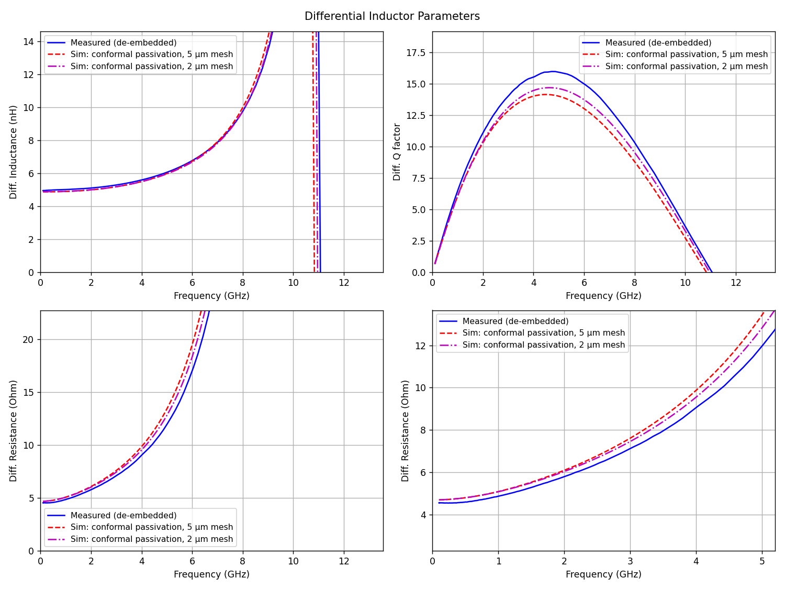

Compared to the 2 micron mesh, we loose accuracy in peak Q and also a little bit in SRF. But at the same time, this runs ~ 3x faster and uses only 1/3rd of the memory. At only 10 minutes simulation time for the sweep, this could be reasonable "daily driver" for the development phase, with some high accuracy check done later.

 Stackup | Via array handling | Conductor model | Mesh | DOF | Mesh elements | Solve time | Peak RAM |
|---|---|---|---:|---:|---:|---:|---:|
| Conformal | merge + correction | Volume | 2 µm | 1,442,856 | 227,614 | 34m 29s | 21.17 GB |
| Conformal | merge + correction | Volume | 5 µm | 555,950 | 87,739 | 10m 31s | 7.39 GB |

Detail view cut at y=40 µm plane, E field  with mesh overlay, stackup "3D conformal". We can clearly see the top cover and side walls in the mesh lines:
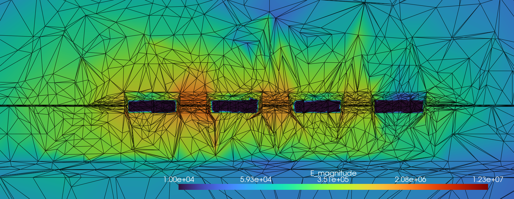

The idea with the side wall dielectric as an additional mesh refinement **around** the trace, while refining at only 5 µm rate **along** the trace, seems to work as expected.

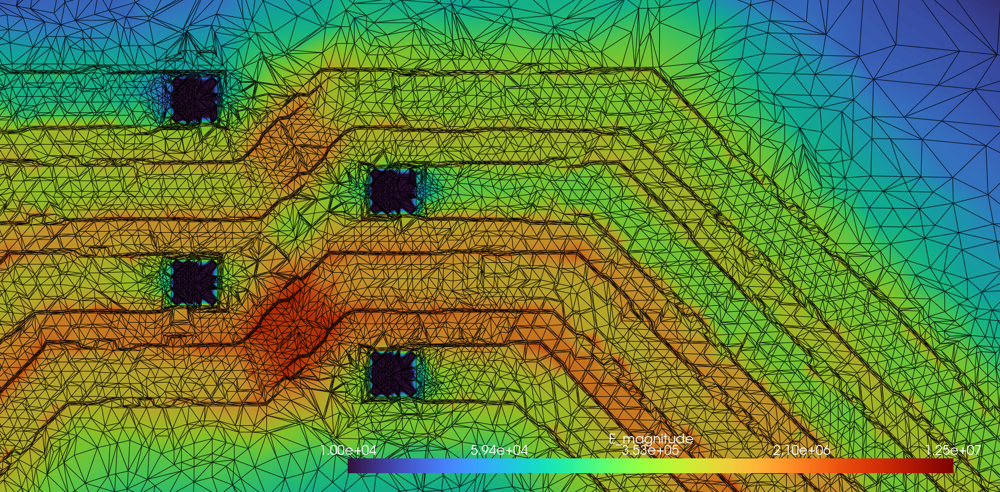

## 6. The ultimate model?

If we are striving for most accurate results, regardless of simulation "cost", we can combine

- via array merging with correction factor, to get effective cross section right  
- conformal passivation stackup, to get the true sidewall coverage above TopMetal2
- filled metals with volume meshing in this rather low frequency case
- small refined_cellsize to make sure field resolution can capture skin effect properly

For our inductor testcase, this was implemented using refined_cellsize = 1 µm instead of the 2 µm mesh resolution used above.

Results show only a very minor change between the refined_cellsize=1 micron (purple) and 2 micron (red) results. This is not worth the simulation effort, but only **after** this check, we know for sure!

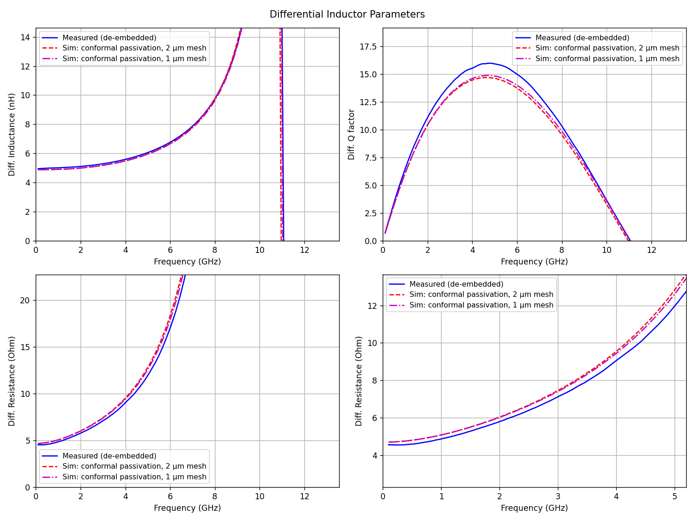

This is still a feasible simulation on a machine with 64 GB RAM or more. Such a "sign off" simulation or reference study can run over night, when simulation time is no concern. It helps to establish trust in the simulation setup and helps to learn about mesh and simulation strategies.

 Stackup | Via array handling | Conductor model | Mesh | DOF | Mesh elements | Solve time | Peak RAM |
|---|---|---|---:|---:|---:|---:|---:|
| Conformal | merge + correction | Volume | 2 µm | 1,442,856 | 227,614 | 34m 29s | 21.17 GB |
| Conformal | merge + correction | Volume | 1 µm | 2,875,590 | 453,423 | 1h 14m 15s | 42.67 GB |

If you like the field and mesh plots in this study: they were all created using the built-in field viewer in setupEM, based on simulation model data with just one `fdump`frequency. That's enough for visualization, simulating fast.  

 **Be aware that "filled metals" with volume mesh is not a universal solution, because it becomes inaccurate when skin effect is much smaller than mesh cell size. Both loss models have their use cases.**  