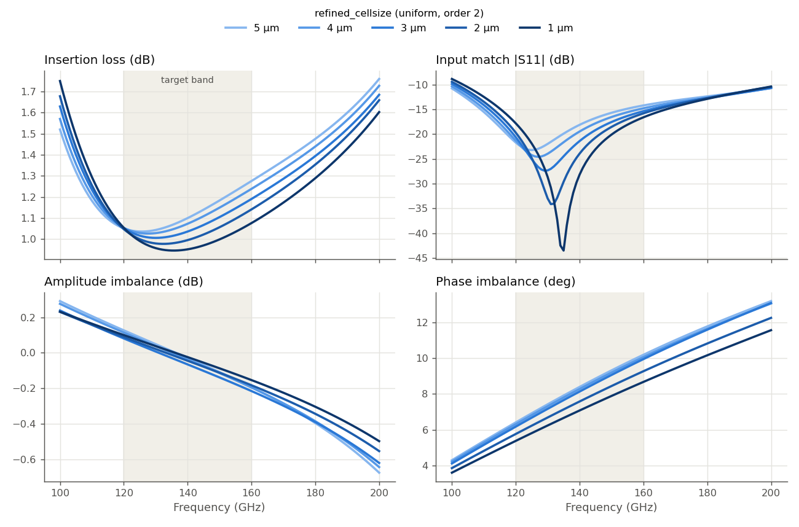
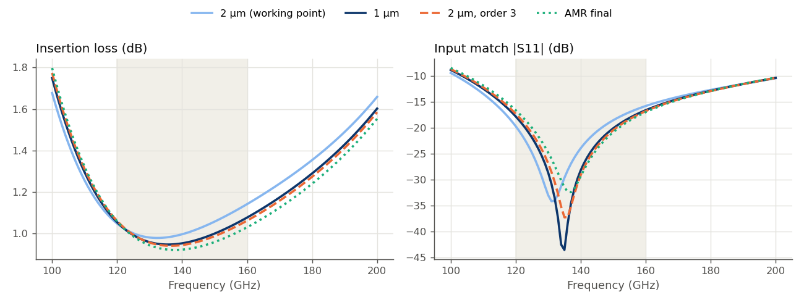
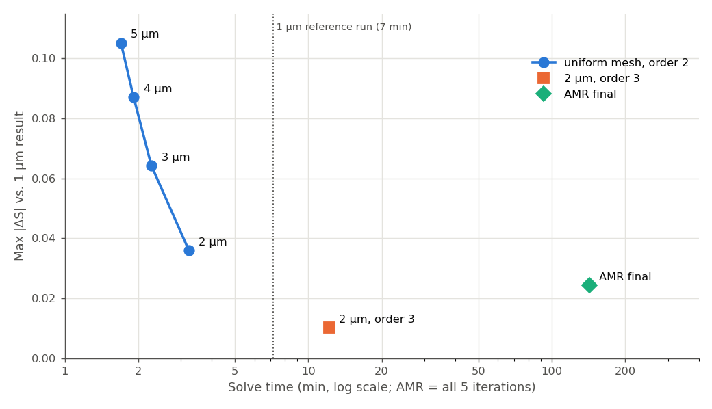

# How fine a mesh does this D-band balun need? (IHP SG13G2)

This study asks a practical question for one specific layout: a compact edge-coupled balun for 120–160 GHz. How fine must the Palace mesh be before the results stop changing in ways a designer would care about? And are the "more accurate" options (finer mesh, higher FEM order, adaptive mesh refinement) worth their cost here?

We answer this in three steps:

1. **Refine a uniform mesh** from 5 µm to 1 µm and watch which balun properties move.
2. **Cross-check the finest result** with two independent routes (higher FEM order, adaptive mesh refinement), to know what "converged" means for this model.
3. **Compare accuracy against cost**, and pick a working point.

The findings apply to this balun, with this stackup, in this frequency range. Other structures can behave quite differently. The [overview page](../README.md) collects the other mesh studies.

## The details of this study

- **Model:** `Balun_140-170G_RupokDas_with_ports.gds`, stackup `SG13G2_nosub.xml` (planar dielectrics above TopMetal2). Despite the file name, the target band is 120–160 GHz.
- **Ports:** 3 via ports (Metal3 → TopMetal2), Z0 = 50 Ω. Port 1 is the input, ports 2 and 3 are the balanced outputs. Port parasitic inductance is de-embedded in all results shown.
- **Solver:** AWS Palace (FEM), ABC boundaries, 50 µm air margin, order 2 unless noted
- **Sweep:** 100–200 GHz in 1 GHz steps (adaptive frequency sweep)
- **Mesh:** `refined_cellsize` varied as described below. Metal3 is a wide ground plane and is always kept at 5 µm (`refined_cellsize_override`).
- **Execution:** `hpz2`, Palace 0.17, 16 of 32 cores

## 0. Layout


The balun is a folded pair of edge-coupled lines on TopMetal2, 6–7 µm wide with a **2 µm gap** between them. Metal3 underneath is a ground plane across the whole cell. The 2 µm gap is the smallest feature that carries strong fields, so we expect it to be what makes this model sensitive to the mesh size.

**What we look at.** A balun is judged by how much power reaches the two outputs and how well they are balanced. So, instead of raw S-parameters, this report mostly uses four quantities:

- **Insertion loss** = −10·log(|S21|² + |S31|²): power that reaches neither output
- **Input match** |S11|
- **Amplitude imbalance** = |S21| / |S31| in dB (ideal: 0 dB)
- **Phase imbalance** = deviation of ∠(S21/S31) from 180° (ideal: 0°)

## 1. Uniform mesh refinement: what moves, what doesn't

We ran the same model at `refined_cellsize` = 5, 4, 3, 2 and 1 µm, all at FEM order 2. The target band is shaded.



The four panels respond very differently:

- **Amplitude balance is insensitive to the mesh.** In the target band, all five curves stay within about 0.1 dB of each other. Even the 5 µm mesh would give a usable amplitude-balance prediction.
- **Phase balance shifts only slightly.** The 1 µm mesh predicts about 1.5° less phase imbalance than the 5 µm mesh. Most of that change happens below 3 µm.
- **Input match and insertion loss move the most**, because the whole response **shifts up in frequency** as the mesh is refined. The S11 null, and with it the best-matched point, moves from 125 GHz (5 µm) to 135 GHz (1 µm), so it wanders across a quarter of the target band. The insertion-loss minimum moves with it. At the upper band edge (160 GHz), this improves the match from −14.2 to −16.6 dB and lowers the insertion loss from 1.28 to 1.08 dB.

Every refinement step moves the curves the same way, and the steps get smaller. So the mesh is converging, but at 1 µm we can't yet tell whether it has stopped. That is the question for step 2.

Cost stays moderate across this sweep:

| Mesh | DOF | Solve time | Peak RAM |
|---|---:|---:|---:|
| 5 µm | 178,262 | 1m 42s | 2.54 GB |
| 2 µm | 340,226 | 3m 14s | 4.17 GB |
| 1 µm | 665,874 | 7m 11s | 7.22 GB |

## 2. Is 1 µm converged? Two independent cross-checks

A finer mesh is only one way to improve an FEM result. To test the 1 µm result, we added two runs that improve accuracy by different means:

- **2 µm mesh, FEM order 3.** Same mesh as the 2 µm run, with higher-order basis functions (p-refinement instead of h-refinement).
- **Adaptive mesh refinement (AMR).** Start from the 5 µm mesh and let Palace refine wherever its error estimate is largest, for 5 iterations.

If all three routes land on the same answer, we can trust that answer. The plot compares them with the 2 µm order-2 run from step 1:



The three runs agree closely with each other, and all of them differ from the 2 µm order-2 run in the same way:

- The **S11 null sits at 135–137 GHz** in all three runs, compared with 131 GHz at 2 µm order 2. Its *depth* varies (−33 to −43 dB), but a null that sharp and deep is very sensitive to small changes and doesn't matter for the design. What matters is its frequency position.
- **Insertion loss** agrees within about 0.05 dB across the target band.
- Measured over all S-parameters and frequencies, the three runs differ from each other by Max|ΔS| = 0.010 to 0.024 (linear). That is the remaining uncertainty of the "converged" answer for this model.

AMR ends up at slightly lower loss than the other two runs, so the true answer may lie a little beyond the 1 µm result. The difference is small compared with everything we saw in step 1.

## 3. Accuracy vs. cost

Now we can put every run on one chart. The vertical axis shows how far each run is from the 1 µm result (Max|ΔS|, linear, over all S-parameters and all frequencies). The horizontal axis shows how long it took.



| Variant | DOF | Solve time | Peak RAM | Max\|ΔS\| vs. 1 µm |
|---|---:|---:|---:|---:|
| 2 µm, order 2 | 340,226 | 3m 14s | 4.17 GB | 0.036 |
| 1 µm, order 2 | 665,874 | 7m 11s | 7.22 GB | (reference) |
| 2 µm, order 3 | 969,582 | 12m 10s | 7.23 GB | 0.010 |
| AMR, 5 iterations | 4,654,886 (final) | 2h 23m (all iterations) | 51 GB | 0.024 |

For this balun:

- **1 µm order 2 and 2 µm order 3 give practically the same answer.** For this model, the 1 µm uniform mesh gets there faster (7 min vs. 12 min) at the same memory.
- **AMR reaches the same answer, at about 20× the time and 7× the memory** of the 1 µm run. The last iterations kept refining after the S-parameters had stopped changing much. For this model, it didn't pay off.

## Summary for this balun

- **2 µm uniform mesh, order 2, is a good working point for design iterations.** It gets amplitude and phase balance right and finishes in about 3 minutes. Its main error is a frequency shift of the response of about 4 GHz (S11 null at 131 GHz instead of 135 GHz), which makes insertion loss look up to about 0.07 dB worse in the target band.
- **For final numbers, run 1 µm once** (about 7 minutes here). This moves the result into the range where three independent methods agree.
- **Mesh size mostly shifts this balun's response in frequency rather than changing its balance.** That is plausibly because the 2 µm coupling gap is under-resolved at coarse settings, but this study doesn't prove the cause.

Again, these numbers belong to this layout. A structure with different feature sizes, frequency range or stackup needs its own check. Running one medium and one fine mesh and comparing them is the minimum.

## Outlook: conformal passivation

All runs above use a planar stackup, where TopMetal2 is buried in a flat block of SiO2. The follow-up study [conformal_3D_passivation](../../conformal_3D_passivation/README.md) runs the same balun with a stackup where the dielectrics follow the metal step, as in the real process. This changes the capacitance between the closely spaced TopMetal2 lines, which, per step 1, is exactly what this model is sensitive to. That study compares both stackups at matched mesh sizes.

## Files

```
mesh_convergence_D-band_balun/
├── palace_balun_mesh5.py … palace_balun_mesh1.py   # uniform mesh model scripts
├── palace_balun_mesh2_order3.py                    # 2 µm, order 3
├── palace_balun_amr5.py                            # AMR, 5 µm start, 5 iterations
├── palace_model/palace_balun_<name>_data/          # mesh, config and full Palace output per run
└── results/
    ├── story_plots.py            # the story_*.png plots and numbers in this report
    ├── analyze_convergence.py    # detailed ΔS tables (CSV) and per-S-parameter overlays
    ├── delta_S_table.csv         # Max|ΔS| between successive runs, per S-parameter
    ├── delta_S_vs_finest.csv     # Max|ΔS| of every run vs. 1 µm, per S-parameter
    ├── snp/                      # Touchstone files, one per run (_raw = without port de-embedding;
    │                             #   the AMR iteration files balun_amr5_iter1..4 are also raw)
    └── plots/
```

Run the scripts from this folder in the `d:\venv\palace` venv to regenerate plots and tables from the archived Touchstone files.
