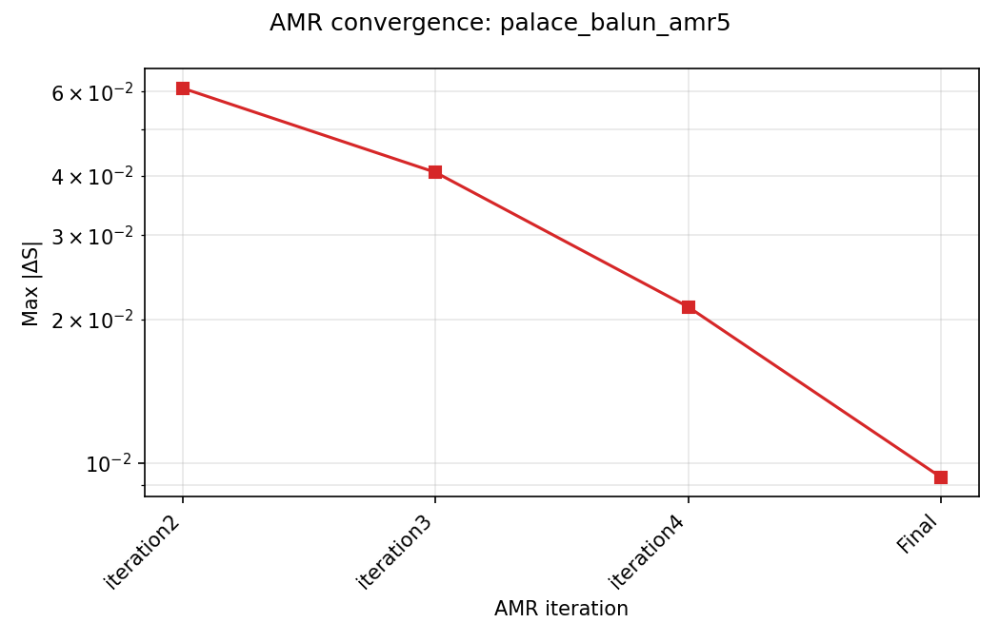
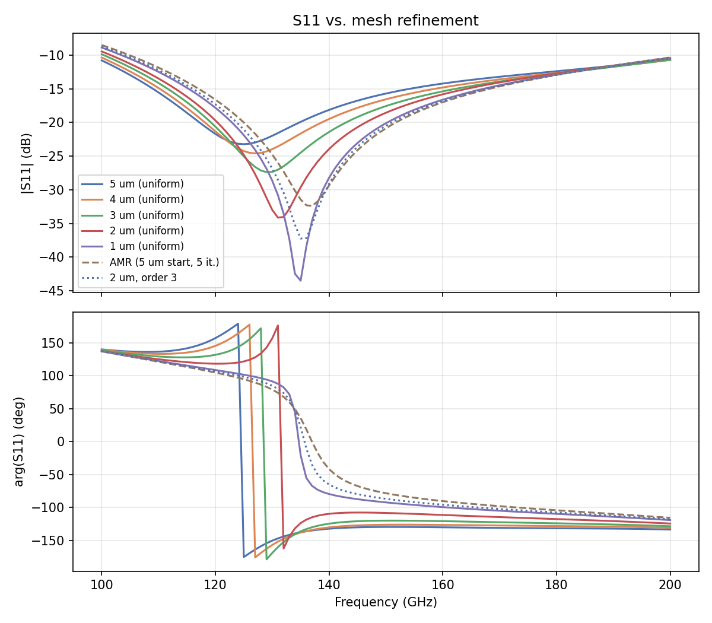
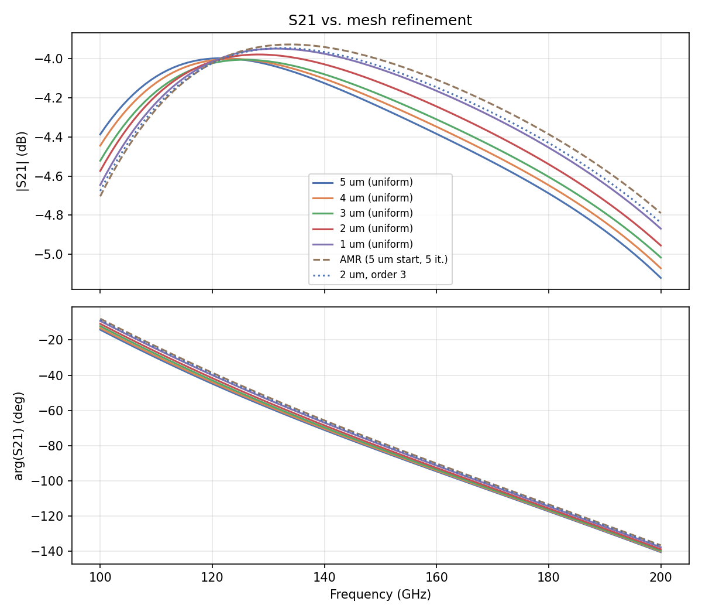
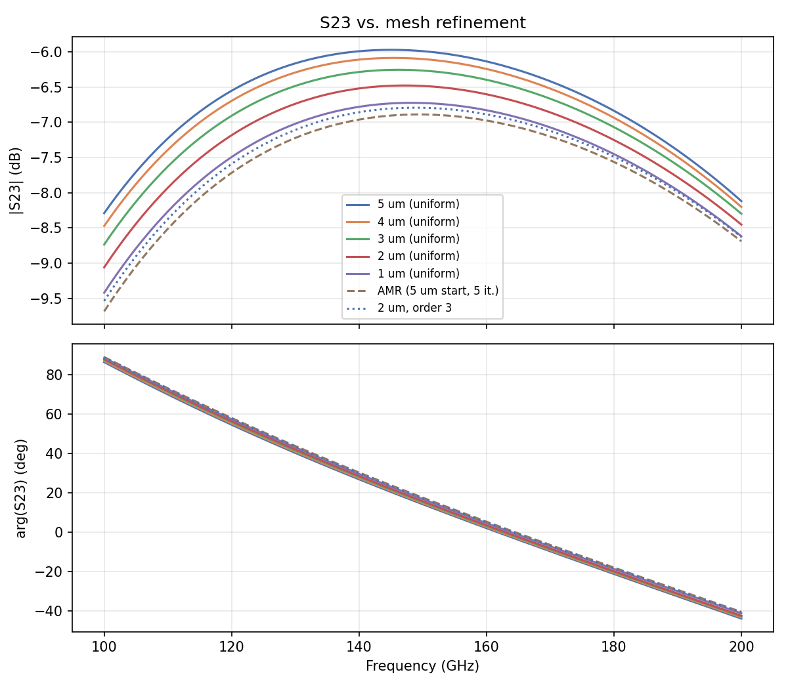

# Mesh Convergence Study: D-Band Balun (RupokDas, IHP SG13G2)

- **Model:** `Balun_140-170G_RupokDas_with_ports.gds`, stackup `SG13G2_nosub.xml`
- **Solver:** AWS Palace (FEM), order 2, ABC boundaries, 50 µm air margin
- **Sweep:** 100–200 GHz, 1 GHz step, Palace's PROM-based adaptive frequency sweep (`adaptive_sweep=True`, default)
- **Ports:** 3 via ports (Metal3 → TopMetal2, Z0 = 50 Ω), de-embedded S-parameters used throughout (port parasitic inductance removed)
- **Execution:** remote solve on `hpz2` via `run_palace` (apptainer, Palace 0.17, `-np 16` of 32 cores, 109 GB RAM), jobs run sequentially

## 0. Layout


Measured directly from the GDS (KLayout, layer 134/TopMetal2 and layer 30/Metal3): the balun is a folded edge-coupled line pair, 6-7 µm trace width with a 2 µm gap between the two coupled lines, routed as a rectangular loop with a ~182×201 µm bounding box inside an overall 223×225 µm cell. **Port 1** (bottom-left) feeds the primary line, which runs the full loop and is picked up by the coupled secondary line, brought out as **Port 2** and **Port 3** on the right side, only ~11 µm apart. **Metal3** is a ground/reference plane spanning the entire 223×225 µm cell footprint (aside from two small 5.6×5.6 µm cutouts) — exactly why `refined_cellsize_override` fixes it at a coarse 5 µm regardless of the main sweep setting (§1).

## 1. Method

Two studies were run from the common baseline `palace_balun_mesh2.py` (`refined_cellsize=2`):

- **Uniform mesh sweep:** `refined_cellsize` = 5, 4, 3, 2, 1 µm, `adaptive_mesh_iterations=0`.
- **Adaptive mesh refinement (AMR):** `refined_cellsize=5` (coarse starting mesh), `adaptive_mesh_iterations=5`.

In all runs, `refined_cellsize_override=[['Metal3', 5.0]]` was kept fixed at 5 µm regardless of the main cell size — Metal3 is a wide ground/reference plane that doesn't need fine local mesh, and fixing it keeps DOF growth concentrated on the layers that matter (signal traces, vias, ports) as the main sweep refines toward 1 µm.

Model files: `palace_balun_mesh5.py` … `palace_balun_mesh1.py`, `palace_balun_amr5.py` (all in `more_examples/mesh_convergence/mesh_convergence_D-band_balun/`).

## 2. Uniform mesh sweep — results

| Mesh | DOF | Mesh elements | Solve time | Peak RAM |
|---|---:|---:|---:|---:|
| 5 µm | 178,262 | 25,518 | 1m 42s | 2.54 GB |
| 4 µm | 200,354 | 28,714 | 1m 55s | 2.77 GB |
| 3 µm | 238,230 | 34,146 | 2m 16s | 3.15 GB |
| 2 µm | 340,226 | 48,701 | 3m 14s | 4.17 GB |
| 1 µm | 665,874 | 94,232 | 7m 11s | 7.22 GB |

DOF, time, and RAM all grow smoothly and moderately (~3.7× DOF, ~4.2× time, ~2.8× RAM from 5 µm to 1 µm) — no blow-up, all runs comfortably cheap on this hardware.

## 3. Adaptive mesh refinement — results

Starting mesh: 5 µm (identical to the uniform 5 µm run — iteration 1 numbers match it exactly). `adaptive_mesh_iterations=5` was interpreted as a hard budget, not a target: the run used **all 5 iterations**.

**The S-parameter-based Max ΔS between the last two iterations was already down to 0.0093** (table below, "Max ΔS vs. prev."), smaller than the ΔS between our 2 µm and 1 µm *uniform* mesh points (0.0187, §5b). By that criterion this run was already well converged after iteration 4 (Max ΔS = 0.0212) — the likely explanation for §6's finding that AMR's cost is out of proportion to its accuracy gain here: it kept refining through the full iteration budget after the S-parameters had, for practical purposes, already stopped changing.

| Iteration | DOF | Mesh elements | Max \|ΔS\| vs. prev. | Solve time | Peak RAM |
|---|---:|---:|---:|---:|---:|
| 1 | 178,262 | 25,518 | n/a | 1m 44s | 2.66 GB |
| 2 | 237,178 | 37,530 | 0.0609 | 4m 21s | 3.42 GB |
| 3 | 583,164 | 100,635 | 0.0406 | 12m 48s | 7.37 GB |
| 4 | 1,679,078 | 299,505 | 0.0212 | 44m 18s | 19.35 GB |
| **Final** | **4,654,886** | **852,533** | **0.0093** | **2h 22m 31s** | **50.97 GB** |



By the final iteration the AMR mesh reached **7× the DOF of the finest uniform mesh (1 µm)**, took **20× longer** than the 1 µm uniform run, and used **7× the peak RAM** — on a 32-core/109 GB machine that's still fine, but it would not fit comfortably on a smaller workstation. Per-iteration Max ΔS (Palace's own linear delta-S vs. the previous iteration) does show real, monotonic convergence (0.061 → 0.041 → 0.021 → 0.009), just not fast enough to plateau within 5 iterations for this geometry.

## 4. S-parameter overlays (all mesh variants + AMR final)





The curves visually converge as the mesh refines. S11 shows the largest spread — expected, since it's a return-loss trace with a deep null that moves in frequency as the mesh changes (see §5 for why this makes raw dB deltas misleading).

## 5. Delta-S tables

**Metric:** `Max|ΔS|` is the standard HFSS-style convergence metric — the maximum **linear** complex-magnitude difference `|S_b − S_a|` over the common frequency band (same convention `palace_summary.py` uses for AMR iterations). This is deliberately *not* a dB-of-S(a) minus dB-of-S(b) difference: near an S-parameter null (S11 dips to −20…−40 dB in this band, around 125-135 GHz), a tiny absolute error produces a huge, physically meaningless dB swing — a general caution worth keeping in mind for the dB columns below, independent of which frequency they're evaluated at. The `|dS_dB|` columns are a secondary, intuitive readout of the dB change at three specific frequencies: the two band edges (100, 200 GHz) and 155 GHz, the center of this balun's actual 140-170 GHz target band. Tables are grouped by S-parameter first, then by mesh comparison, so each parameter's convergence trend reads top-to-bottom without interleaving.

### 5a. Successive uniform-mesh steps

#### S11

| Comparison | Max\|ΔS\| (linear) | \|ΔS\|@100GHz (dB) | \|ΔS\|@155GHz (dB) | \|ΔS\|@200GHz (dB) |
|---|---:|---:|---:|---:|
| 5→4 µm | 0.0183 | 0.426 | 0.703 | 0.051 |
| 4→3 µm | 0.0233 | 0.489 | 0.762 | 0.019 |
| 3→2 µm | 0.0290 | 0.420 | 0.666 | 0.226 |
| 2→1 µm | 0.0359 | 0.578 | 1.102 | 0.062 |
| 1µm→AMR final | 0.0243 | 0.378 | 0.530 | 0.065 |

#### S21

| Comparison | Max\|ΔS\| (linear) | \|ΔS\|@100GHz (dB) | \|ΔS\|@155GHz (dB) | \|ΔS\|@200GHz (dB) |
|---|---:|---:|---:|---:|
| 5→4 µm | 0.0102 | 0.058 | 0.034 | 0.049 |
| 4→3 µm | 0.0132 | 0.077 | 0.035 | 0.055 |
| 3→2 µm | 0.0145 | 0.052 | 0.065 | 0.061 |
| 2→1 µm | 0.0187 | 0.072 | 0.076 | 0.086 |
| 1µm→AMR final | 0.0150 | 0.058 | 0.053 | 0.079 |

#### S23

| Comparison | Max\|ΔS\| (linear) | \|ΔS\|@100GHz (dB) | \|ΔS\|@155GHz (dB) | \|ΔS\|@200GHz (dB) |
|---|---:|---:|---:|---:|
| 5→4 µm | 0.0093 | 0.182 | 0.110 | 0.083 |
| 4→3 µm | 0.0126 | 0.264 | 0.159 | 0.097 |
| 3→2 µm | 0.0147 | 0.324 | 0.211 | 0.154 |
| 2→1 µm | 0.0169 | 0.360 | 0.234 | 0.166 |
| 1µm→AMR final | 0.0117 | 0.264 | 0.154 | 0.071 |

The step-to-step Max\|ΔS\| slightly *increases* as the mesh gets finer (5→4 µm is a 20% cell-size reduction; 2→1 µm is a 50% reduction) — that's the relative refinement step getting larger each time, not divergence. §5b isolates true convergence behavior against a fixed reference. S11's 155 GHz dB deltas (0.5-1.1 dB) run somewhat higher than S21/S23's (0.03-0.23 dB) — consistent with S11 being a return-loss trace closer to a null elsewhere in the band — but 155 GHz itself is far enough from that ~125-135 GHz null that the dB and linear columns agree on the trend here, unlike right at a null (see the general caution above).

### 5b. Every mesh vs. the finest uniform mesh (1 µm) as reference

#### S11

| Mesh | Max\|ΔS\| vs. 1 µm (linear) | \|ΔS\|@100GHz (dB) | \|ΔS\|@155GHz (dB) | \|ΔS\|@200GHz (dB) |
|---|---:|---:|---:|---:|
| 5 µm | 0.1052 | 1.913 | 3.234 | 0.255 |
| 4 µm | 0.0870 | 1.487 | 2.531 | 0.306 |
| 3 µm | 0.0642 | 0.998 | 1.769 | 0.287 |
| 2 µm | 0.0359 | 0.578 | 1.102 | 0.062 |
| AMR final | 0.0243 | 0.378 | 0.530 | 0.065 |

#### S21

| Mesh | Max\|ΔS\| vs. 1 µm (linear) | \|ΔS\|@100GHz (dB) | \|ΔS\|@155GHz (dB) | \|ΔS\|@200GHz (dB) |
|---|---:|---:|---:|---:|
| 5 µm | 0.0554 | 0.259 | 0.210 | 0.252 |
| 4 µm | 0.0455 | 0.202 | 0.176 | 0.203 |
| 3 µm | 0.0331 | 0.124 | 0.140 | 0.148 |
| 2 µm | 0.0187 | 0.072 | 0.076 | 0.086 |
| AMR final | 0.0150 | 0.058 | 0.053 | 0.079 |

#### S23

| Mesh | Max\|ΔS\| vs. 1 µm (linear) | \|ΔS\|@100GHz (dB) | \|ΔS\|@155GHz (dB) | \|ΔS\|@200GHz (dB) |
|---|---:|---:|---:|---:|
| 5 µm | 0.0530 | 1.129 | 0.713 | 0.499 |
| 4 µm | 0.0439 | 0.948 | 0.604 | 0.417 |
| 3 µm | 0.0314 | 0.684 | 0.445 | 0.320 |
| 2 µm | 0.0169 | 0.360 | 0.234 | 0.166 |
| AMR final | 0.0117 | 0.264 | 0.154 | 0.071 |

This view shows clean, monotonic convergence toward the 1 µm result as the uniform mesh refines — both in the linear `Max|ΔS|` column (S11: 0.105 → 0.087 → 0.064 → 0.036) and in the 155 GHz dB column (S11: 3.23 → 2.53 → 1.77 → 1.10 dB), since 155 GHz sits well clear of S11's ~125-135 GHz null. The AMR final result sits slightly *closer* to the 1 µm reference than the 2 µm uniform mesh does on every parameter — but note this comparison is somewhat circular, since neither AMR nor 1 µm is an independent "truth."

## 6. Discussion / recommendation

- **Uniform mesh converges smoothly and cheaply.** Going from 2 µm → 1 µm only changes Max\|ΔS\| by ~0.02–0.04 (linear), at a cost of ~3m14s→7m11s and 4.2GB→7.2GB — a reasonable, bounded cost for the accuracy gained.
- **2 µm (the original template's setting) looks like a good working point**: it differs from the 1 µm result by only 0.02–0.04 linear ΔS, at less than half the runtime and RAM of the 1 µm mesh.
- **AMR was not cost-effective here.** With this geometry, a 5 µm start, and a 5-iteration budget, AMR consumed **the entire iteration budget**, ballooning to 4.65M DOF, 2h22m, and 51GB RAM — while landing at an S-parameter accuracy comparable to (not clearly better than) the much cheaper 2 µm uniform mesh, and its own Max|ΔS| showed it had already effectively converged by iteration 4 (§3). The via-port/seal-ring geometry likely produces sharp, localized refinement triggers that keep the mesh growing without a matching S-parameter benefit. If AMR is worth revisiting, capping it at 2–3 iterations (stopping around 583k–1.68M DOF, 13–44 min) would likely capture most of the benefit at a fraction of the cost — but for this model, plain uniform refinement at 2 µm is simpler, cheaper, and already close to the finest-mesh answer.

## 7. Where everything lives

```
more_examples/mesh_convergence/mesh_convergence_D-band_balun/
├── mesh_convergence_report.md                      # this report
├── palace_balun_mesh5.py … palace_balun_mesh1.py   # uniform mesh model scripts
├── palace_balun_amr5.py                            # AMR model script
├── palace_model/palace_balun_<name>_data/           # generated mesh/config + full Palace output
│     (config.json, .msh, palace.json, port-S.csv, ...)
└── results/
    ├── delta_S_table.csv                           # §5a
    ├── delta_S_vs_finest.csv                       # §5b
    ├── analyze_convergence.py                      # regenerates the CSVs/plots above
    ├── render_labeled_layout.py                    # regenerates the labeled layout picture (§0)
    ├── snp/                                        # de-embedded (and raw) Touchstone files, one per mesh point
    │     balun_mesh5um.s3p … balun_mesh1um.s3p
    │     balun_amr5_iter1.s3p … balun_amr5_iter4.s3p, balun_amr5_final.s3p
    │     (each also has a _raw.s3p sibling without port de-embedding)
    └── plots/
          balun_layout.png, balun_layout_labeled.png   # §0
          s11_convergence.png, s21_convergence.png, s23_convergence.png
          amr5_convergence.png
```

All `.s3p` files are de-embedded (port parasitic inductance removed) unless suffixed `_raw`. Re-run `python results/analyze_convergence.py` from `more_examples/mesh_convergence/mesh_convergence_D-band_balun/` (in the `d:\venv\palace` venv) any time to regenerate the tables and plots from the archived `.snp` files.
