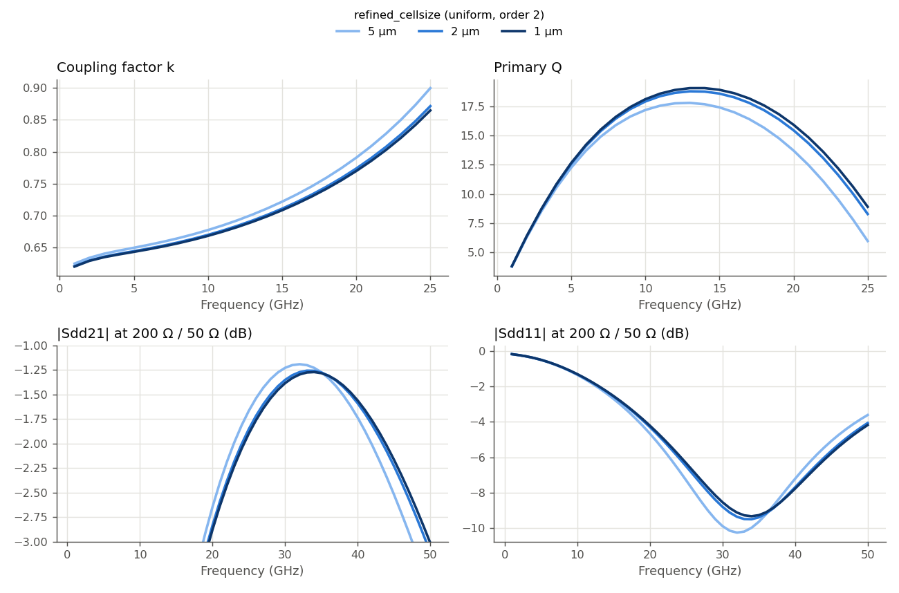
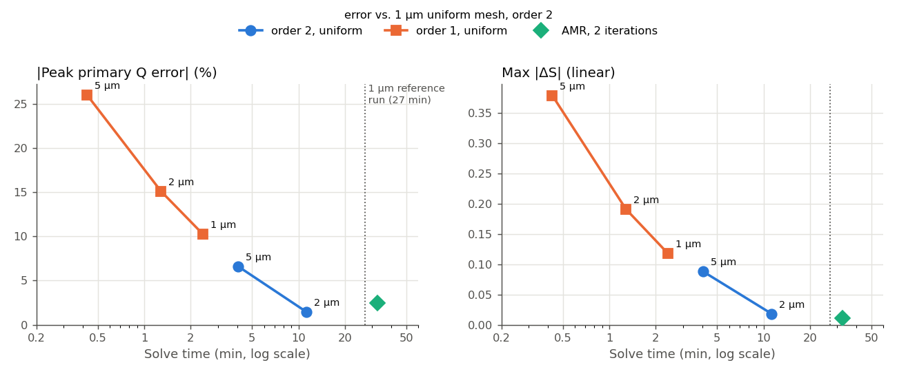

# How fine a mesh does this 2:1 edge-coupled balun need? (IHP SG13G2)

This study asks a practical question for one specific layout: a 2:1 balun made of edge-coupled lines with a 2 µm gap, simulated from 1 to 50 GHz. How fine must the Palace mesh be to get its coil properties and its transmission right? And do FEM order 1 or adaptive mesh refinement help?

We answer this in three steps:

1. **Refine a uniform mesh** from 5 µm to 1 µm and see which properties move.
2. **Cross-check the finest result** with adaptive mesh refinement (AMR).
3. **Try FEM order 1** as a fast alternative, and compare everything on accuracy vs. cost.

The findings apply to this balun, with this stackup, in this frequency range. Other structures can behave quite differently. The [overview page](../README.md) collects the other mesh studies.

## The details of this study

- **Model:** `balun2x1_edgecoupled_do200_w8_s2.gds`, stackup `SG13G2_200um.xml`
- **Ports:** 4 via ports (Metal1 → TopMetal2), Z0 = 50 Ω, de-embedded: 1/2 = primary pair, 3/4 = secondary pair, no center tap
- **Solver:** AWS Palace (FEM), ABC boundaries, 100 µm margin + 20 µm air, order 2 unless noted
- **Sweep:** 1–50 GHz in 1 GHz steps (adaptive frequency sweep)
- **Execution:** `hpz2`, 16 of 32 cores
- **Scope:** this is the bare balun. A real matching network would add MIM capacitors that are not in this model, so no matching or real-load result is reported.

## 0. Layout


A single octagonal loop of 4 edge-coupled lines on TopMetal2, 8 µm wide with a **2 µm gap**, about 200 µm outer diameter. The primary (ports 1/2, left) uses two of the lines in series through the crossovers at top and bottom. The secondary (ports 3/4, right) uses one line. That gives a 2:1 turns ratio, so the system impedances are 200 Ω (primary) and 50 Ω (secondary).

**What we look at.** From the 4-port Z-matrix we form the differential impedances of primary and secondary and read:

- **Coupling factor** k, **inductance** L and **Q factor** of each coil. These are only meaningful below the primary's self-resonance at about 29 GHz.
- **|Sdd21|** and **|Sdd11|**: differential transmission and reflection at 200 Ω / 50 Ω. |Sdd21| peaks at about −1.3 dB near 34 GHz.

## 1. Uniform mesh refinement

We ran the model at `refined_cellsize` = 5, 2 and 1 µm, all at FEM order 2.



- **The 5 µm mesh stands apart; 2 µm and 1 µm nearly coincide.** A 5 µm cell is wider than the 2 µm coupling gap, so it can't resolve the field there. (gmsh also reported a few ill-shaped elements at this setting.)
- **Coupling and inductance change little.** At 10 GHz, 5 µm overestimates k by 1.3% and L by 0.5%.
- **Q is the most sensitive coil property.** Peak primary Q is 6.6% low at 5 µm and 1.4% low at 2 µm (1 µm: 19.0 at 14 GHz).
- **Transmission shifts in frequency.** The |Sdd21| peak moves from 32 GHz (5 µm) to 34 GHz (1 µm). The 5 µm mesh also shows about 0.08 dB less loss than the finer meshes.

The step from 2 to 1 µm is much smaller than the step from 5 to 2 µm, on every quantity. The mesh is converging.

| Mesh | DOF | Solve time | Peak RAM |
|---|---:|---:|---:|
| 5 µm | 311,536 | 4m 3s | 4.36 GB |
| 2 µm | 843,390 | 11m 18s | 11.02 GB |
| 1 µm | 1,672,974 | 27m 5s | 24.17 GB |

## 2. Cross-check with AMR

AMR started from the 5 µm mesh and ran 2 refinement iterations, ending at 1.08 million DOF.

| | Peak primary Q | \|Sdd21\| peak | Max\|ΔS\| vs. 1 µm | Total time | Peak RAM |
|---|---:|---:|---:|---:|---:|
| 2 µm uniform | 18.77 | −1.26 dB at 33 GHz | 0.018 | 11m 18s | 11.0 GB |
| 1 µm uniform | 19.04 | −1.27 dB at 34 GHz | (reference) | 27m 5s | 24.2 GB |
| AMR, 2 iterations | 18.57 | −1.27 dB at 34 GHz | 0.011 | 32m 36s | 15.6 GB |

- **For the S-parameters, AMR confirms the 1 µm result.** Its |Sdd21| peak is identical, and its Max|ΔS| distance to 1 µm is smaller than that of the 2 µm mesh.
- **For Q, AMR is less accurate than the 2 µm uniform mesh.** It ends between the 2 µm and 5 µm results. AMR refines where Palace's error estimate is largest, and for this model that isn't where Q is decided.
- The uniform Q steps shrink quickly (+5.6%, then +1.4%). So we take 1 µm as the reference for Q, and expect it to be within about 1% of the converged value.

## 3. Order 1 as a shortcut? Accuracy vs. cost

FEM order 1 runs about 10× faster than order 2 on the same mesh. We re-ran all three meshes at order 1. The chart shows every run's error against the 1 µm order-2 reference, over its solve time:



- **Order 1 is far off on this balun.** At 5 µm, peak Q is 26% low and the |Sdd21| peak sits at 26 GHz instead of 34 GHz. The error shrinks with a finer mesh, but at 1 µm Q is still 10% low and the peak is at 31 GHz.
- **Order 1 also makes the balun look better than it is.** Its |Sdd21| peak is −0.96 dB at 5 µm and −1.14 dB at 1 µm, compared with −1.27 dB for the reference.
- **Order 2 at 5 µm is more accurate than order 1 at 1 µm**, in Q, in frequency and in Max|ΔS|, at 1.7× the time (4 vs. 2.4 minutes).

## Summary for this balun

- **2 µm uniform mesh, order 2, is the working point.** Q is within 1.5%, |Sdd21| within 0.02 dB and 1 GHz of the finest result, in about 11 minutes.
- **5 µm is too coarse for this geometry**, because the cell is wider than the 2 µm coupling gap. It's still usable for a first look at L and k.
- **Don't use order 1 for this balun**, not even on a fine mesh. It shifts the response down in frequency and underestimates loss.
- **AMR matched the S-parameters but not Q.** When Q matters, check it on a uniform mesh.

These numbers belong to this layout. Other gap widths, line widths or frequency ranges will change them.

## Files

```
mesh_convergence_balun2x1/
├── balun2x1_edgecoupled_do200_w8_s2.py                # original model (refined_cellsize=5)
├── balun2x1_edgecoupled_do200_w8_s2_mesh{5,2,1}.py    # uniform mesh, order 2
├── balun2x1_edgecoupled_do200_w8_s2_mesh{5,2,1}_order1.py  # uniform mesh, order 1
├── balun2x1_edgecoupled_do200_w8_s2_amr2.py           # AMR, 5 µm start, 2 iterations
├── palace_model/balun2x1_edgecoupled_do200_w8_s2_<name>_data/  # mesh, config and full Palace output per run
└── results/
    ├── story_plots.py            # the story_*.png plots and numbers in this report
    ├── analyze_convergence.py    # mixed-mode Sdd ΔS tables (CSV) and Sdd overlays
    ├── order_comparison.py       # order 1 vs. order 2 overlays and timing table
    ├── delta_S_table.csv, delta_S_vs_finest.csv, order_comparison_table.csv
    ├── snp/                      # de-embedded 4-port Touchstone files, one per run
    │                             #   (the AMR iteration files balun2x1_amr2_iter1..2 are raw)
    └── plots/
```

Run the scripts from this folder in the `d:\venv\palace` venv to regenerate plots and tables from the archived Touchstone files.
