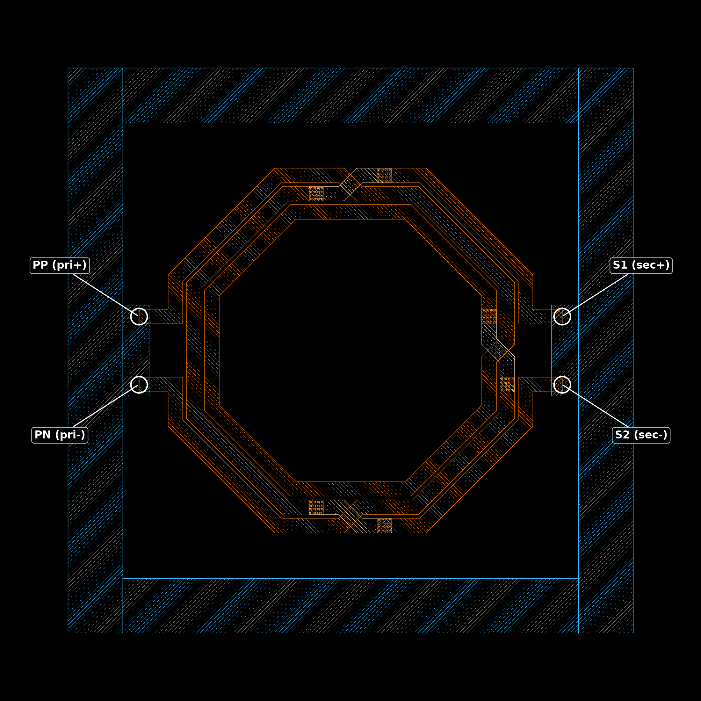
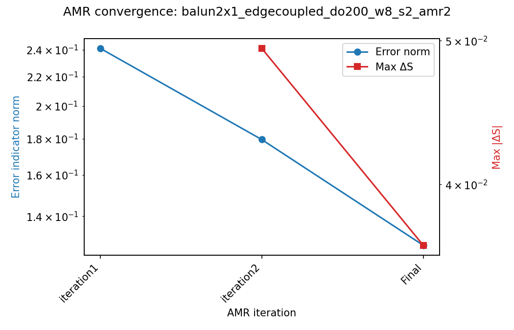
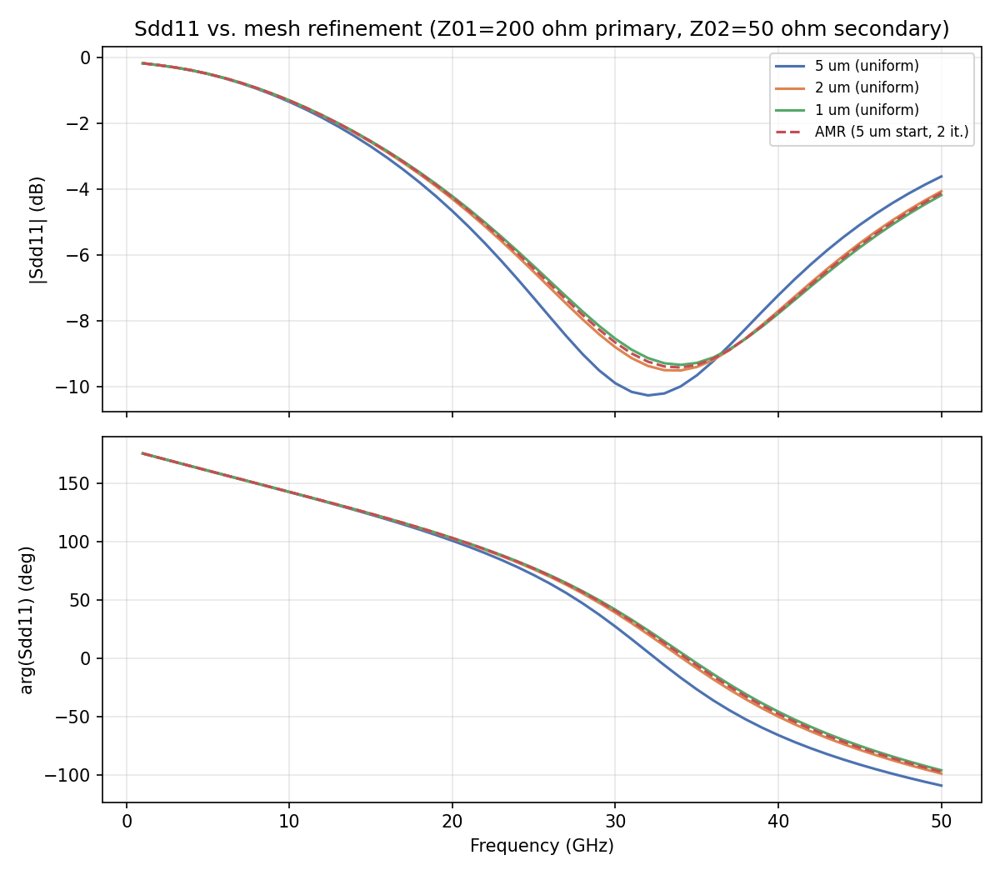
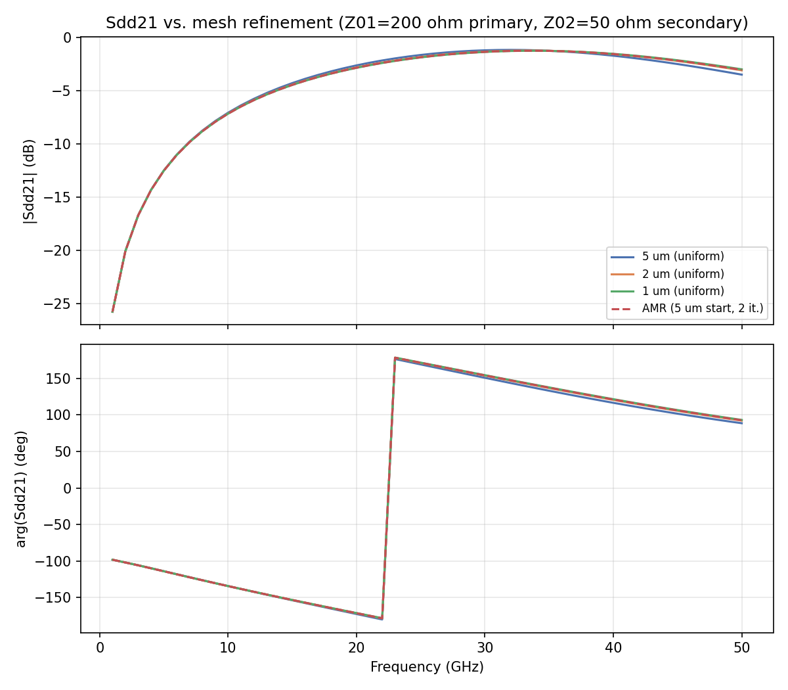
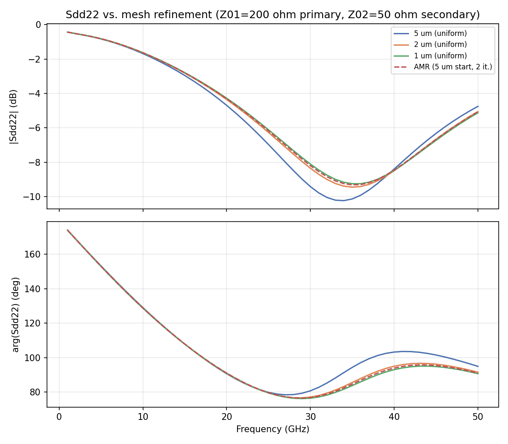
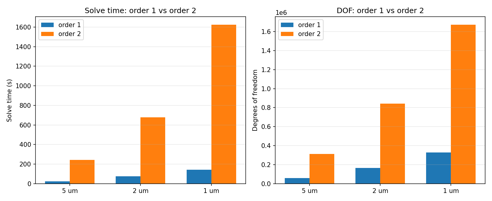
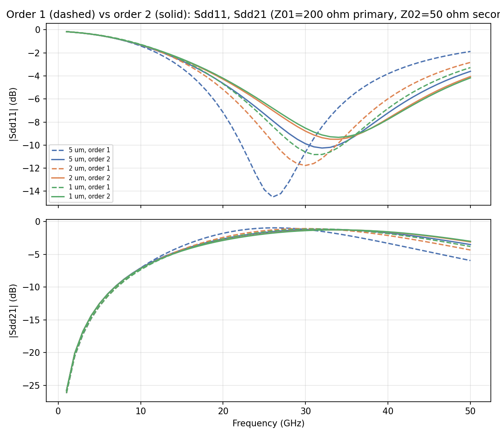

# Mesh Convergence Study: balun2x1 edge-coupled balun (IHP SG13G2)

- **Model:** `balun2x1_edgecoupled_do200_w8_s2.gds`, stackup `SG13G2_200um.xml`
- **Solver:** AWS Palace (FEM), order 2 unless noted, ABC boundaries, 100 µm margin + 20 µm air-around
- **Sweep:** 1–50 GHz, 1 GHz step, Palace's PROM-based adaptive frequency sweep
- **Ports:** 4 via ports (Metal1→TopMetal2), Z0 = 50 Ω — 1/2 = primary +/- (PP/PN), 3/4 = secondary +/- (S1/S2), no center tap
- **Execution:** remote solve on `hpz2` (`mpirun -n 16` of 32 cores, 109 GB RAM), jobs run sequentially

## 0. Layout



Measured directly from the GDS (KLayout): a single octagonal loop of 4 edge-coupled parallel lines, 8 µm trace width with a 2 µm gap between adjacent lines, ~200 µm outer diameter, inside a 310×310 µm cell. **PP/PN** (primary, ports 1/2) break out on the left, **S1/S2** (secondary, ports 3/4) on the right; two via-stitched line-transposition crossovers are visible at the top and bottom of the loop. **Turns ratio is 2:1 (primary:secondary)** — the primary uses 2 of the 4 lines connected in series through the crossovers (2 effective turns), the secondary uses 1 line (1 turn). A separate Metal1 guard ring runs around the entire cell perimeter (visible as the outer frame) and is not part of the signal path.

## 1. Method

Seven model variants were generated from the common baseline (`balun2x1_edgecoupled_do200_w8_s2.py`, `refined_cellsize=5`):

- **Uniform mesh sweep (order 2):** `refined_cellsize` = 5, 2, 1 µm, `adaptive_mesh_iterations=0`.
- **Adaptive mesh refinement (AMR, order 2):** `refined_cellsize=5` (starting mesh), `adaptive_mesh_iterations=2`.
- **Order comparison:** the same 5, 2, 1 µm cell sizes re-run at `order=1`.

Model files: `balun2x1_edgecoupled_do200_w8_s2_mesh{5,2,1}.py`, `..._amr2.py`, `..._mesh{5,2,1}_order1.py` (all in `more_examples/mesh_convergence/mesh_convergence_balun2x1/`).

## 2. Uniform mesh sweep — results (order 2)

| Mesh | DOF | Mesh elements | Solve time | Peak RAM | Error indicator norm | Error indicator max |
|---|---:|---:|---:|---:|---:|---:|
| 5 µm | 311,536 | 45,074 | 4m 3s | 4.36 GB | 2.412e-01 | 1.234e-02 |
| 2 µm | 843,390 | 120,688 | 11m 18s | 11.02 GB | 1.456e-01 | 4.112e-03 |
| 1 µm | 1,672,974 | 236,525 | 27m 5s | 24.17 GB | 1.095e-01 | 2.600e-03 |

No crashes or mesh-quality failures anywhere in this range, though gmsh flagged 2 "ill-shaped tets" at the 5 µm setting (out of ~45k elements) — consistent with a cell size larger than the 2 µm coupled-line gap it needs to resolve.

## 3. Adaptive mesh refinement — results

Starting mesh: 5 µm. Requested `adaptive_mesh_iterations=2`.

| Iteration | DOF | Mesh elements | Error Norm | Error Max | Max \|ΔS\| vs. prev. | Time (cumulative) | Peak RAM |
|---|---:|---:|---:|---:|---:|---:|---:|
| 1 | 311,536 | 45,074 | 2.412e-01 | 1.234e-02 | n/a | 4m 5s | 4.56 GB |
| 2 | 418,314 | 66,872 | 1.795e-01 | 3.839e-03 | 0.0494 | 10m 29s | 6.35 GB |
| **Final** | **1,084,000** | **189,855** | **1.275e-01** | **1.653e-03** | **0.0364** | **32m 36s** | **15.60 GB** |



Iteration 1 matches the 5 µm uniform mesh exactly, as expected. Both the error indicator and Max|ΔS| keep improving through the final iteration (no plateau within this 2-iteration budget) — Max|ΔS| roughly halves from 0.0494 to 0.0364.

## 4. Mixed-mode S-parameters at the real system impedances (200 Ω / 50 Ω)

Local port order [1:primary+, 2:primary-, 3:secondary+, 4:secondary-] maps directly onto ports 1-4 — no port elimination is needed here (unlike the 5-port transformer study's center-tap drop). This is a 2:1 turns-ratio balun with system impedances of **200 Ω differential on the primary, 50 Ω differential on the secondary** (4:1, matching the turns ratio squared). Mixed-mode parameters are computed at this reference by reducing the native 4-port Z-matrix to the differential-equivalent 2-port `(Zaa,Zab,Zba,Zbb)` (antisymmetric combination across each port pair) and applying the standard unequal-reference-impedance 2-port Z→S conversion:

```
Zaa = Z11-Z12-Z21+Z22   (primary)
Zab = Z13-Z14-Z23+Z24
Zba = Z31-Z32-Z41+Z42   (== Zab by reciprocity)
Zbb = Z33-Z34-Z43+Z44

D     = (Zaa+Z01)*(Zbb+Z02) - Zab*Zba
Sdd11 = ((Zaa-Z01)*(Zbb+Z02) - Zab*Zba) / D
Sdd22 = ((Zaa+Z01)*(Zbb-Z02) - Zab*Zba) / D
Sdd21 = 2*Zba*sqrt(Z01*Z02) / D
```

with `Z01 = 200 Ω`, `Z02 = 50 Ω`. (Setting `Z01=Z02` reduces this to the standard equal-impedance Z→S formula, confirmed to ~1e-4 as a sanity check on the general formula.)





### 4a. Successive mesh steps

| Param | Comparison | Max\|ΔS\| (linear) | \|ΔS\|@1GHz (dB) | \|ΔS\|@25GHz (dB) | \|ΔS\|@50GHz (dB) |
|---|---|---:|---:|---:|---:|
| Sdd11 | 5→2 µm | 0.1240 | 0.0004 | 0.7930 | 0.4517 |
| Sdd11 | 2→1 µm | 0.0322 | 0.0001 | 0.1758 | 0.1148 |
| Sdd11 | 1µm→AMR final | 0.0149 | 0.0004 | 0.0755 | 0.0623 |
| Sdd21 | 5→2 µm | 0.0589 | 0.0144 | 0.1864 | 0.4041 |
| Sdd21 | 2→1 µm | 0.0153 | 0.0008 | 0.0456 | 0.0967 |
| Sdd21 | 1µm→AMR final | 0.0076 | 0.0049 | 0.0123 | 0.0541 |
| Sdd22 | 5→2 µm | 0.0560 | 0.0004 | 0.7010 | 0.3028 |
| Sdd22 | 2→1 µm | 0.0134 | 0.0000 | 0.1556 | 0.0711 |
| Sdd22 | 1µm→AMR final | 0.0061 | 0.0002 | 0.0604 | 0.0559 |

### 4b. Every mesh vs. the finest uniform mesh (1 µm) as reference

| Param | Mesh | Max\|ΔS\| vs. 1 µm (linear) | \|ΔS\|@1GHz (dB) | \|ΔS\|@25GHz (dB) | \|ΔS\|@50GHz (dB) |
|---|---|---:|---:|---:|---:|
| Sdd11 | 5 µm | 0.1559 | 0.0005 | 0.9688 | 0.5664 |
| Sdd11 | 2 µm | 0.0322 | 0.0001 | 0.1758 | 0.1148 |
| Sdd11 | AMR final | 0.0149 | 0.0004 | 0.0755 | 0.0623 |
| Sdd21 | 5 µm | 0.0740 | 0.0152 | 0.2320 | 0.5008 |
| Sdd21 | 2 µm | 0.0153 | 0.0008 | 0.0456 | 0.0967 |
| Sdd21 | AMR final | 0.0076 | 0.0049 | 0.0123 | 0.0541 |
| Sdd22 | 5 µm | 0.0694 | 0.0005 | 0.8566 | 0.3739 |
| Sdd22 | 2 µm | 0.0134 | 0.0000 | 0.1556 | 0.0711 |
| Sdd22 | AMR final | 0.0061 | 0.0002 | 0.0604 | 0.0559 |

The 5 µm mesh is clearly the worst point (Max|ΔS| up to 0.16 vs. the 1 µm reference) — this structure's 2 µm coupled-line gap is smaller than the 5 µm cell size itself, so that setting can't really resolve the coupling at all. 2 µm brings all three parameters within 0.01–0.03 of the 1 µm reference. The AMR final result is closer to the 1 µm reference than the 2 µm uniform mesh on every parameter. Peak `Sdd21` (finest mesh) reaches about **−1.27 dB at 34 GHz** — a well-matched, low-loss balun.

## 5. Why there is no "real load" / floating-impedance analysis here

An earlier version of this report reduced the 4-port Z-matrix under a floating 50 Ω differential load on the secondary, to derive `Zin_diff` at the primary and compare it against the mixed-mode `Sdd11` from §4. That analysis has been removed: this test structure is the coupled-line balun coils only — it does not include the MIM capacitors that a real matching network would use to compensate the balun's imaginary part. A bare-coil floating-load impedance (or any "how well does this match a real load" claim built on it) is therefore not representative of the real circuit, and reporting it invites the wrong conclusion. The mixed-mode S-parameters in §4 remain valid as EM characterization of the coil pair itself (referenced to the true 200 Ω/50 Ω system impedances, not a claim about real-load matching), and are the right basis for feeding into a separate matching-network design step.

## 6. Order 1 vs. order 2 comparison

| Cell size | Order | DOF | Mesh elements | Solve time | Peak RAM |
|---:|---:|---:|---:|---:|---:|
| 5 µm | 1 | 60,271 | 45,074 | 25.6 s | 2.44 GB |
| 5 µm | 2 | 311,536 | 45,074 | 4m 3s | 4.36 GB |
| 2 µm | 1 | 164,249 | 120,688 | 1m 17s | 5.83 GB |
| 2 µm | 2 | 843,390 | 120,688 | 11m 18s | 11.02 GB |
| 1 µm | 1 | 328,043 | 236,525 | 2m 24s | 10.04 GB |
| 1 µm | 2 | 1,672,974 | 236,525 | 27m 5s | 24.17 GB |




Order 1 is ~5.2× fewer DOF and roughly 9-11× faster than order 2 at the same mesh, at 40-60% of the RAM — similar ratios to the other studies. **The accuracy picture is different from the spiral inductor study, though**: rather than a fixed offset independent of mesh size, order 1's `Sdd11` dip is visibly shifted in both frequency and depth at 5 µm (dipping ~4 dB deeper, shifted a few GHz lower than order 2), and that shift shrinks as the mesh refines toward 1 µm. In other words, on this tightly-coupled structure the order-1 error and the coarse-mesh error compound at 5 µm; refining the mesh does help order 1 get closer here, though it still doesn't fully close the gap to order 2 at 1 µm. **Order 1 remains a reasonable way to get a quick rough look, not a source of final numbers, and that conclusion is structure-dependent** — check both mesh and order sensitivity on any new geometry rather than assuming one dominates.

## 7. Discussion

- **This structure's 2 µm coupled-line gap makes 5 µm mesh a poor choice** — Max|ΔS| up to 0.16 vs. the 1 µm reference, clearly worse than the equivalent coarse point in the transformer or balun studies (both had ≥3 µm gaps/traces relative to their coarsest mesh). **2 µm uniform mesh is the practical minimum working point** for this geometry, bringing all three Sdd parameters within 0.01–0.03 of the finest mesh at under half the 1 µm run's cost.
- **AMR (5 µm start, 2 iterations) lands closer to the 1 µm reference than the 2 µm uniform mesh does**, on all three mixed-mode S-parameters, without needing to already know 2 µm was a reasonable cell size — consistent with the spiral inductor study's finding, though again at higher wall-clock cost (32m 36s, 15.6 GB) than the 2 µm uniform run (11m 18s, 11.0 GB).
- **Order 1's error is coupled to mesh coarseness here**, unlike the spiral inductor's roughly mesh-independent offset — a reminder that these behaviors are structure-dependent and worth checking per design rather than assuming a prior study's pattern carries over.

## 8. Where everything lives

```
more_examples/mesh_convergence/mesh_convergence_balun2x1/
├── mesh_convergence_report.md                        # this report
├── balun2x1_edgecoupled_do200_w8_s2.py                # original baseline (refined_cellsize=5)
├── balun2x1_edgecoupled_do200_w8_s2_mesh{5,2,1}.py    # uniform mesh model scripts, order 2
├── balun2x1_edgecoupled_do200_w8_s2_amr2.py           # AMR model script, 5 um start, 2 iterations
├── balun2x1_edgecoupled_do200_w8_s2_mesh{5,2,1}_order1.py  # order 1 comparison model scripts
├── palace_model/balun2x1_edgecoupled_do200_w8_s2_<name>_data/  # generated mesh/config + full Palace output
└── results/
    ├── delta_S_table.csv, delta_S_vs_finest.csv       # §4a/4b (real 200/50 ohm reference)
    ├── order_comparison_table.csv                     # §6
    ├── analyze_convergence.py                         # regenerates the Sdd CSVs/plots (§4, 200/50 ohm)
    ├── order_comparison.py                            # regenerates §6's table/plots
    ├── render_labeled_layout.py                       # regenerates the labeled layout picture (§0)
    ├── snp/                                           # de-embedded 4-port Touchstone files
    │     balun2x1_mesh{5,2,1}.s4p, balun2x1_mesh{5,2,1}_order1.s4p
    │     balun2x1_amr2_iter1.s4p, balun2x1_amr2_iter2.s4p, balun2x1_amr2_final.s4p
    └── plots/
          balun2x1_layout_labeled.png                              # §0
          amr2_convergence.png                                     # §3
          sdd11_convergence.png, sdd21_convergence.png, sdd22_convergence.png  # §4 (200/50 ohm)
          order_comparison_time_dof.png, order_comparison_sdd.png   # §6
```

Re-run `python results/analyze_convergence.py` and `python results/order_comparison.py` from `more_examples/mesh_convergence/mesh_convergence_balun2x1/` (in the `d:\venv\palace` venv) any time to regenerate the tables and plots from the archived `.snp`/`palace.json` files.
