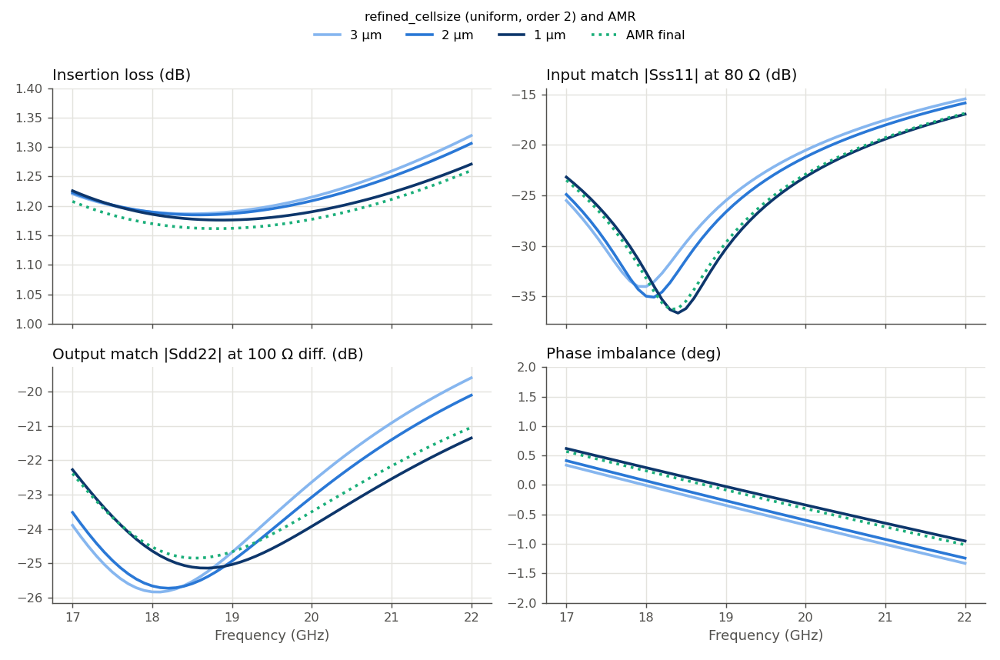

# How fine a mesh does this MIM-loaded balun need? (IHP SG13G2)

This study asks a practical question for one specific layout: a complete 17–22 GHz balun, including its MIM capacitors, that converts an 80 Ω single-ended port into a 100 Ω differential pair. How fine must the Palace mesh be to trust its loss, match and balance? And how close does the simulation get to the nominal value of one of its MIM capacitors?

We answer this in three steps:

1. **Refine a uniform mesh** from 3 µm to 1 µm and see which balun properties move.
2. **Cross-check the finest result** with adaptive mesh refinement (AMR).
3. **Check one MIM capacitor on its own**, against its nominal value.

The findings apply to this balun, with this stackup, in this frequency range. Other structures can behave quite differently. The [overview page](../README.md) collects the other mesh studies.

## The details of this study

- **Model:** `trans_100diff_to_80se_ports.gds`, stackup `SG13G2_200um.xml`
- **Ports:** 3 via ports (Metal3 → TopMetal2), simulated at 50 Ω and re-referenced afterwards to the true system impedances: port 1 single-ended at 80 Ω, ports 2/3 differential at 100 Ω. Raw S-parameters are used (no port de-embedding), for all runs alike.
- **Solver:** AWS Palace (FEM), order 2, ABC boundaries, 100 µm margin + 20 µm air
- **Sweep:** 17–22 GHz in 0.1 GHz steps (adaptive frequency sweep)
- **Mesh:** `refined_cellsize` varied as described below. Metal3 is always kept at 5 µm (`refined_cellsize_override`), and via arrays are merged identically in all runs.
- **Execution:** `hpz2`, 16 cores

## 0. Layout


A single-turn racetrack coil in a 350 × 660 µm cell. **P1** (single-ended) is on the left, **P2/P3** (differential pair) on the right. Three MIM capacitors complete the matching: 280 fF near P1 and 2 × 350 fF near P2/P3 (nominal values from the GDS text labels).

**What we look at.** At the true system impedances:

- **Insertion loss**: transmission from the single-ended input to the differential output
- **Input match** |Sss11| at 80 Ω and **output match** |Sdd22| at 100 Ω differential
- **Amplitude and phase imbalance** between the two outputs (ideal: 0 dB, 180°)

## 1. Uniform mesh refinement

We ran the model at `refined_cellsize` = 3, 2 and 1 µm, all at FEM order 2. The dotted line is the AMR result from step 2. Note the zoomed axes: the differences are all small.



- **Insertion loss is robust**: 1.18–1.32 dB across the band for every mesh. Refining lowers it by at most 0.05 dB, at the upper band edge.
- **Balance is robust**: amplitude imbalance stays within ±0.15 dB for every mesh (not plotted). Phase imbalance shifts by about 0.3° between meshes and stays within ±1.3°.
- **The match moves the most, but stays good.** The input-match null moves from 18.0 GHz (3 µm) to 18.4 GHz (1 µm). The worst in-band input match (at 22 GHz) improves from −15.5 to −17.0 dB, and the output match from −19.6 to −21.3 dB.

3 µm and 2 µm are close to each other. The larger step comes from 2 µm to 1 µm, where the matching curves move toward the AMR result.

| Mesh | DOF | Solve time | Peak RAM |
|---|---:|---:|---:|
| 3 µm | 696,908 | 9m 6s | 7.02 GB |
| 2 µm | 948,860 | 13m 19s | 9.30 GB |
| 1 µm | 1,951,380 | 25m 42s | 17.52 GB |

## 2. Cross-check with AMR

AMR started from the 2 µm mesh and ran 2 refinement iterations, ending at 3.1 million DOF. In the plot above it is the dotted line, and it lies on top of the 1 µm curve in the match and phase panels.

| | Max\|ΔS\| vs. AMR | Worst input match | Total time | Peak RAM |
|---|---:|---:|---:|---:|
| 3 µm | 0.033 | −15.5 dB | 9m 6s | 7.02 GB |
| 2 µm | 0.024 | −15.9 dB | 13m 19s | 9.30 GB |
| 1 µm | 0.003 | −17.0 dB | 25m 42s | 17.52 GB |
| AMR, 2 iterations | (reference) | −16.9 dB | 1h 54m | 30.0 GB |

(Max|ΔS| is taken over the mixed-mode parameters Sss11, Sds21 and Sdd22 at the true system impedances.)

The 1 µm uniform mesh and AMR agree within Max|ΔS| = 0.003, so we consider 1 µm converged for this balun. AMR adds a useful confirmation, but at 4.5× the time of the 1 µm run it doesn't change the answer. AMR's insertion loss sits about 0.015 dB below the 1 µm curve, which is negligible for design.

## 3. Side check: one MIM capacitor vs. its nominal value

Separately from the mesh sweep, the 280 fF capacitor near P1 was simulated alone (`verify_MIM_nominal_280.gds`), with a 1-port across its plates. Its capacitance C = Im(Y11)/ω was evaluated at 1 GHz:

| Mesh | Simulated C | Nominal C | Difference |
|---|---:|---:|---:|
| 2 µm | 303.1 fF | 280.0 fF | +8.2% |
| 1 µm | 295.9 fF | 280.0 fF | +5.7% |

Refining the mesh closes about a third of the gap. The rest is plausibly real: the port sits 20–30 µm away from the capacitor, on a Metal3 connection whose own capacitance the EM model includes but the nominal value does not. This was not investigated further.

## Summary for this balun

- **Loss and balance are insensitive to the mesh** in this study. Even 3 µm predicts them within about 0.06 dB and 0.3° of the finest result.
- **1 µm is needed for the final match numbers.** It agrees with AMR, while 2 µm is about 1 dB pessimistic on the worst-case match. For design iterations, 2 µm (13 minutes) gets everything else right.
- **AMR confirms the 1 µm result**, at 4.5× its cost.
- **Expect simulated MIM capacitance to come out a few percent above nominal** in this setup. Part of that is mesh, part is the port connection.

These numbers belong to this layout. Other coil sizes, capacitor arrangements or frequency ranges will change them.

## Files

```
mesh_convergence_balun_mim/
├── trans_100diff_to_80se_ports.py           # 3 µm (initial check)
├── trans_100diff_to_80se_ports_mesh{2,1}.py  # uniform mesh, order 2
├── trans_100diff_to_80se_ports_amr2.py      # AMR, 2 µm start, 2 iterations
├── verify_MIM_nominal_280.gds / .py         # MIM capacitor side check (§3)
├── palace_model/<name>_data/                # mesh, config and full Palace output per run
└── results/
    ├── story_plots.py             # the story_balun.png plot and numbers in this report
    ├── analyze_convergence.py     # mixed-mode ΔS tables (CSV), per-parameter overlays, balance plots
    ├── analyze_baseline.py        # plots of the initial 3 µm run
    ├── verify_mim_capacitance.py  # capacitance from the MIM side check
    ├── delta_S_table.csv, delta_S_vs_finest.csv, s_parameter_table.csv, s_parameter_magnitude_table.csv
    ├── snp/                       # raw Touchstone files, one per run
    └── plots/
```

Run the scripts from this folder in the `d:\venv\palace` venv to regenerate plots and tables from the archived Touchstone files.
