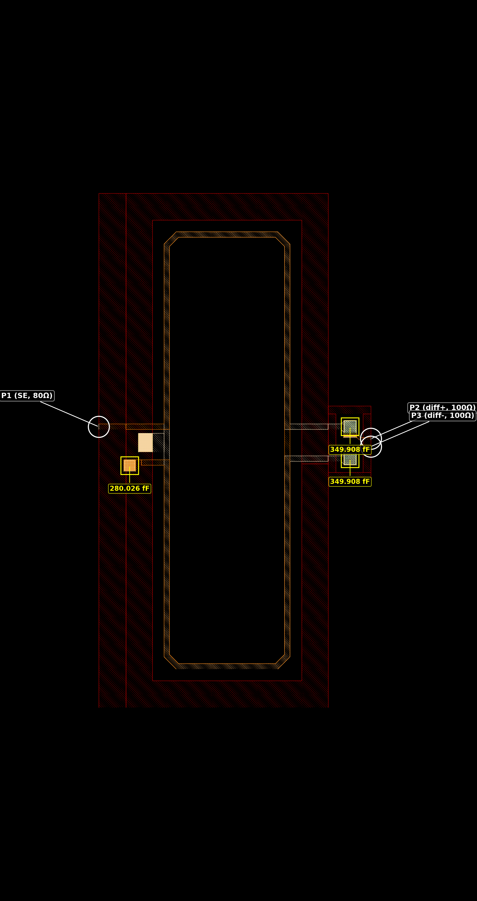
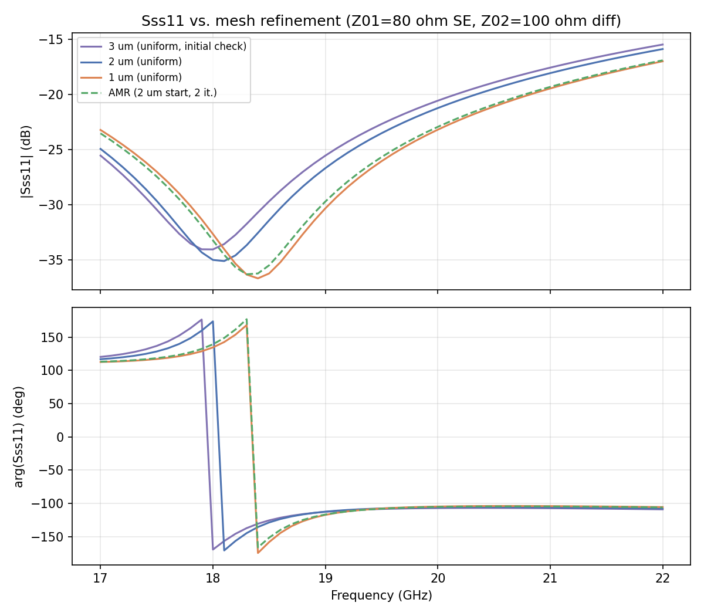
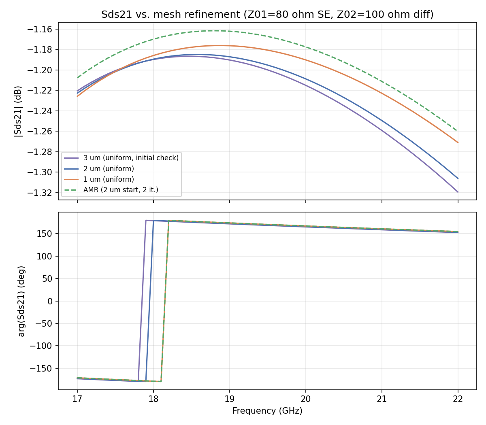
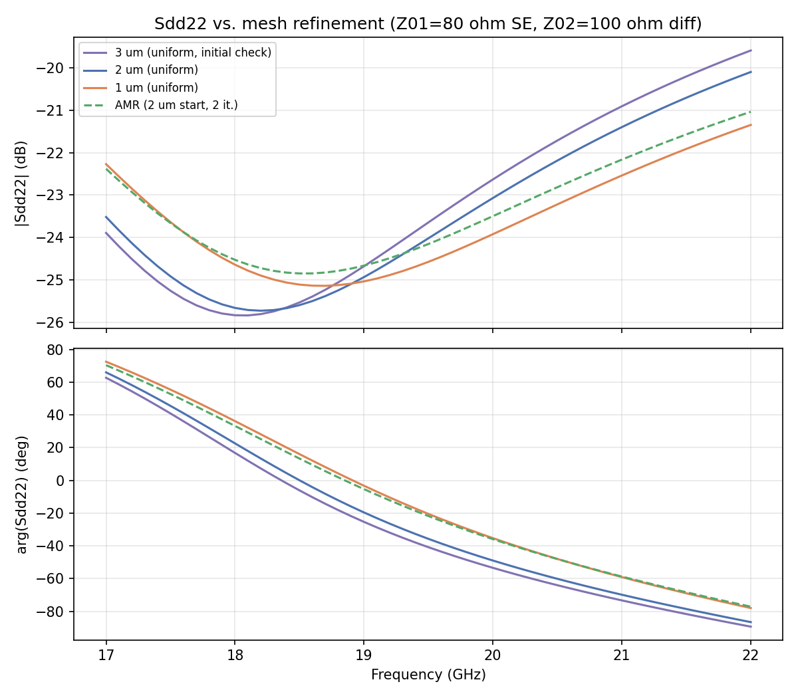
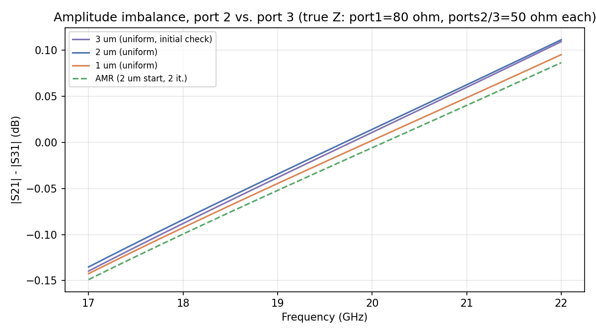
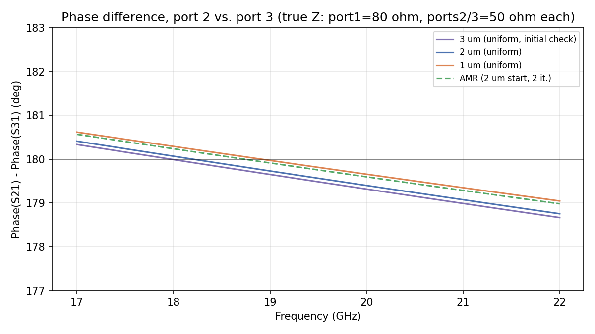

# Mesh Convergence Study: MIM-loaded balun (trans_100diff_to_80se_ports, IHP SG13G2)

- **Model:** `trans_100diff_to_80se_ports.gds`, stackup `SG13G2_200um.xml`
- **Solver:** AWS Palace (FEM), order 2, ABC boundaries, 100 µm margin + 20 µm air-around
- **Sweep:** 17–22 GHz, 0.1 GHz step, Palace's PROM-based adaptive frequency sweep
- **Ports:** 3 via ports (Metal3→TopMetal2), Z0 = 50 Ω — port 1 single-ended, ports 2/3 a differential pair (no center tap)
- **Execution:** remote solve on `hpz2` (`mpirun -n 16`), variants run sequentially

## 0. Layout



Measured directly from the GDS: a single-turn racetrack coil, 350×660 µm cell. **P1** (single-ended, target 80 Ω external) breaks out on the left; **P2/P3** (differential pair, target 100 Ω external differential) break out on the right. Three MIM capacitors are present, with nominal values read from their GDS text labels: one 280.026 fF cap near P1, and two 349.908 fF caps near P2/P3.

## 1. Method

Four model variants: `refined_cellsize` = 3 µm (initial check), 2 µm, 1 µm (all uniform, order 2), plus AMR (2 iterations, starting mesh 2 µm). No order=1 comparison for this study. Metal3 is pinned to a fixed 5 µm `refined_cellsize_override` in every variant, independent of the swept global cell size. TopVia2/Vmim arrays are merged into one polygon per via cluster (`merge_polygon_size = 3 µm`), identical across all variants.

All 3 ports were simulated at `port_Z0 = 50 Ω`; the true external system impedances (80 Ω single-ended at port 1, 100 Ω differential across ports 2/3) are applied afterward by re-referencing the S-parameters (§3). All S-parameter results in this report use the **raw** Touchstone files, not the port-inductance-de-embedded ones — see §4.

## 2. Mesh sweep — results

| Mesh | DOF | Mesh elements | Solve time | Peak RAM | Error indicator norm | Error indicator max |
|---|---:|---:|---:|---:|---:|---:|
| 3 µm (initial check) | 696,908 | 99,773 | 9m 6s | 7.02 GB | 1.968e-01 | 1.130e-02 |
| 2 µm | 948,860 | 134,844 | 13m 19s | 9.30 GB | 1.724e-01 | 8.151e-03 |
| 1 µm | 1,951,380 | 274,919 | 25m 42s | 17.52 GB | 1.243e-01 | 5.033e-03 |

No crashes or fatal mesh-quality failures anywhere in this range; gmsh flagged a handful of non-fatal "ill-shaped tets" warnings at every setting (4-8 out of >100k elements), consistent with the small MIM-via geometry rather than a config issue.

### 2a. Adaptive mesh refinement

Starting mesh: 2 µm. Requested `adaptive_mesh_iterations=2`.

| Iteration | DOF | Mesh elements | Error Norm | Error Max | Max \|ΔS\| vs. prev. | Time (cumulative) | Peak RAM |
|---|---:|---:|---:|---:|---:|---:|---:|
| 1 | 948,860 | 134,844 | 1.724e-01 | 8.151e-03 | n/a | 13m 42s | 9.92 GB |
| 2 | 1,304,880 | 206,468 | 1.327e-01 | 4.005e-03 | 0.0112 | 38m 8s | 13.54 GB |
| **Final** | **3,112,276** | **537,603** | **9.665e-02** | **1.929e-03** | **0.0066** | **1h 54m 12s** | **29.99 GB** |

Iteration 1 matches the 2 µm uniform mesh exactly, as expected. Both the error indicator and Max|ΔS| keep improving through the final iteration — Max|ΔS| roughly halves from 0.0112 to 0.0066, no plateau within this 2-iteration budget.

## 3. Mixed-mode S-parameters at the true system impedance (80 Ω SE / 100 Ω differential)

Port 1 is single-ended; ports 2/3 form a differential pair. The native 3-port Z-matrix is reduced to a single-ended/differential-mode 2-port equivalent (port a = SE port 1, port b = differential mode of ports 2/3) using the plain differential-impedance convention `Zdiff = Vdiff/I` (I = the current in one leg, driven with I2=-I3), the same convention already validated in the balun2x1 and transformer studies — **not** the Bockelman-Eisenstadt power-normalized convention, whose own `Zbb` term is exactly half of this and would silently impose a 2×Z02 differential termination if paired with Z02 directly:

```
Zaa = Z11
Zab = Z12 - Z13
Zba = Z21 - Z31
Zbb = Z22 - Z23 - Z32 + Z33

D     = (Zaa+Z01)*(Zbb+Z02) - Zab*Zba
Sss11 = ((Zaa-Z01)*(Zbb+Z02) - Zab*Zba) / D
Sdd22 = ((Zaa+Z01)*(Zbb-Z02) - Zab*Zba) / D
Sds21 = 2*Zba*sqrt(Z01*Z02) / D
```

with `Z01 = 80 Ω`, `Z02 = 100 Ω`. **Confirmed:** this terminates the differential pair at 100 Ω, not 100+100=200 Ω — derived directly from `Vdiff/I` with `I` the actual leg current, not a per-leg-then-summed quantity.





| Param | Mesh | 17 GHz \|S\| (dB) | 19.5 GHz \|S\| (dB) | 22 GHz \|S\| (dB) |
|---|---|---:|---:|---:|
| Sss11 | 3 µm | -25.52 | -22.66 | -15.45 |
| Sss11 | 2 µm | -24.92 | -23.50 | -15.86 |
| Sss11 | 1 µm | -23.20 | -26.03 | -16.97 |
| Sss11 | AMR final | -23.51 | -25.66 | -16.88 |
| Sds21 | 3 µm | -1.22 | -1.20 | -1.32 |
| Sds21 | 2 µm | -1.22 | -1.20 | -1.31 |
| Sds21 | 1 µm | -1.23 | -1.18 | -1.27 |
| Sds21 | AMR final | -1.21 | -1.17 | -1.26 |
| Sdd22 | 3 µm | -23.89 | -23.64 | -19.60 |
| Sdd22 | 2 µm | -23.52 | -24.02 | -20.10 |
| Sdd22 | 1 µm | -22.27 | -24.57 | -21.35 |
| Sdd22 | AMR final | -22.38 | -24.15 | -21.04 |

Both ports are well matched at their true impedances (Sss11, Sdd22 below -15 dB across the whole band, with a match null near -35 dB around 18.3 GHz), and insertion loss Sds21 is flat at ~1.2-1.3 dB.

### 3a. Convergence vs. finest (AMR final)

| Param | Mesh | Max\|ΔS\| vs. AMR final (linear) |
|---|---|---:|
| Sss11 | 3 µm | 0.0268 |
| Sss11 | 2 µm | 0.0185 |
| Sss11 | 1 µm | 0.0025 |
| Sds21 | 3 µm | 0.0331 |
| Sds21 | 2 µm | 0.0244 |
| Sds21 | 1 µm | 0.0021 |
| Sdd22 | 3 µm | 0.0260 |
| Sdd22 | 2 µm | 0.0184 |
| Sdd22 | 1 µm | 0.0034 |

Monotonic convergence toward the AMR final result at every mesh step. The 1 µm uniform mesh alone already comes within ~0.003 of the AMR final answer — AMR mainly buys a cross-check here rather than a materially different result.

### 3b. Amplitude and phase balance (port 2 vs. port 3)

A balun's two differential outputs should be equal in amplitude and 180° apart in phase. Both S21 and S31 are renormalized to the true impedance per physical port (port 1 → 80 Ω, ports 2/3 left at 50 Ω each — the natural per-leg reference for a 100 Ω differential pair with equal legs) via `skrf.Network.renormalize`, then compared directly (`results/analyze_convergence.py`). The phase trace is unwrapped along frequency and shifted by whole 360° turns to sit near 180°, avoiding the display artifact of a raw phase difference crossing the ±180° branch cut.




Both are excellent across the band: amplitude imbalance stays within ±0.15 dB, and phase difference stays within about 1.3° of the ideal 180° — consistent across every mesh variant.

## 4. Why raw, not de-embedded, S-parameters

This report uses the raw Touchstone output (the S-parameters as computed at the port reference plane) rather than the port-inductance-de-embedded variant that `combine_snp` also produces. The de-embedding step cascades out a small negative series inductance per port (a few pH, from the port's own geometry) to shift the reference plane closer to the structure — useful when comparing to a probe-tip or pad-referenced measurement, but an extra processing step on top of the solver's direct output. For this mesh convergence study, the raw S-parameters are the more direct and reproducible quantity to track across mesh variants.

## 5. MIM capacitor verification (separate check)

Independent of the mesh sweep above: `verify_MIM_nominal_280.gds`/`.py` is a standalone 1-port test structure isolating the 280.026 fF MIM capacitor (the one near port 1 in the full model), to check the EM-simulated capacitance against its nominal GDS-text-label value. Port 1 is a lumped via port bridging the capacitor's two plates directly (Metal3 bottom-plate net to TopMetal2 top-plate net), so `C = Im(Y11)/(2*pi*f)` from the 1-port Y-parameter is the capacitance directly (`results/verify_mim_capacitance.py`).

Two mesh sizes were checked, evaluated at 0.1 GHz and 1 GHz:

| refined_cellsize | 0.1 GHz simulated C | 1 GHz simulated C | Nominal C | Error (1 GHz) |
|---|---:|---:|---:|---:|
| 2 µm | — | 303.10 fF | 280.03 fF | +8.24% |
| 1 µm | 295.86 fF | 295.90 fF | 280.03 fF | +5.67% |

The two frequencies agree to within 0.04 fF at 1 µm, confirming a genuinely capacitive (not numerical-noise) result. Halving the mesh size reduced the error from +8.24% to +5.67%, so mesh discretization is a real but partial contributor. The remaining gap is consistent with port 1 sitting ~20–30 µm from the actual MIM plate footprint (connected via a Metal3 trace): the EM simulation necessarily includes that trace's own parasitic capacitance to substrate, which the nominal (compact-model) value does not include. This was not investigated further (out of scope for the mesh convergence study); the full-model port assignment and layer overlap were independently confirmed correct (see `trans_100diff_to_80se_ports.py` docstring).
