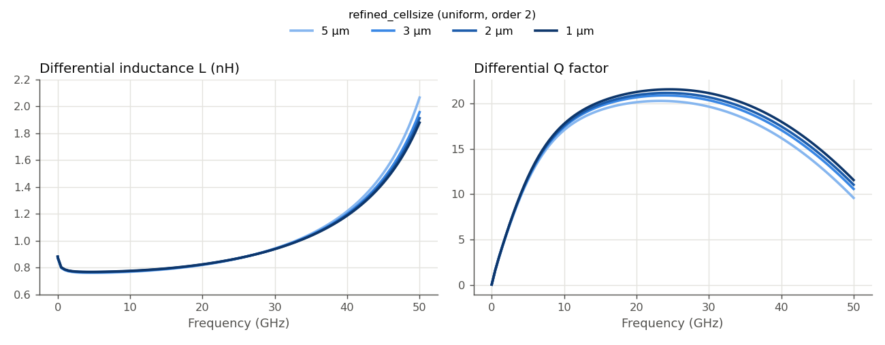
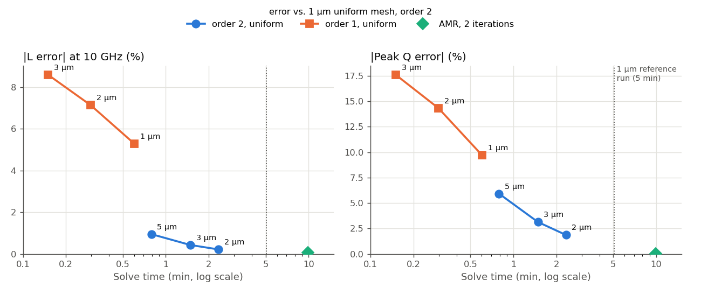

# How fine a mesh does this spiral inductor need? (IHP SG13G2)

This study asks a practical question for one specific layout: a small 4-turn spiral inductor, simulated from DC to 50 GHz. How fine must the Palace mesh be to get its inductance and Q factor right? And do the two shortcuts people reach for, a cheaper FEM order or adaptive mesh refinement, help here?

We answer this in three steps:

1. **Refine a uniform mesh** from 5 µm to 1 µm and see how L and Q respond.
2. **Cross-check the finest result** with adaptive mesh refinement (AMR), to know whether 1 µm is converged.
3. **Try FEM order 1** as a fast alternative, and compare everything on accuracy vs. cost.

The findings apply to this inductor, with this stackup, in this frequency range. Other structures can behave quite differently. The [overview page](../README.md) collects the other mesh studies.

## The details of this study

- **Model:** `ind_frame_with_ports.gds`, stackup `SG13G2_200um.xml`
- **Ports:** 2 via ports (Metal1 → TopMetal2), Z0 = 50 Ω, de-embedded (port parasitic inductance removed) in all results shown, evaluated as one differential pair
- **Solver:** AWS Palace (FEM), ABC boundaries, 20 µm margin, order 2 unless noted
- **Sweep:** 0–50 GHz in 0.5 GHz steps (adaptive frequency sweep)
- **Execution:** `hpz2`, 16 of 32 cores

## 0. Layout


A 4-turn square spiral on TopMetal2, 5 µm trace width and 5 µm spacing, about 100 × 115 µm. Neighboring turns carry current in the same direction. The field between them therefore changes less sharply than in a differential (symmetric) inductor, where neighboring traces carry opposite currents. We would expect this to make the structure relatively easy to mesh.

**What we look at.** From the two ports we form the differential impedance Zdiff = Z11 − Z12 − Z21 + Z22 and read:

- **Inductance** L = Im(Zdiff)/ω
- **Q factor** Q = Im(Zdiff)/Re(Zdiff)

## 1. Uniform mesh refinement: L is easy, Q is not

We ran the model at `refined_cellsize` = 5, 3, 2 and 1 µm, all at FEM order 2.



- **Inductance barely depends on the mesh.** At 10 GHz, even the 5 µm mesh is within 1% of the 1 µm result (0.768 vs. 0.775 nH). Only near the upper sweep limit, where L rises toward self-resonance, do the curves spread out.
- **Q is clearly more sensitive.** The peak Q (21.6 at about 24 GHz with the 1 µm mesh) comes out 6% low at 5 µm, 3% low at 3 µm and 2% low at 2 µm. The error is in the resistance: at 1 GHz all meshes agree on R within 0.2%, but at 10 GHz the 5 µm mesh reports 3% more resistance than the 1 µm mesh. A plausible reason is that a coarse mesh cannot follow how the current crowds toward the trace edges at higher frequency.

Each refinement step closes a good part of the remaining gap, so the uniform mesh is converging.

| Mesh | DOF | Solve time | Peak RAM |
|---|---:|---:|---:|
| 5 µm | 161,484 | 48 s | 2.51 GB |
| 2 µm | 429,096 | 2m 20s | 5.37 GB |
| 1 µm | 881,044 | 5m 5s | 9.47 GB |

## 2. Is 1 µm converged? Cross-check with AMR

AMR starts from the 5 µm mesh and lets Palace refine wherever its own error estimate is largest. After 2 refinement passes, it lands on nearly the same answer as the 1 µm uniform mesh:

| | L at 10 GHz | Peak Q | Max\|ΔS\| vs. 1 µm |
|---|---:|---:|---:|
| 1 µm uniform | 0.7750 nH | 21.58 | (reference) |
| AMR, 2 iterations | 0.7756 nH | 21.57 | 0.0024 |

L agrees within 0.1% and Q within 0.05%. Since two different refinement strategies reach the same result, we treat the 1 µm result as converged for this inductor and use it as the reference below.

## 3. Order 1 as a shortcut? Accuracy vs. cost

FEM order 1 uses simpler basis functions: about 5× fewer unknowns on the same mesh, and runs 8–10× faster. We re-ran the 3, 2 and 1 µm meshes at order 1. The chart shows every run's error against the 1 µm order-2 reference, over its solve time:



- **Order 1 is fast, but it is much less accurate here.** At 3 µm it underestimates L by 9% and peak Q by 18%. Refining the order-1 mesh helps (1 µm: L −5%, Q −10%), but it is still far from the order-2 results.
- **Order 2 on a coarse mesh beats order 1 on a fine mesh.** The 5 µm order-2 run takes about as long as the 1 µm order-1 run (48 s vs. 36 s), but its errors are 5× smaller for L and less than half for Q.
- **AMR reaches the reference accuracy, at about twice the cost** of simply running the 1 µm mesh (9m 54s total vs. 5m 5s, and 11.2 vs. 9.5 GB). Here it is a good cross-check, but not a shortcut.

| Variant | Solve time | L error at 10 GHz | Peak Q error |
|---|---:|---:|---:|
| 1 µm, order 1 | 36 s | −5.3% | −9.7% |
| 5 µm, order 2 | 48 s | −0.9% | −5.9% |
| 2 µm, order 2 | 2m 20s | −0.2% | −1.9% |
| 1 µm, order 2 | 5m 5s | (reference) | (reference) |
| AMR, 2 iterations | 9m 54s | +0.1% | −0.05% |

## Summary for this inductor

- **For inductance alone, a 5 µm order-2 mesh is enough** (within 1%, under a minute).
- **For Q, use 2 µm** (within 2%, about 2 minutes) during design, and **1 µm for final numbers**. Here, 1 µm agrees with AMR within a fraction of a percent.
- **Don't use order 1 for L or Q of this inductor.** Refining the mesh reduces its error, but even at 1 µm it is larger than that of a 5 µm order-2 run that costs about the same.

These numbers belong to this layout. A differential inductor, tighter spacing or a different frequency range can shift them. Running one medium and one fine mesh and comparing Q is the minimum check.

## Files

```
mesh_convergence_inductor/
├── palace_ind_frame.py                         # original model
├── palace_ind_frame_mesh{5,3,2,1}.py            # uniform mesh, order 2
├── palace_ind_frame_mesh{3,2,1}_order1.py       # uniform mesh, order 1
├── palace_ind_frame_amr2.py                     # AMR, 5 µm start, 2 iterations
├── palace_model/palace_ind_frame_<name>_data/   # mesh, config and full Palace output per run
└── results/
    ├── story_plots.py                # the story_*.png plots and numbers in this report
    ├── analyze_convergence.py        # detailed ΔS tables (CSV) and S-parameter overlays
    ├── plot_inductor_convergence.py  # L/Q/R overlays and delta_LQ_table.csv
    ├── order_comparison.py           # order 1 vs. order 2 overlays and timing table
    ├── delta_S_table.csv, delta_S_vs_finest.csv, delta_LQ_table.csv, order_comparison_table.csv
    ├── snp/                          # de-embedded 2-port Touchstone files, one per run
    │                                 #   (the AMR iteration files ind_frame_amr2_iter1..2 are raw)
    └── plots/
```

Run the scripts from this folder in the `d:\venv\palace` venv to regenerate plots and tables from the archived Touchstone files.
