# Mesh Convergence Study: ind_frame spiral inductor (IHP SG13G2)

- **Model:** `ind_frame_with_ports.gds`, stackup `SG13G2_200um.xml`
- **Solver:** AWS Palace (FEM), ABC boundaries, 20 µm margin, order 2 unless noted
- **Sweep:** 0–50 GHz (auto-shifted to 0.01 GHz start), 0.5 GHz step, Palace's PROM-based adaptive frequency sweep (only a small number of sample points are actually solved to cover the full requested sweep)
- **Ports:** 2 via ports (Metal1→TopMetal2), Z0 = 50 Ω, evaluated as a single differential pair (`Zdiff = Z11-Z12-Z21+Z22`), the same convention as `D:\github\plot_inductor\plot_inductor.py`
- **Execution:** remote solve on `hpz2` (`mpirun -n 16` of 32 cores, 109 GB RAM), jobs run sequentially

## 0. Layout

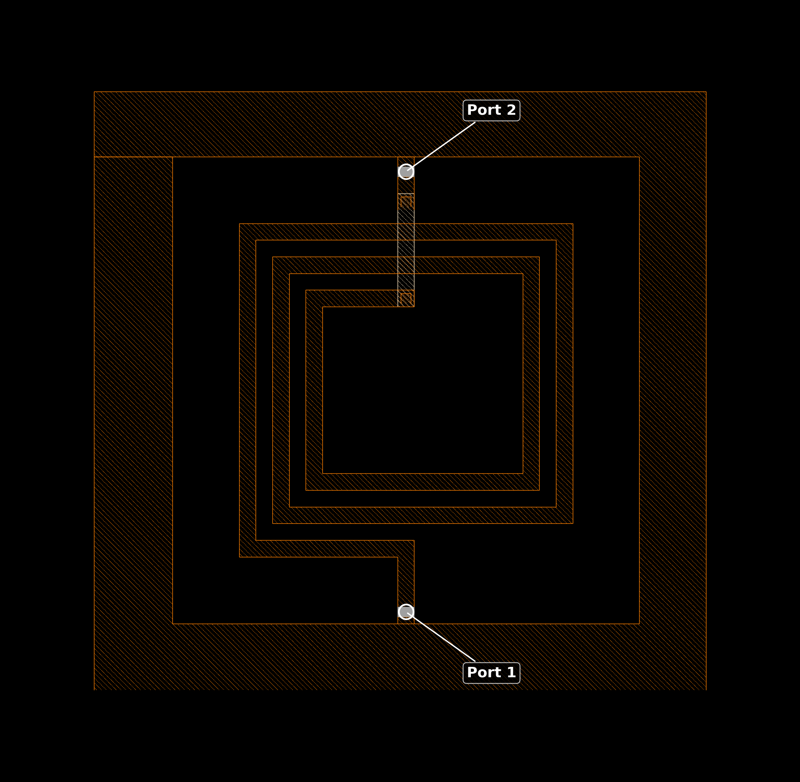

Measured directly from the GDS (KLayout, layer 134/TopMetal2): a single-polygon, 4-turn square spiral, 5 µm trace width, 5 µm spacing (10 µm pitch), ~100×115 µm footprint. Port 1 and Port 2 are via ports (Metal1→TopMetal2) at the two coil terminals — this is a plain 2-port inductor, so the L/Q/S-parameter analysis below treats ports 1,2 directly as the differential pair (`Zdiff = Z11-Z12-Z21+Z22`), with no port-reduction step needed.

## 1. Method

Eight model variants were generated from a common template (`palace_ind_frame.py`):

- **Uniform mesh sweep (order 2):** `refined_cellsize` = 5, 3, 2, 1 µm, `adaptive_mesh_iterations=0`.
- **Adaptive mesh refinement (AMR, order 2):** `refined_cellsize=5` (starting mesh), `adaptive_mesh_iterations=2`.
- **Order comparison:** the same 3, 2, 1 µm cell sizes re-run at `order=1`, to compare solve time/DOF against the order 2 sweep at matching mesh density (§6).

Model files: `palace_ind_frame_mesh{1,2,3,5}.py`, `palace_ind_frame_amr2.py`, `palace_ind_frame_mesh{1,2,3}_order1.py` (all in `more_examples/mesh_convergence/mesh_convergence_inductor/`).

## 2. Uniform mesh sweep — results (order 2)

| Mesh | DOF | Mesh elements | Solve time | Peak RAM | Error indicator norm | Error indicator max |
|---|---:|---:|---:|---:|---:|---:|
| 5 µm | 161,484 | 23,333 | 47.5 s | 2.51 GB | 1.528e-01 | 9.419e-03 |
| 3 µm | 284,030 | 41,082 | 1m 29s | 3.77 GB | 1.205e-01 | 5.622e-03 |
| 2 µm | 429,096 | 62,016 | 2m 20s | 5.37 GB | 1.029e-01 | 5.022e-03 |
| 1 µm | 881,044 | 125,218 | 5m 5s | 9.47 GB | 8.033e-02 | 4.659e-03 |

DOF, time, and RAM all grow smoothly with refinement, with no instability anywhere in this range.

## 3. Adaptive mesh refinement — results

Starting mesh: 5 µm. Requested `adaptive_mesh_iterations=2`.

| Iteration | DOF | Mesh elements | Error Norm | Error Max | Max \|ΔS\| vs. prev. | Time (cumulative) | Peak RAM |
|---|---:|---:|---:|---:|---:|---:|---:|
| 1 | 161,484 | 23,333 | 1.528e-01 | 9.419e-03 | n/a | 48.0 s | 2.62 GB |
| 2 | 294,110 | 49,429 | 1.125e-01 | 3.424e-03 | 0.0146 | 2m 42s | 4.18 GB |
| **Final** | **863,146** | **151,006** | **7.422e-02** | **1.762e-03** | **0.0102** | **9m 54s** | **11.16 GB** |

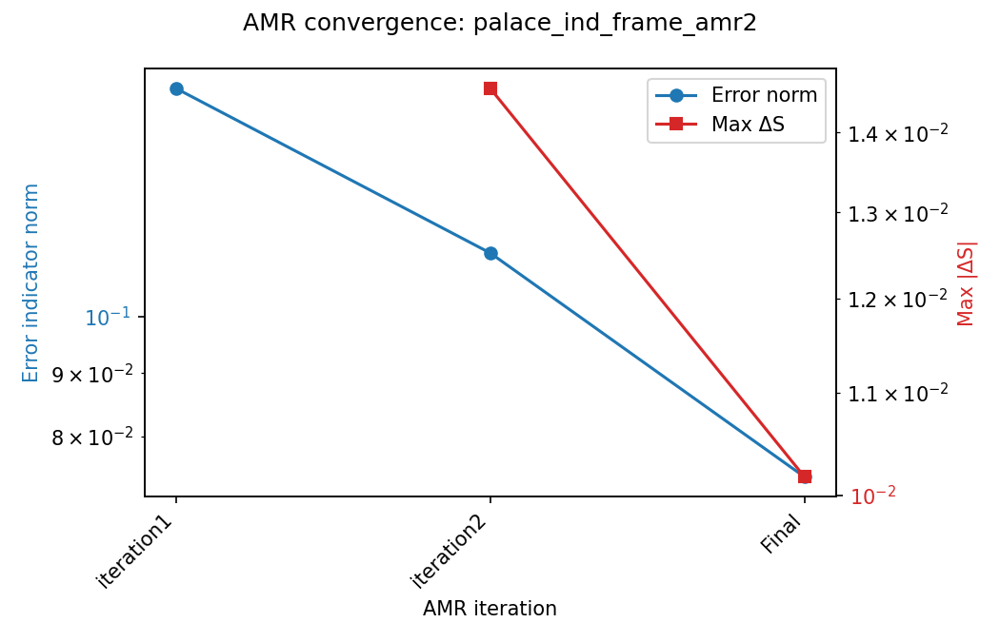

Iteration 1 matches the 5 µm uniform mesh run exactly, as expected. Both the error-indicator norm and Max|ΔS| keep decreasing through the final iteration here — unlike a run given a larger iteration budget, this 2-iteration run doesn't show a clear "diminishing returns" plateau; the final iteration still delivers a meaningful accuracy gain (Max|ΔS| more than halves, from 0.0146 to 0.0102).

## 4. S-parameters

This is a plain 2-port network (no mixed-mode reduction needed). S12 is not shown separately (S12 = S21 by reciprocity for this passive structure).

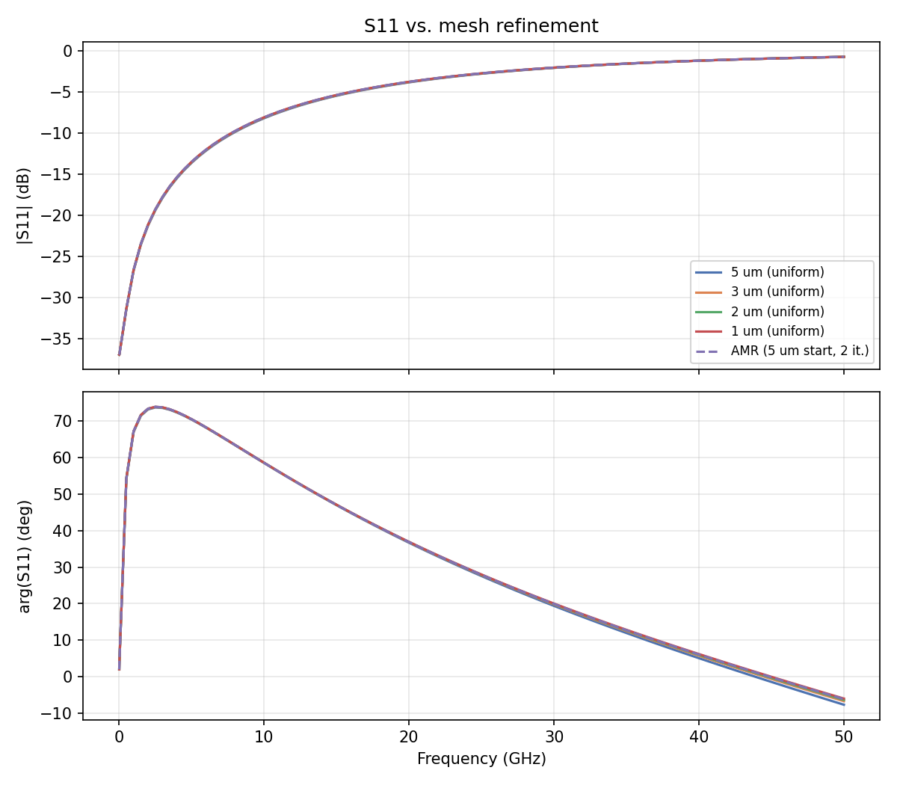
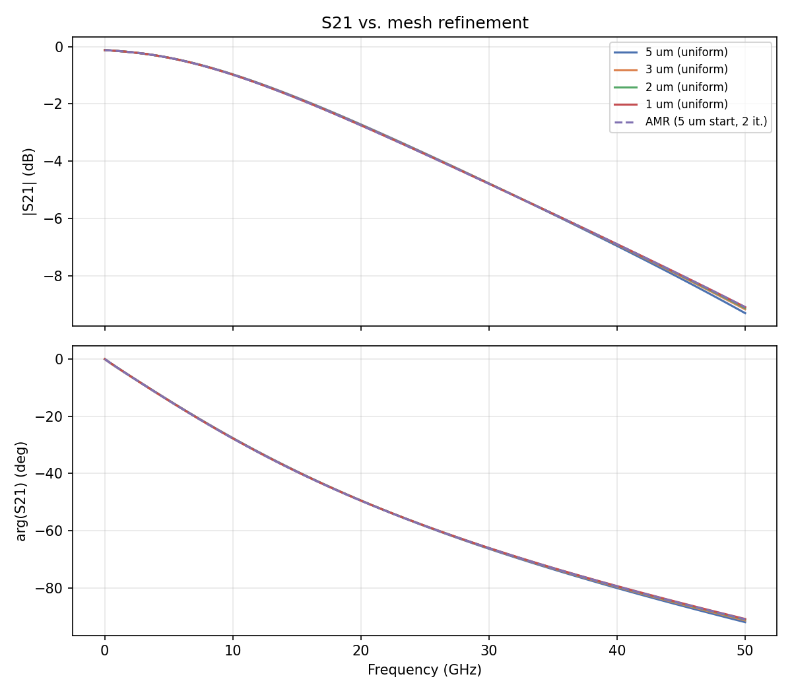
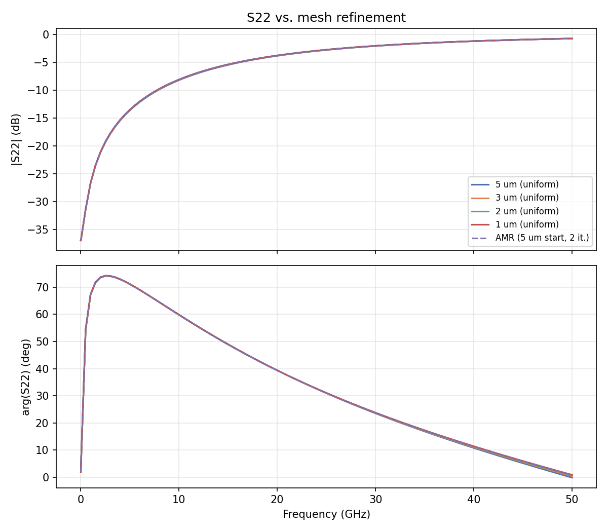

### 4a. Successive mesh steps

| Param | Comparison | Max\|ΔS\| (linear) | \|ΔS\|@1GHz (dB) | \|ΔS\|@25GHz (dB) | \|ΔS\|@50GHz (dB) |
|---|---|---:|---:|---:|---:|
| S11 | 5→3 µm | 0.0158 | 0.0497 | 0.0212 | 0.0118 |
| S11 | 3→2 µm | 0.0058 | 0.0235 | 0.0106 | 0.0030 |
| S11 | 2→1 µm | 0.0056 | 0.0198 | 0.0122 | 0.0005 |
| S11 | 1µm→AMR final | 0.0024 | 0.0025 | 0.0009 | 0.0000 |
| S21 | 5→3 µm | 0.0065 | 0.0001 | 0.0124 | 0.1343 |
| S21 | 3→2 µm | 0.0025 | 0.0000 | 0.0072 | 0.0432 |
| S21 | 2→1 µm | 0.0019 | 0.0001 | 0.0070 | 0.0341 |
| S21 | 1µm→AMR final | 0.0007 | 0.0001 | 0.0018 | 0.0022 |
| S22 | 5→3 µm | 0.0080 | 0.0495 | 0.0216 | 0.0115 |
| S22 | 3→2 µm | 0.0051 | 0.0237 | 0.0109 | 0.0028 |
| S22 | 2→1 µm | 0.0035 | 0.0204 | 0.0125 | 0.0005 |
| S22 | 1µm→AMR final | 0.0010 | 0.0021 | 0.0009 | 0.0000 |

### 4b. Every mesh vs. the finest uniform mesh (1 µm) as reference

| Param | Mesh | Max\|ΔS\| vs. 1 µm (linear) | \|ΔS\|@1GHz (dB) | \|ΔS\|@25GHz (dB) | \|ΔS\|@50GHz (dB) |
|---|---|---:|---:|---:|---:|
| S11 | 5 µm | 0.0271 | 0.0930 | 0.0440 | 0.0153 |
| S11 | 3 µm | 0.0113 | 0.0433 | 0.0228 | 0.0036 |
| S11 | 2 µm | 0.0056 | 0.0198 | 0.0122 | 0.0005 |
| S11 | AMR final | 0.0024 | 0.0025 | 0.0009 | 0.0000 |
| S21 | 5 µm | 0.0108 | 0.0002 | 0.0266 | 0.2116 |
| S21 | 3 µm | 0.0044 | 0.0001 | 0.0142 | 0.0773 |
| S21 | 2 µm | 0.0019 | 0.0001 | 0.0070 | 0.0341 |
| S21 | AMR final | 0.0007 | 0.0001 | 0.0018 | 0.0022 |
| S22 | 5 µm | 0.0165 | 0.0936 | 0.0450 | 0.0149 |
| S22 | 3 µm | 0.0086 | 0.0441 | 0.0234 | 0.0034 |
| S22 | 2 µm | 0.0035 | 0.0204 | 0.0125 | 0.0005 |
| S22 | AMR final | 0.0010 | 0.0021 | 0.0009 | 0.0000 |

S21 shows a much larger spread at the 50 GHz sweep edge than at 1 or 25 GHz (up to 0.21 dB for the 5 µm mesh) — the coarser meshes lose accuracy faster as frequency increases. The AMR final result sits closer to the 1 µm reference than the 2 µm uniform mesh does, on every parameter and at every listed frequency.

## 5. Inductance, Q factor, and resistance (plot_inductor method)

Evaluated the same way as `D:\github\plot_inductor\plot_inductor.py`: `Zdiff = Z11-Z12-Z21+Z22`, `Ldiff = Im(Zdiff)/ω`, `Qdiff = Im(Zdiff)/Re(Zdiff)`, `Rdiff = Re(Zdiff)`.

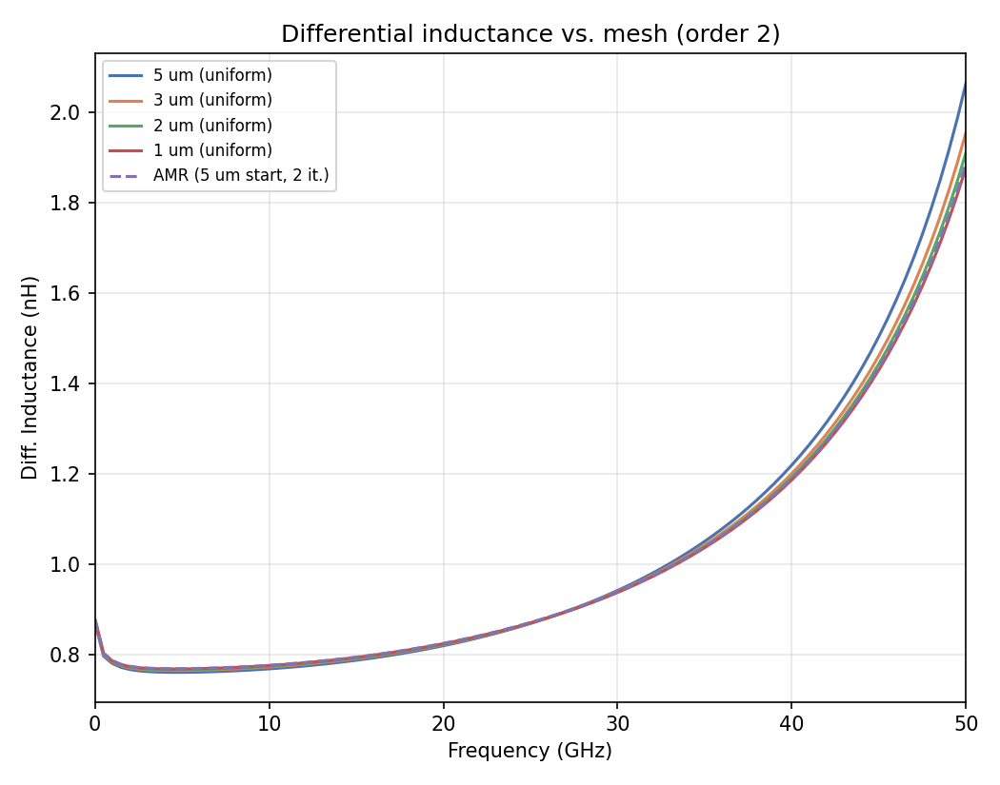
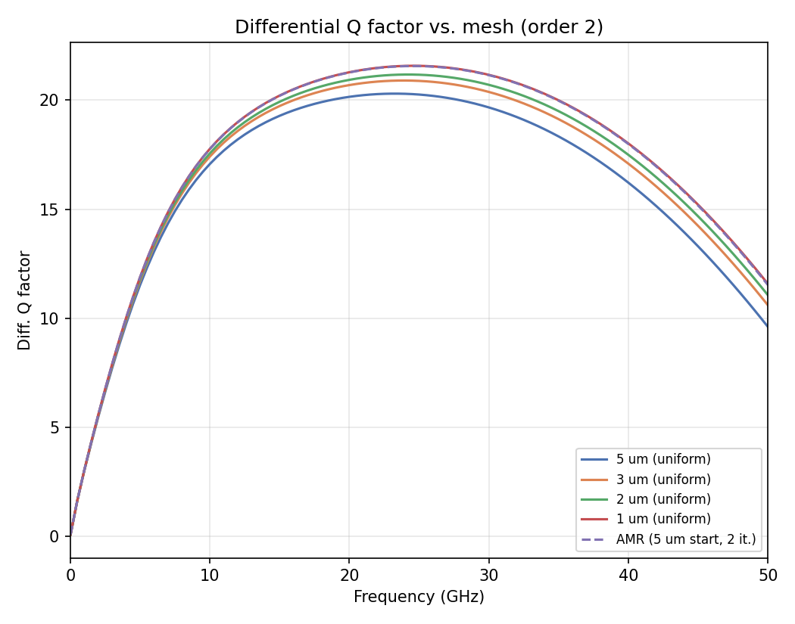
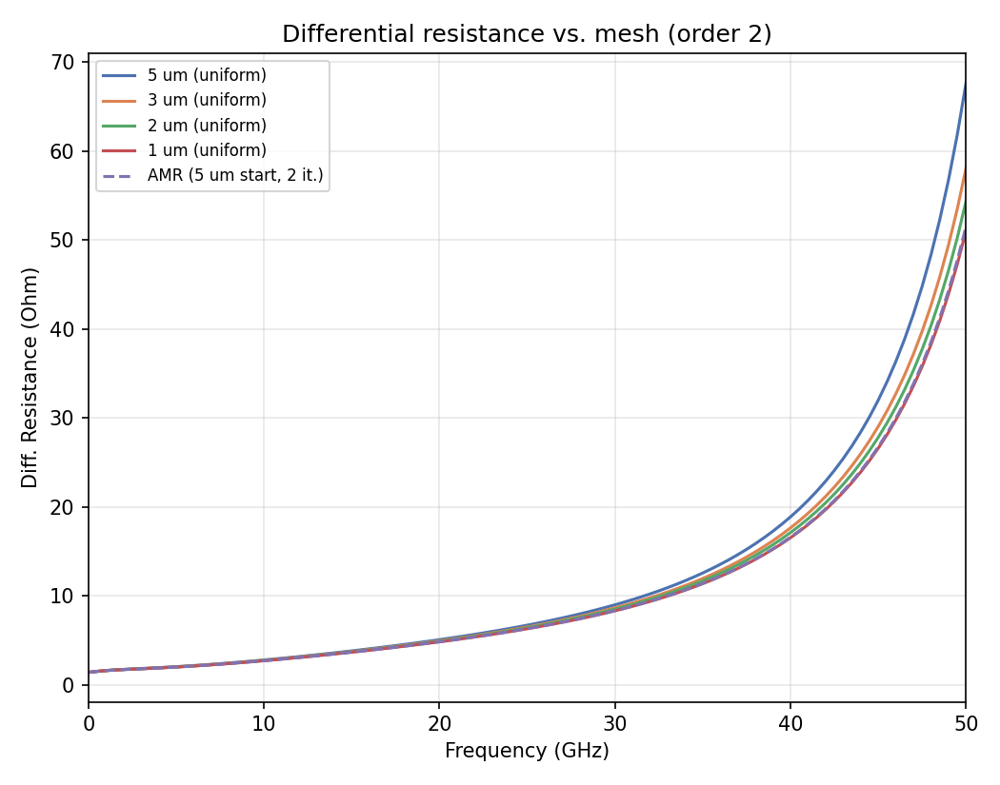

With the sweep now extending to 50 GHz, the full Q curve is visible: **Q peaks at ~21.6 around 24 GHz** (finest mesh) and falls off on both sides. Inductance stays in a shallow bowl (~0.76-0.79 nH) from 1-10 GHz, then rises steeply above ~30 GHz toward a self-resonance that lies above the 50 GHz sweep limit (L reaches ~1.9-2.1 nH at 50 GHz without crossing zero).

| Freq (GHz) | Mesh | L (nH) | L vs. 1 µm | Q | Q vs. 1 µm |
|---:|---|---:|---:|---:|---:|
| 1 | 5 µm | 0.7796 | −0.72% | 2.99 | −0.89% |
| 1 | 3 µm | 0.7828 | −0.32% | 3.01 | −0.38% |
| 1 | 2 µm | 0.7842 | −0.15% | 3.01 | −0.20% |
| 1 | AMR final | 0.7860 | +0.09% | 3.02 | +0.06% |
| 10 | 5 µm | 0.7677 | −0.95% | 17.07 | −3.92% |
| 10 | 3 µm | 0.7717 | −0.43% | 17.41 | −2.00% |
| 10 | 2 µm | 0.7734 | −0.22% | 17.56 | −1.17% |
| 10 | AMR final | 0.7756 | +0.07% | 17.76 | −0.04% |
| 25 | 5 µm | 0.8683 | −0.14% | 20.26 | −6.11% |
| 25 | 3 µm | 0.8689 | −0.07% | 20.88 | −3.20% |
| 25 | 2 µm | 0.8690 | −0.06% | 21.17 | −1.89% |
| 25 | AMR final | 0.8705 | +0.11% | 21.56 | −0.05% |

Inductance is well converged even at the coarsest (5 µm) mesh (within ~1%), while Q shows more sensitivity to mesh coarseness near its peak (5 µm mesh is 6.1% low at 25 GHz). The AMR final result tracks the 1 µm reference more tightly than any of the uniform meshes on both L and Q (within 0.1% throughout).

## 6. Order 1 vs. order 2 comparison

The same 3/2/1 µm cell sizes were re-run at FEM order 1 instead of order 2, to see the timing trade-off.

| Cell size | Order | DOF | Mesh elements | Solve time | Peak RAM |
|---:|---:|---:|---:|---:|---:|
| 3 µm | 1 | 54,981 | 41,082 | 9.0 s | 2.15 GB |
| 3 µm | 2 | 284,030 | 41,082 | 1m 29s | 3.77 GB |
| 2 µm | 1 | 83,121 | 62,016 | 17.9 s | 3.18 GB |
| 2 µm | 2 | 429,096 | 62,016 | 2m 20s | 5.37 GB |
| 1 µm | 1 | 172,335 | 125,218 | 36.1 s | 5.32 GB |
| 1 µm | 2 | 881,044 | 125,218 | 5m 5s | 9.47 GB |

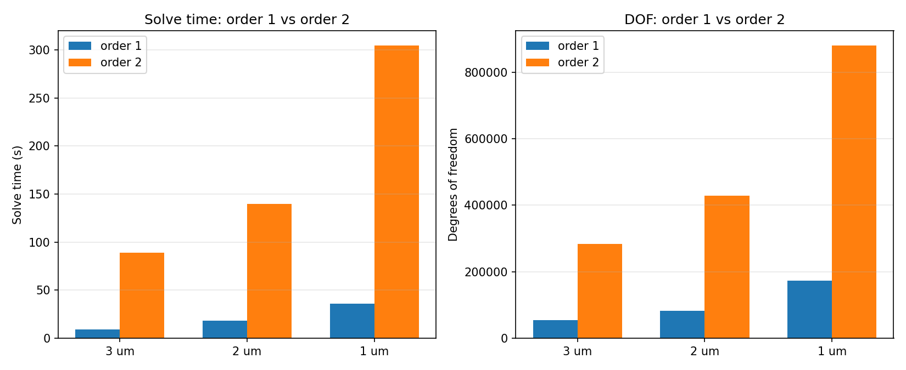
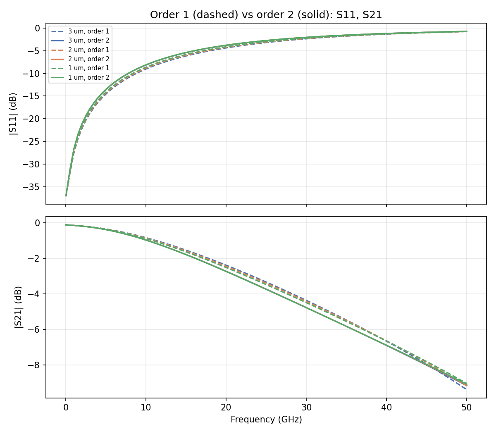
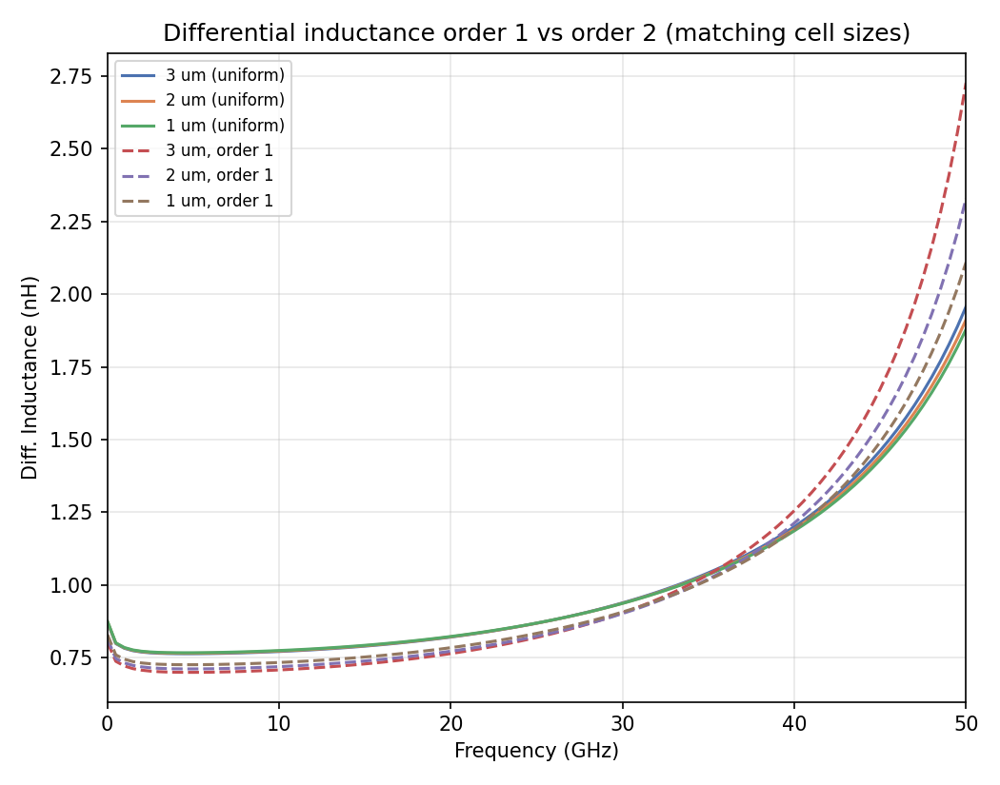
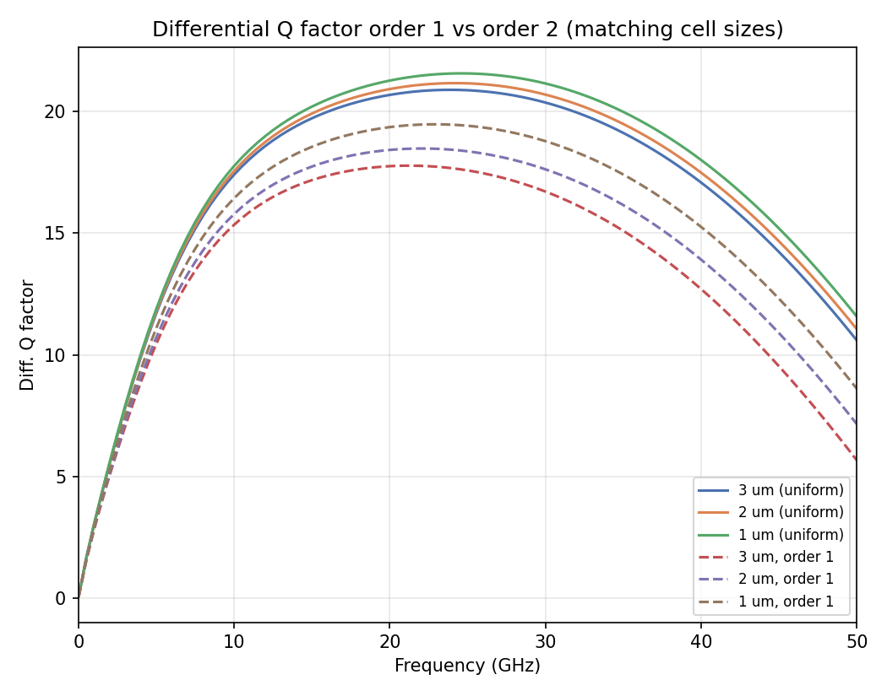
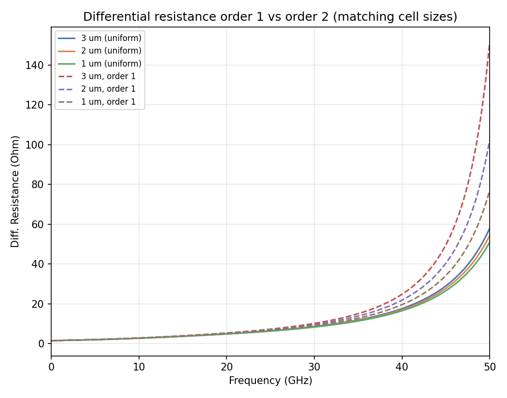

Order 1 is consistently ~5.2× fewer DOF and roughly 8-10× faster than order 2 at the same mesh (same mesh element count, since `refined_cellsize` — not order — drives meshing; only the FEM basis function order changes), at 40-60% of the RAM.

The L/Q/R plots show a small but systematic offset between order 1 and order 2 that does **not** shrink as the order-1 mesh is refined from 3→2→1 µm — the three order-1 traces stay bunched together, offset from the three order-2 traces. This is the signature of a basis-function-order truncation error rather than a mesh-discretization error: it cannot be closed by refining an order-1 mesh further, only by switching to order 2.

## 7. Discussion

- **Inductance converges quickly with mesh refinement** — even the 5 µm mesh is within ~1% of the 1 µm reference — while **Q is more sensitive near its peak**, showing a 6% deviation at the coarsest mesh.
- **The AMR run (5 µm start, 2 iterations) reaches accuracy at or beyond the 1 µm uniform mesh** on both S-parameters and L/Q, without needing the 1 µm cell size chosen in advance — starting from the much coarser 5 µm mesh, two refinement passes land closer to the finest-mesh answer than the 2 µm uniform run does, though at a higher wall-clock cost (9m 54s) and RAM (11.16 GB) than running the 1 µm uniform mesh directly (5m 5s, 9.47 GB) in this case.
- **2 µm uniform mesh, order 2** is a reasonable middle ground for quick iteration: within 0.6-1.9% of the 1 µm reference on L/Q at a fraction of the 1 µm run's cost (2m 20s vs. 5m 5s).
- **Order 1 gives a large speed-up (8-10×) but carries a fixed offset** in L/Q/S-parameters that further mesh refinement does not remove — useful for a quick early look, not for final numbers.

## 8. Where everything lives

```
more_examples/mesh_convergence/mesh_convergence_inductor/
├── mesh_convergence_report.md                  # this report
├── palace_ind_frame.py                         # original test case
├── palace_ind_frame_mesh{1,2,3,5}.py            # uniform mesh model scripts, order 2
├── palace_ind_frame_amr2.py                     # AMR model script, 5 um start, 2 iterations
├── palace_ind_frame_mesh{1,2,3}_order1.py       # order 1 comparison model scripts
├── palace_model/palace_ind_frame_<name>_data/   # generated mesh/config + full Palace output
│     (config.json, .msh, palace.json, port-S.csv, error-indicators.csv, ...)
└── results/
    ├── delta_S_table.csv, delta_S_vs_finest.csv # §4a/4b
    ├── delta_LQ_table.csv                       # §5 (L/Q vs. 1 um reference)
    ├── order_comparison_table.csv               # §6
    ├── analyze_convergence.py                   # regenerates the S-parameter CSVs/plots
    ├── plot_inductor_convergence.py             # regenerates the L/Q/R CSVs/plots (§5)
    ├── order_comparison.py                      # regenerates §6's table/plots
    ├── render_labeled_layout.py                 # regenerates the labeled layout picture (§0)
    ├── snp/                                     # de-embedded 2-port Touchstone files
    │     ind_frame_mesh{1,2,3,5}.s2p, ind_frame_mesh{1,2,3}_order1.s2p
    │     ind_frame_amr2_iter1.s2p, ind_frame_amr2_iter2.s2p, ind_frame_amr2_final.s2p
    └── plots/
          ind_frame_layout_labeled.png                          # §0
          s11_convergence.png, s21_convergence.png, s22_convergence.png  # §4
          amr2_convergence.png                                   # §3
          inductor_LQR_convergence_{l,q,r}.png                   # §5
          order_comparison_time_dof.png, order_comparison_s_params.png  # §6
          inductor_LQR_order_comparison_{l,q,r}.png              # §6
```

Re-run `python results/analyze_convergence.py`, `python results/plot_inductor_convergence.py`, and `python results/order_comparison.py` from `more_examples/mesh_convergence/mesh_convergence_inductor/` (in the `d:\venv\palace` venv) any time to regenerate the tables and plots from the archived `.snp`/`palace.json` files.
