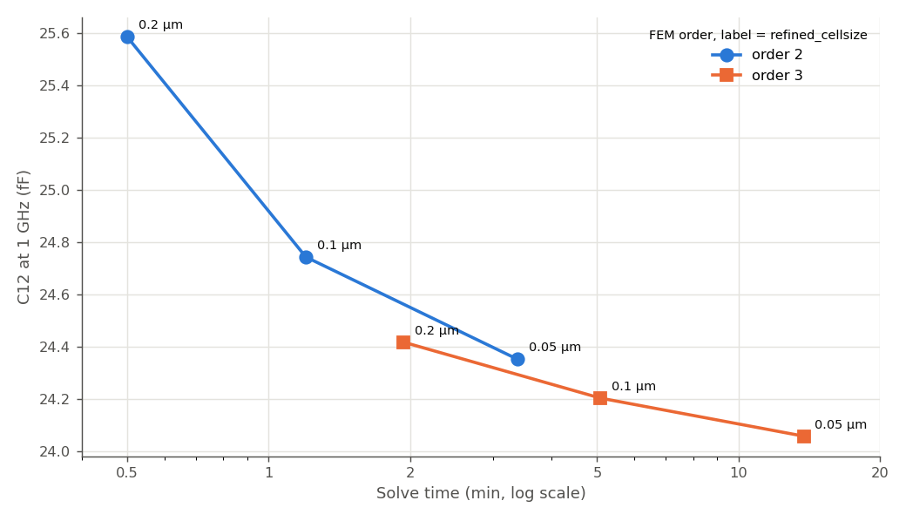

# How fine a mesh does this MOM capacitor need? (IHP SG13CMOS5L)

This study asks a practical question for one specific layout: a small interdigitated MOM capacitor on IHP's new **SG13CMOS5L** stackup. How fine must the Palace mesh be to get its capacitance right, and is FEM order 2 enough, or does order 3 pay off?

We answer this in three steps:

1. **Refine the mesh at order 2** from 0.2 µm to 0.05 µm and watch the capacitance.
2. **Repeat at order 3**, as an independent route to the answer.
3. **Compare both on accuracy vs. cost.**

The findings apply to this capacitor, with this stackup. Other structures can behave quite differently. The [overview page](../README.md) collects the other mesh studies.

## The details of this study

- **Model:** `c4_frame_ports.gds`, stackup `SG13CMOS5L_150um.xml`
- **Ports:** 2 via ports (Metal1 → Metal4), Z0 = 50 Ω. Raw S/Y-parameters, no de-embedding. The port parasitics are the same in every run, so they don't affect the comparison, but absolute values shouldn't be compared with de-embedded results from other studies.
- **Solver:** AWS Palace 0.16 (FEM), ABC boundaries, 10 µm margin
- **Frequency:** single point at 1 GHz. One extra run sweeps 0–50 GHz (see the end of step 3).
- **Execution:** `hpz2`, 16 of 32 cores

## 0. Layout


The capacitor is built from fingers on Metal1 to Metal4, with the finger direction rotated by 90° from one metal layer to the next. This uses both the lateral coupling between fingers and the vertical coupling between layers. Fingers are 0.16–0.20 µm wide with 0.18–0.21 µm gaps, much finer than in the other studies here, which is why the mesh sizes are in tens of nanometers. P1 and P2 feed the capacitor from left and right. An outer metal frame surrounds it.

**What we look at.** The coupling capacitance between the two ports, from the Y-parameters: **C12 = −Im(Y12)/ω**. The S-parameters carry the same information: S11 hardly changes at all, and S21 changes in step with C12.

## 1. Order 2: refining the mesh

At order 2, C12 comes out at:

| Mesh | C12 | Change from previous step | Solve time |
|---|---:|---:|---:|
| 0.2 µm | 25.58 fF | | 30 s |
| 0.1 µm | 24.74 fF | −3.3% | 1m 12s |
| 0.05 µm | 24.35 fF | −1.6% | 3m 23s |

The capacitance **falls with every refinement**, and each step is about half the previous one. A coarse mesh overestimates the capacitance. The trend is clean, but at 0.05 µm (3–4 cells across a finger) it has not stopped yet.

## 2. Order 3: an independent route

Raising the FEM order improves accuracy without changing the mesh. At order 3:

| Mesh | C12 | Change from previous step | Solve time |
|---|---:|---:|---:|
| 0.2 µm | 24.42 fF | | 1m 56s |
| 0.1 µm | 24.20 fF | −0.9% | 5m 5s |
| 0.05 µm | 24.06 fF | −0.6% | 13m 46s |

Order 3 falls the same way, but in much smaller steps: it starts close to where order 2 ends. Even the finest order-2 result is still 1.2% above the finest order-3 result. **The best estimate here is 24.06 fF** (order 3, 0.05 µm). Since that sequence is also still falling slowly, the true value is probably slightly lower.

## 3. Accuracy vs. cost

Putting both orders on one chart against solve time shows which route gets closer for the same effort:



- **At equal cost, order 3 wins.** Order 3 at 0.2 µm (2 minutes) is already close to order 2 at 0.05 µm (3.4 minutes), and order 3 at 0.1 µm (5 minutes) is better than any order-2 run.
- **Order 3 at 0.1 µm is a good working point for this capacitor**: within 0.6% of the best estimate, in 5 minutes.
- **Order 2 on a coarse mesh overestimates C12 noticeably**: +6% at 0.2 µm. That's fine for a first look, not for a final value.

**Frequency dependence.** A separate 0–50 GHz sweep at the coarsest setting (0.2 µm, order 2) shows C12 rising smoothly by 2.8% from DC to 50 GHz, with no resonance ([plot](results/plots/c12_vs_frequency.png)). The absolute level of that sweep carries the +6% coarse-mesh bias. Only its shape is meaningful.

## Summary for this capacitor

- **Capacitance converges from above**: coarser meshes and lower order both overestimate it.
- **Order 2 alone isn't enough when the exact value matters.** Even at the finest mesh it stays 1.2% above order 3.
- **Use order 3 at 0.1 µm** for this capacitor: within about 0.6% of the best estimate, in 5 minutes.

These numbers belong to this layout. Finger sizes, layer count and stackup all change them. For any capacitive structure, one order-3 run is a worthwhile check.

## Files

```
mesh_convergence_mom_cmos5l/
├── c4_frame_ports.gds, SG13CMOS5L_150um.xml       # layout and stackup
├── c4_frame_ports.py                              # base model
├── c4_frame_ports_mesh{200,100,50}nm.py           # order 2, fixed 1 GHz
├── c4_frame_ports_mesh{200,100,50}nm_order3.py    # order 3, fixed 1 GHz
├── c4_frame_ports_mesh200nm_sweep.py              # 0-50 GHz sweep, 0.2 µm, order 2
├── palace_model/c4_frame_ports_<name>_data/       # mesh, config and full Palace output per run
└── results/
    ├── story_plots.py             # the story_c12_vs_cost.png plot and numbers in this report
    ├── analyze_convergence.py     # C12 and ΔS tables (CSV), C12 and S-parameter plots
    ├── capacitance_convergence.csv, order_comparison.csv, c12_vs_frequency.csv
    ├── delta_S_table_order{2,3}.csv, delta_S_vs_finest_order{2,3}.csv
    ├── snp/                       # raw 2-port Touchstone files, one per run
    └── plots/
```

Run the scripts from this folder in the `d:\venv\palace` venv to regenerate plots and tables from the archived Touchstone files.
