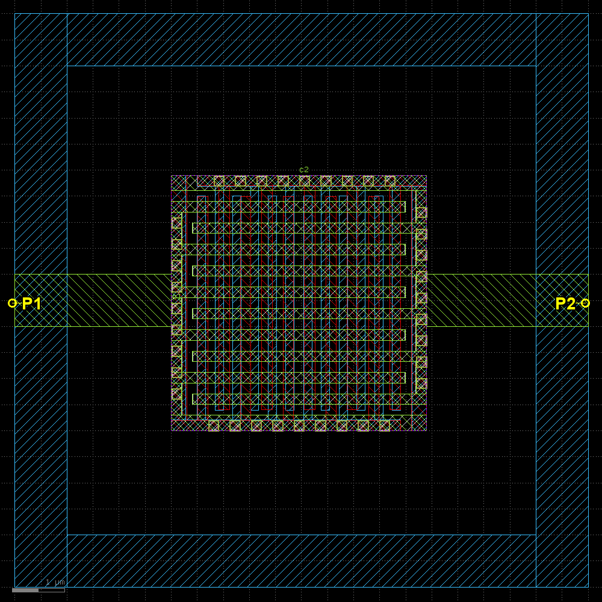
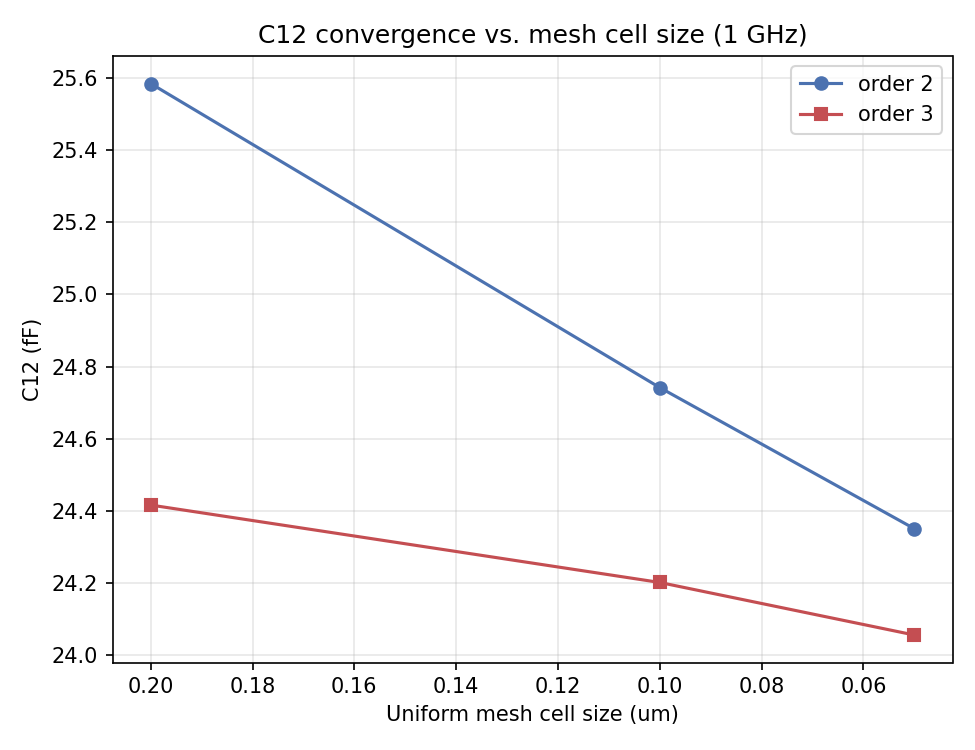
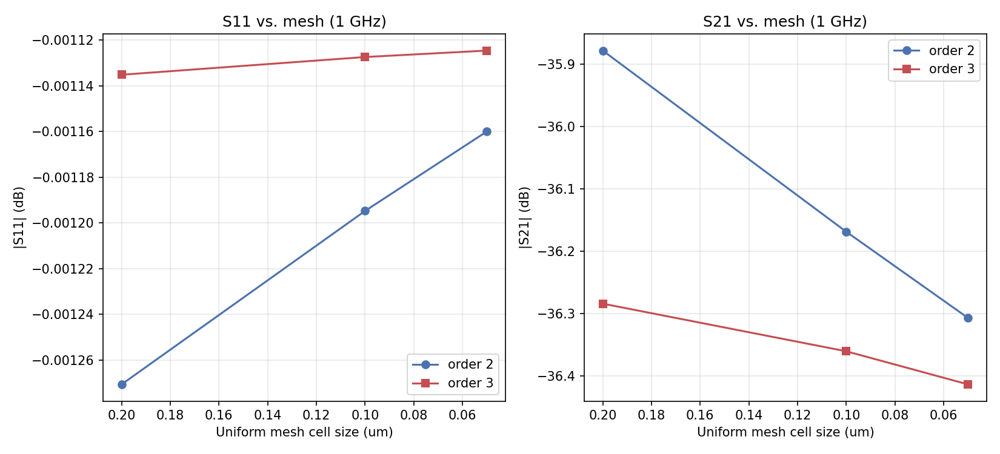
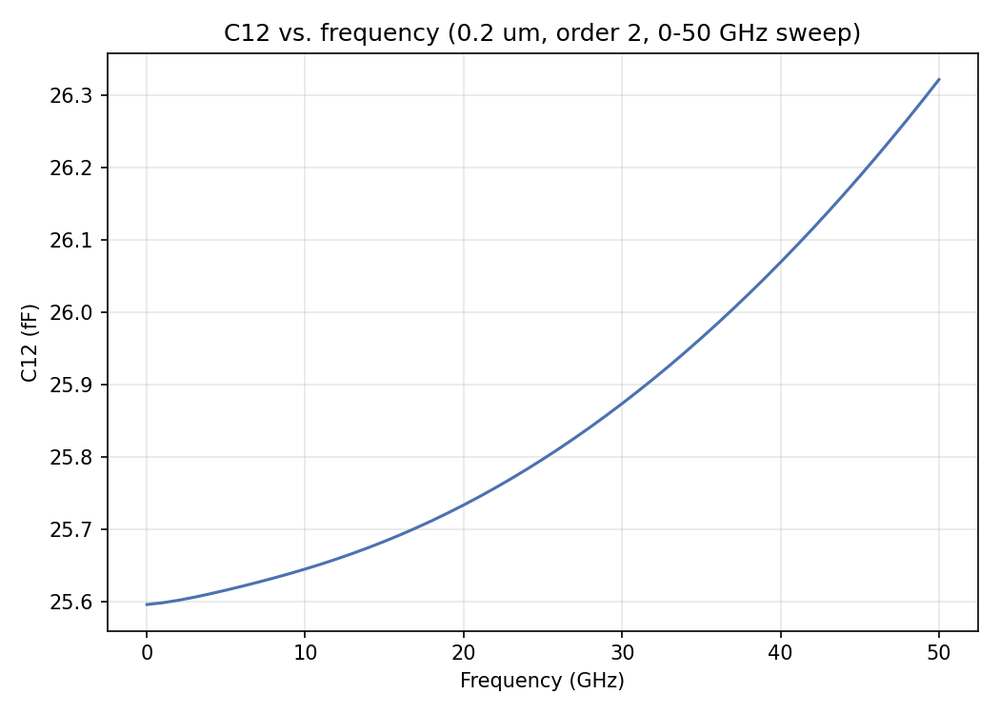

# Mesh Convergence Study: c4_frame_ports MOM capacitor (IHP SG13CMOS5L)

- **Model:** `c4_frame_ports.gds`, stackup `SG13CMOS5L_150um.xml` — IHP's new **SG13CMOS5L** offering (alongside SG13G2) in the IHP Open PDK
- **Solver:** AWS Palace (FEM), ABC boundaries, 10 µm margin/air-around
- **Frequency:** fixed single point, **1 GHz**, no sweep — for the 6 mesh/order convergence runs. One additional variant (§5) runs a 0-50 GHz sweep at the coarsest mesh/order 2, for documentation only, and is not part of the convergence metric.
- **Ports:** 2 via ports (Metal1→Metal4), Z0 = 50 Ω. **Raw S/Y-parameters only — no de-embedding applied**, unlike the other studies on this page.
- **Execution:** remote solve on `hpz2`, Spack-built Palace 0.16.0 (`run_palace_spack`, `mpirun -n 16` of 32 cores, 109 GB RAM), jobs run sequentially

Per the study brief, this report evaluates **C12** (the port1-port2 mutual/coupling capacitance) and **delta-S** convergence only. Palace's internal error-indicator Norm/Max is not reported — see the [top-level README](../README.md) for why. Solve time is included in §2 since it's directly useful for judging the mesh/order trade-off.

## 0. Layout



A square MOM capacitor test structure (cell `c2`): two via-port feeds (P1 at left, P2 at right, both Metal1→Metal4 vertical via stacks, ~1×2.6 µm each) run into a central interdigitated/finger MOM capacitor block, with an outer metal frame ring around it (only P1/P2 are excited in this 2-port model; the frame's exact electrical role — shield, unconnected fill, or tied to one plate — isn't determined from the GDS alone). Port separation is 11 µm center-to-center.

The finger pattern (measured directly from the GDS) uses **Metal1/Metal3 fingers running vertically (narrow in x) and Metal2/Metal4 fingers running horizontally (narrow in y) — a 90° rotation between each adjacent metal layer**, the standard technique for maximizing both lateral (finger-to-finger) and vertical (layer-to-layer crossing) coupling in a MOM cap. Finger width/gap: **0.16 µm / 0.18 µm** on Metal1 (0.34 µm pitch), **0.20 µm / 0.21 µm** on Metal2-4 (0.41 µm pitch) — all comfortably above this study's finest 0.05 µm mesh (3-4 cells across even the narrowest finger/gap).

## 1. Method

Seven model variants were generated from a common template (`c4_frame_ports.py`), all in `more_examples/mesh_convergence/mesh_convergence_mom_cmos5l/`:

- **Mesh/order cross (6 runs, fixed 1 GHz):** uniform `refined_cellsize` = 0.2, 0.1, 0.05 µm, each at Palace FEM `order` = 2 and `order` = 3 — `c4_frame_ports_mesh{200,100,50}nm.py` (order 2) and `c4_frame_ports_mesh{200,100,50}nm_order3.py` (order 3).
- **Frequency-sweep variant (1 run, documentation only):** `c4_frame_ports_mesh200nm_sweep.py`, same 0.2 µm/order 2 settings as the coarsest fixed-frequency run, but 0-50 GHz instead of a single point — shows how C12 varies with frequency (§5), not used for the mesh-convergence comparisons in §2-4.

No adaptive mesh refinement (AMR) was used — this study only compares uniform-mesh cell sizes and FEM order.

C12 is extracted from the raw Y-parameters as **C12 = -Im(Y12) / (2·π·f)**.

## 2. C12 convergence

| Order | Mesh (µm) | C12 (fF) | Δ vs. next-finer | Δ vs. finest (same order) | Solve time |
|---:|---:|---:|---:|---:|---:|
| 2 | 0.2 | 25.584 | −3.29% | +5.06% | 30 s |
| 2 | 0.1 | 24.742 | −1.58% | +1.60% | 1m 12s |
| 2 | 0.05 | 24.351 | — | — | 3m 23s |
| 3 | 0.2 | 24.417 | −0.88% | +1.50% | 1m 56s |
| 3 | 0.1 | 24.202 | −0.60% | +0.61% | 5m 5s |
| 3 | 0.05 | 24.057 | — | — | 13m 46s |



Both orders converge monotonically as the mesh refines, from above (coarser mesh over-estimates C12 in both cases). Order 3 converges both **faster** (0.2→0.05 µm changes C12 by 1.5% at order 3 vs. 5.1% at order 2) and to a **lower** value (0.29 fF, ~1.2%, below order 2's finest-mesh result) — consistent with order 2 still carrying a small basis-function-order truncation error on top of its mesh-discretization error, at least at this geometry scale. Order 3 at 0.05 µm is the best available estimate: **24.06 fF**.

Solve time grows quickly with both finer mesh and higher order — order 3 at the finest mesh (13m 46s) is the most expensive run by a wide margin, roughly 4× its order-2 counterpart at the same mesh and ~27× the coarsest order-2 run — for a further 0.6% change in C12 over the 0.1 µm/order-3 result. Whether that's worth it depends on how tight a tolerance the downstream use needs; 0.1 µm/order 3 (5m 5s, within 0.6% of the finest result) is a reasonable middle ground.

## 3. Delta-S

This is a plain 2-port network; S12 is not shown separately (S12 = S21 by reciprocity). Since each fixed-frequency run has only the single 1 GHz point, `Max|ΔS|` (linear) and the dB delta at 1 GHz describe the same comparison.



### 3a. Vs. finest mesh, same order

| Param | Mesh | \|ΔS\| (linear) | \|ΔS\|@1GHz (dB) |
|---|---|---:|---:|
| S11 | 0.2 µm, order 2 | 0.000785 | 0.0001 |
| S11 | 0.1 µm, order 2 | 0.000249 | 0.0000 |
| S21 | 0.2 µm, order 2 | 0.000774 | 0.4289 |
| S21 | 0.1 µm, order 2 | 0.000245 | 0.1383 |
| S11 | 0.2 µm, order 3 | 0.000228 | 0.0000 |
| S11 | 0.1 µm, order 3 | 0.000092 | 0.0000 |
| S21 | 0.2 µm, order 3 | 0.000227 | 0.1295 |
| S21 | 0.1 µm, order 3 | 0.000093 | 0.0531 |

(S22 tracks S11 closely, as expected for this symmetric 2-port, and is omitted here — full tables for all three parameters, plus the successive-mesh-step comparisons, are in `results/delta_S_table_order{2,3}.csv` and `results/delta_S_vs_finest_order{2,3}.csv`.)

S11/S22 barely move with mesh or order at all (both near-unity magnitude — this MOM cap looks almost like an open circuit to each port individually at 1 GHz, so reflection is dominated by the port model, not mesh-resolved coupling detail). **S21 is the sensitive parameter**: its magnitude is small (~-36 dB, weak port-to-port coupling), so the same absolute mesh-refinement error shows up as a much larger *relative* (dB) change — 0.43 dB between the coarsest and finest order-2 meshes, shrinking to 0.13 dB at order 3. This mirrors the C12 convergence pattern in §2, since S21 and C12 are two views of the same weak capacitive coupling.

## 4. Order 2 vs. order 3

| Mesh | C12 order 2 (fF) | C12 order 3 (fF) | Δ C12 | \|ΔS11\| (dB) | \|ΔS21\| (dB) |
|---|---:|---:|---:|---:|---:|
| 0.2 µm | 25.584 | 24.417 | −4.56% | 0.0001 | 0.4059 |
| 0.1 µm | 24.742 | 24.202 | −2.18% | 0.0001 | 0.1917 |
| 0.05 µm | 24.351 | 24.057 | −1.21% | 0.0000 | 0.1065 |

The order-2/order-3 gap in C12 shrinks as the mesh refines (4.56% → 1.21%) but does not fully close at 0.05 µm — some of the order-2 error is basis-order truncation that mesh refinement alone reduces slowly, similar to what the [inductor study](../mesh_convergence_inductor/mesh_convergence_report.md) found for order 1 vs. order 2. For a final C12 number, order 3 is the more trustworthy choice; order 2 is fine for a quick look but expect it to read a few percent high.

## 5. C12 vs. frequency (documentation only)



Using the 0.2 µm/order 2 sweep variant (raw numbers in `results/c12_vs_frequency.csv`): C12 is essentially flat near DC (25.60 fF at 10 MHz, matching the fixed-frequency 1 GHz result at the same mesh/order to within 0.05%) and rises smoothly and monotonically to 26.32 fF at 50 GHz — a gentle +2.8% quasi-static increase over the band, with no resonance or discontinuity in range. This variant used the coarsest mesh/order combination, so its absolute C12 level carries the same ~5% high bias seen in §2 for that setting; the frequency *trend* (shape, not absolute level) is the useful takeaway here.

## 6. Discussion

- **C12 converges monotonically from above** as mesh refines, at both orders tried; order 3 converges faster and to a value ~1.2% lower than order 2's finest-mesh result, so **order 3 is recommended when the exact capacitance value matters**.
- **S11/S22 are essentially mesh/order-insensitive** here (near-unity reflection, dominated by the port model rather than resolved geometric detail); **S21 (and C12, its physical counterpart) is the parameter that actually needs mesh refinement to trust** — a useful general point for interpreting delta-S on other weakly-coupled 2-ports.
- **Cost grows fast**: order 3 at 0.05 µm took 13m 46s vs. 30s for the coarsest order-2 run, for a combined ~1.2%/1.2% (mesh+order) improvement in C12 over the cheapest setting. **0.1 µm/order 3** (5m 5s, within 0.6% of the finest result) is a reasonable practical choice for this structure.
- **No de-embedding was applied** (raw S/Y-parameters, per this study's brief) — the reported C12/S-parameters include whatever port-model parasitics the via-port lumped-port boundary contributes; that's a fixed offset across all variants here (same port geometry throughout), not a mesh-convergence effect, but it means these absolute values shouldn't be compared directly against a de-embedded number from another study.

## 7. Where everything lives

```
more_examples/mesh_convergence/mesh_convergence_mom_cmos5l/
├── mesh_convergence_report.md                        # this report
├── c4_frame_ports.gds, SG13CMOS5L_150um.xml           # layout + stackup
├── c4_frame_ports.py                                  # base template
├── c4_frame_ports_mesh{200,100,50}nm.py               # order 2 mesh sweep, fixed 1 GHz
├── c4_frame_ports_mesh{200,100,50}nm_order3.py        # order 3 mesh sweep, fixed 1 GHz
├── c4_frame_ports_mesh200nm_sweep.py                  # 0-50 GHz sweep, 0.2 um/order 2 (§5, documentation only)
├── palace_model/c4_frame_ports_<name>_data/           # generated mesh/config + full Palace output
│     (config.json, .msh, port_information.json, run_sim, ...)
└── results/
    ├── analyze_convergence.py                         # regenerates all CSVs/plots below
    ├── capacitance_convergence.csv                     # §2
    ├── delta_S_table_order{2,3}.csv                    # §3a-adjacent (successive mesh steps)
    ├── delta_S_vs_finest_order{2,3}.csv                # §3a
    ├── order_comparison.csv                            # §4
    ├── c12_vs_frequency.csv                             # §5
    ├── snp/                                             # raw (non-de-embedded) 2-port Touchstone files
    │     c4_frame_ports_mesh{200,100,50}nm.s2p
    │     c4_frame_ports_mesh{200,100,50}nm_order3.s2p
    │     c4_frame_ports_mesh200nm_sweep.s2p
    └── plots/
          layout.png                                    # §0
          c12_convergence.png                            # §2
          s_param_convergence.png                        # §3
          c12_vs_frequency.png                            # §5
```

Re-run `python results/analyze_convergence.py` from `more_examples/mesh_convergence/mesh_convergence_mom_cmos5l/` (in the `d:\venv\palace` venv) any time to regenerate the tables and plots from the archived `.s2p` files.
