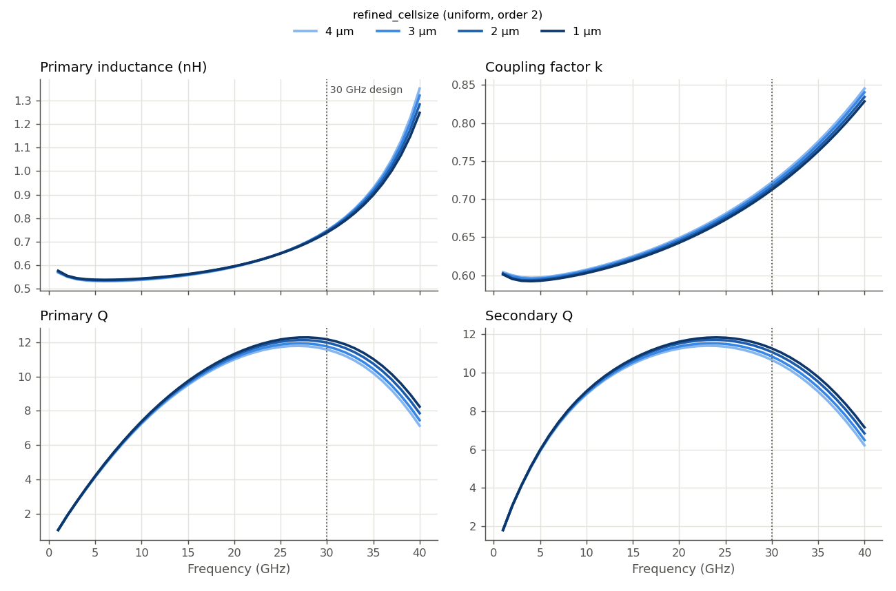
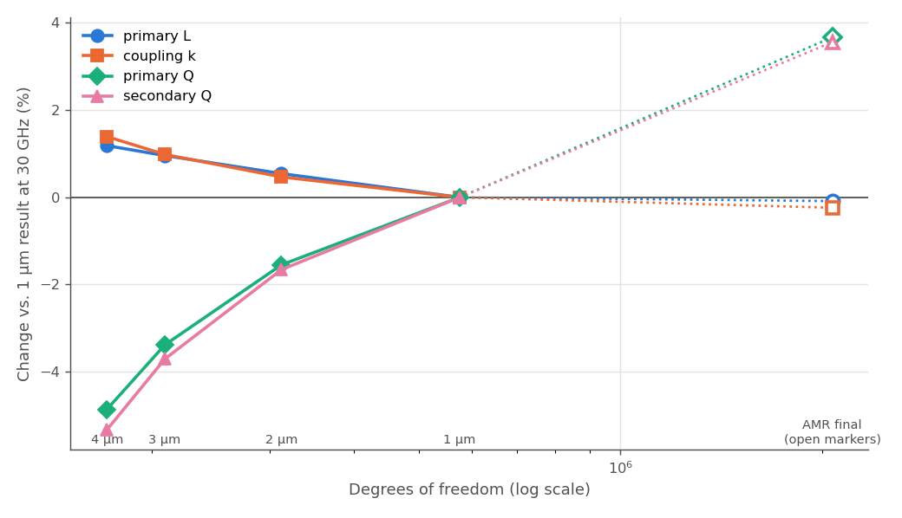

# How fine a mesh does this 30 GHz transformer need? (IHP SG13G2)

This study asks a practical question for one specific layout: a 1:1 transformer coil pair designed for 30 GHz. How fine must the Palace mesh be to get the numbers a transformer designer uses, which are inductance, coupling and Q factor? And does adaptive mesh refinement add anything here?

We answer this in three steps:

1. **Refine a uniform mesh** from 4 µm to 1 µm and see which coil properties move.
2. **Look at the trend at 30 GHz** and ask whether each quantity has settled.
3. **Cross-check with adaptive mesh refinement (AMR)**, which goes to a much larger mesh than the uniform sweep.

The findings apply to this transformer, with this stackup, in this frequency range. Other structures can behave quite differently. The [overview page](../README.md) collects the other mesh studies.

## The details of this study

- **Model:** `Transformer_IMN_ports.gds`, stackup `SG13G2_200um.xml`
- **Ports:** 5 via ports, Z0 = 50 Ω, de-embedded: 1/2 = primary (TopMetal1), 3 = primary center tap, 4/5 = secondary (TopMetal2)
- **Solver:** AWS Palace (FEM), order 2, ABC boundaries, 50 µm air margin
- **Sweep:** 0–200 GHz in 1 GHz steps (adaptive frequency sweep). This report looks at 1–40 GHz, below the primary self-resonance near 48 GHz.
- **Mesh:** `refined_cellsize` varied as described below. The Metal3 ground plane is always kept at 5 µm (`refined_cellsize_override`).
- **Execution:** `hpz2`, Palace 0.17, 16 of 32 cores
- **Scope:** this is the bare coil pair. The real matching network adds MIM capacitors that are not in this model, so no matching or real-load result is reported, only the coil properties.

## 0. Layout


Both coils are single-turn octagons with **2 µm trace width**: the primary on TopMetal1 (about 46 µm radius, center tap on the right) and the secondary on TopMetal2 (about 50 µm radius). The narrow traces are the finest feature in this model.

**What we look at.** From the 5-port Z-matrix we form the differential impedances of the primary (ports 1/2) and the secondary (ports 4/5), with the center tap left open, and read:

- **Inductance** L = Im(Z)/ω of each coil
- **Coupling factor** k between the coils
- **Q factor** Q = Im(Z)/Re(Z) of each coil

## 1. Uniform mesh refinement

We ran the model at `refined_cellsize` = 4, 3, 2 and 1 µm, all at FEM order 2. A 5 µm mesh was also tried, but Palace crashed on it (a NaN inside its error estimation). A cell size of more than twice the 2 µm trace width is likely too coarse for this geometry. The 30 GHz design frequency is marked.



On this scale, **inductance and coupling look identical for every mesh**, while **Q visibly rises** with each refinement step. The rise gets larger toward higher frequencies.

| Mesh | DOF | Solve time | Peak RAM |
|---|---:|---:|---:|
| 4 µm | 171,460 | 4m 2s | 2.72 GB |
| 2 µm | 312,234 | 7m 4s | 4.19 GB |
| 1 µm | 576,114 | 14m 4s | 7.51 GB |

## 2. Has it settled? The trend at 30 GHz

To see the small changes, the next plot shows each quantity at 30 GHz relative to its 1 µm value, over the size of the model (degrees of freedom). The solid lines are the uniform mesh. The open markers on the right are from step 3.



Follow the solid lines from left (4 µm) to the 1 µm point:

- **Inductance and coupling are settled.** They change by about 1% over the whole sweep, in shrinking steps.
- **Q is not settled.** It rises about 5% from 4 µm to 1 µm, and the step from 2 µm to 1 µm (+1.6%) is no smaller than the step before it. The 1 µm result is still moving.

At 1 µm there are only two cells across the 2 µm traces. A plausible reason for the slow Q convergence is that the loss depends on how current distributes across such a narrow trace, which this mesh only coarsely resolves. This study doesn't isolate the cause.

## 3. Cross-check with AMR

AMR started from the 2 µm mesh and ran 3 iterations, refining wherever Palace's error estimate was largest. It ended at 2.07 million DOF, 3.6× the 1 µm model. These are the open markers in the plot above.

| | Primary L | Coupling k | Primary Q | Secondary Q | Total time | Peak RAM |
|---|---:|---:|---:|---:|---:|---:|
| 2 µm uniform | 0.743 nH | 0.716 | 11.97 | 11.07 | 7m 4s | 4.19 GB |
| 1 µm uniform | 0.739 nH | 0.712 | 12.16 | 11.26 | 14m 4s | 7.51 GB |
| AMR, 3 iterations | 0.738 nH | 0.711 | 12.60 | 11.66 | 1h 47m | 25.1 GB |

- **L and k confirm the uniform result**: AMR agrees with 1 µm within 0.3%.
- **Q continues the upward trend**: AMR is another 3.6% above the 1 µm result, for both coils. This confirms what step 2 suggested. The Q of this transformer is not converged at 1 µm, and the true value is likely at least a few percent higher.
- AMR's last iteration changed the S-parameters by as much as the one before (Max|ΔS| 0.020, then 0.019), so AMR itself had not settled either. More iterations would cost several more hours here.

## Summary for this transformer

- **For inductance and coupling, 2 µm is enough** (within 0.5% of the finest results, about 7 minutes).
- **Q is the hard quantity.** Even the finest run here (AMR, almost 2 hours) is still rising. Treat simulated Q at 30 GHz as a lower bound: the 2 µm mesh underestimates it by roughly 5% compared with AMR, and the true value may be higher still.
- **5 µm is too coarse for this geometry** and crashed the solver. The cell size should not be much larger than the 2 µm trace width.

These numbers belong to this layout. Wider traces or a different frequency range will change them. When Q matters, check it with one finer run, since L and k settling doesn't mean Q has settled.

## Files

```
mesh_convergence_transformer/
├── palace_transformer_imn_mesh{5,4,3,2,1}.py    # uniform mesh (mesh5 crashes, kept for reference)
├── palace_transformer_imn_amr3.py                # AMR, 2 µm start, 3 iterations
├── palace_model/palace_transformer_imn_<name>_data/   # mesh, config and full Palace output per run
└── results/
    ├── story_plots.py            # the story_*.png plots and numbers in this report
    ├── analyze_convergence.py    # mixed-mode Sdd ΔS tables (CSV) and Sdd overlays
    ├── delta_S_table.csv, delta_S_vs_finest.csv
    ├── snp/                      # 5-port Touchstone files, one per run (_raw = without port de-embedding;
    │                             #   the AMR iteration files transformer_amr3_iter1..2 are also raw)
    └── plots/
```

Run the scripts from this folder in the `d:\venv\palace` venv to regenerate plots and tables from the archived Touchstone files.
