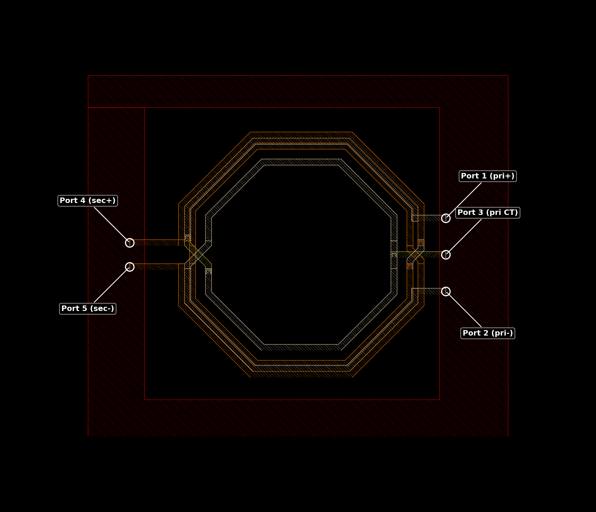
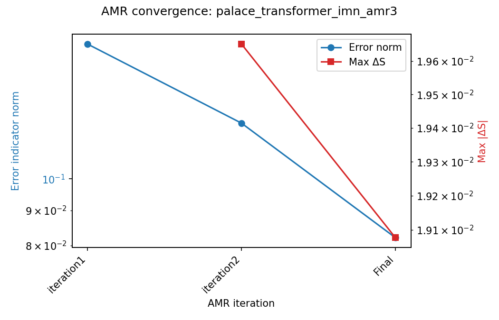
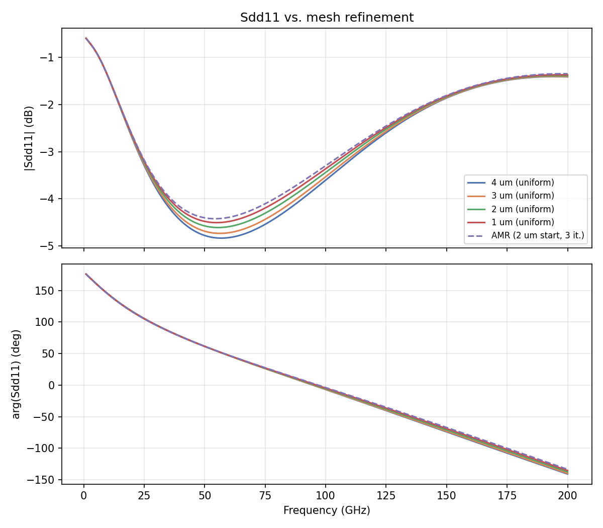
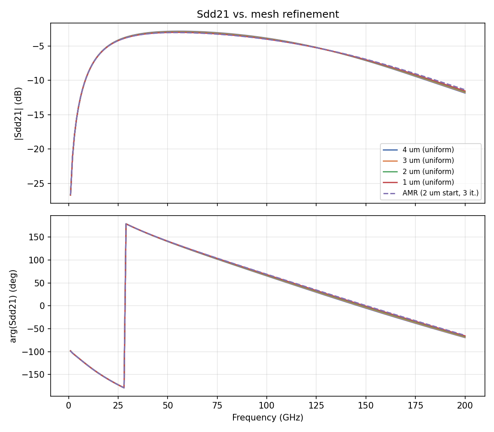
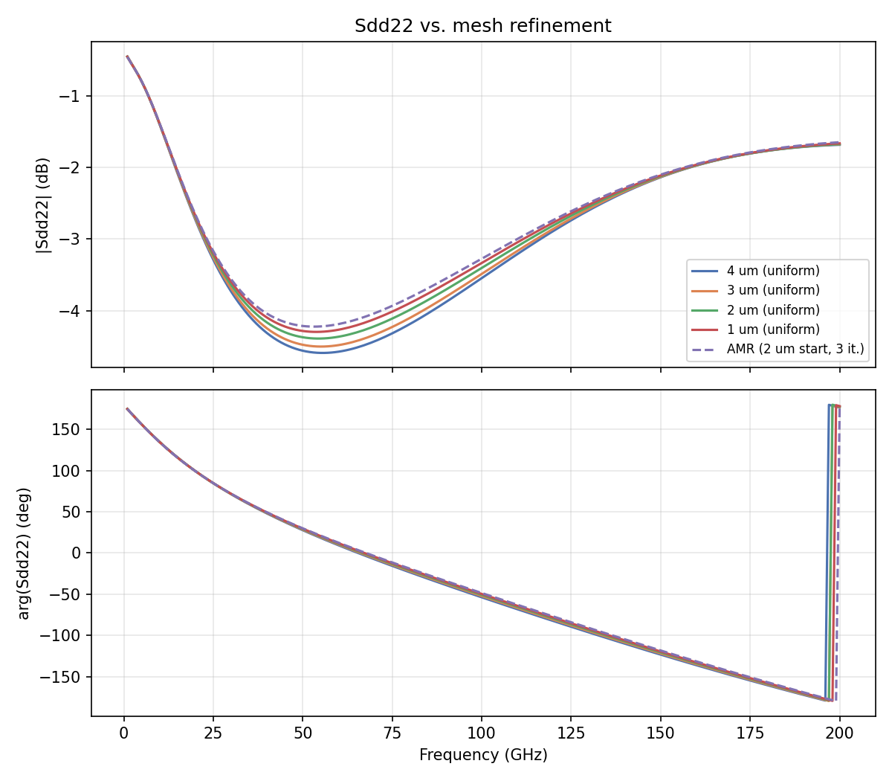
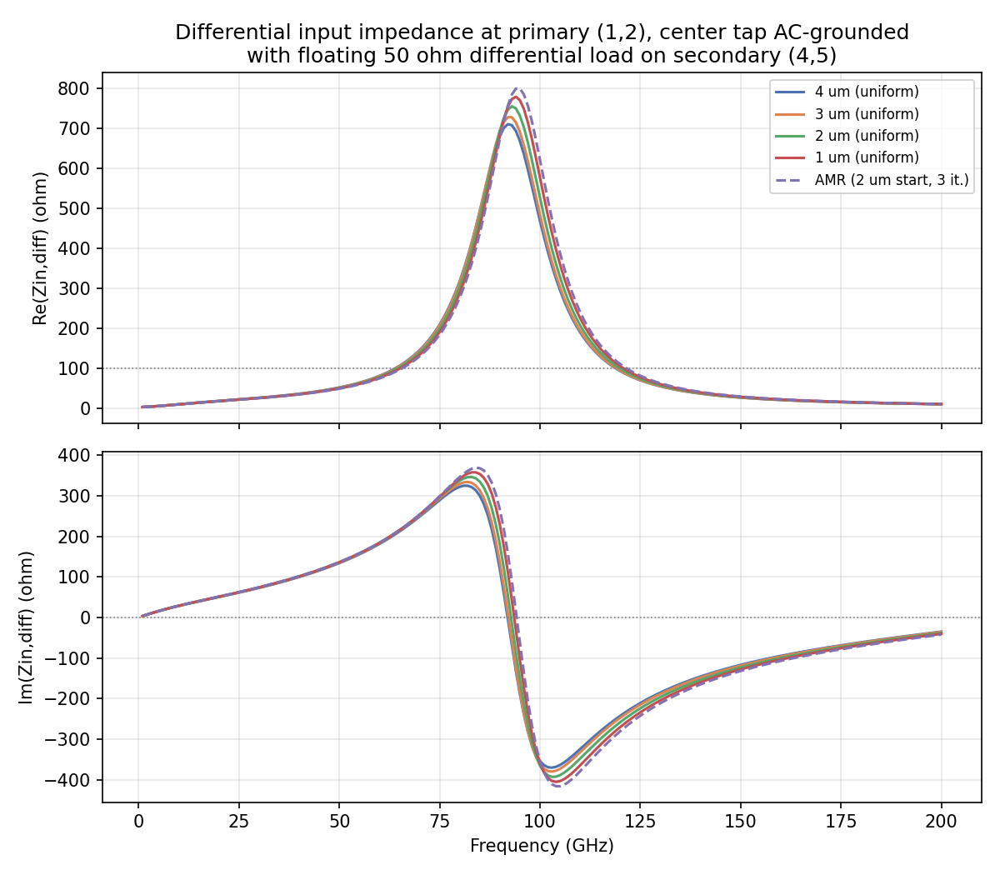
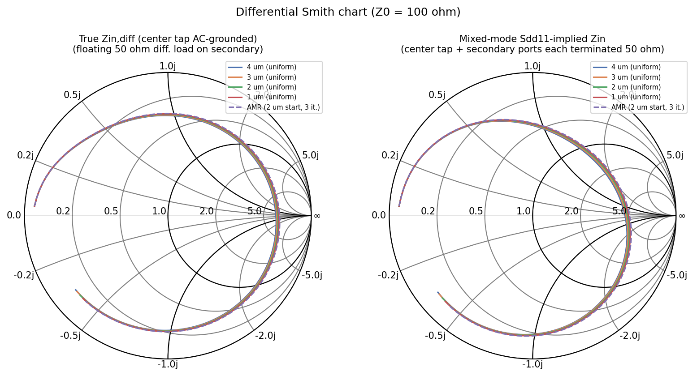

# Mesh Convergence Study: Transformer_IMN (IHP SG13G2)

- **Model:** `Transformer_IMN_ports.gds`, stackup `SG13G2_200um.xml`
- **Solver:** AWS Palace (FEM), order 2, ABC boundaries, 50 µm air margin
- **Sweep:** 0–200 GHz (auto-shifted to 0.01 GHz start), 1 GHz step, Palace's PROM-based adaptive frequency sweep
- **Ports:** 5 lumped via ports — 1/2 = primary +/- (Metal3→TopMetal1), 3 = primary center tap (Metal3→Metal5), 4/5 = secondary +/- (Metal3→TopMetal2), all Z0 = 50 Ω
- **Execution:** remote solve on `hpz2` via `run_palace` (apptainer, Palace 0.17, `-np 16` of 32 cores, 109 GB RAM), jobs run sequentially

## 0. Layout and turns ratio



Rendered with `gds_viewer`'s exact layer colors/dither patterns, with port positions overlaid from the GDS marker layers (201–205). Per-layer polygon inspection (not just the port list) shows **both coils are single-turn octagonal spirals** — primary on TopMetal1 (orange, ~46 µm radius, 2 µm trace width, broken at the right side by the center-tap port 3), secondary on TopMetal2 (white/cream, ~50 µm radius, 2 µm trace width, no center tap, break on the left). **Turns ratio Np:Ns = 1:1**, giving a nominal ideal impedance ratio of 1:1 — consistent with the model's uniform `port_Z0=50.0` on all 5 ports. The real, frequency-dependent transformation of a coupled (k<1) transformer like this is better read from the simulated mixed-mode S-parameters (§4) than assumed from turn count alone. The dark red hatched background is the **Metal3** ground/reference plane (large but not full-footprint here, ~43% coverage), which is why `refined_cellsize_override` fixes it at 5 µm regardless of the main mesh setting.

## 1. Method

Six model variants were generated from a common template (`palace_transformer_imn_mesh2.py`):

- **Uniform mesh sweep:** `refined_cellsize` = 5, 4, 3, 2, 1 µm, `adaptive_mesh_iterations=0`.
- **Adaptive mesh refinement (AMR):** `refined_cellsize=2` (starting mesh), `adaptive_mesh_iterations=3` — capped at 3 iterations per the balun study's finding that further iterations mostly add cost, not accuracy.

`refined_cellsize_override=[['Metal3', 5.0]]` is fixed at 5 µm in every variant, matching the balun study's convention.

**A solver crash was hit during setup:** the original model crashed Palace with `GetMaxSingularValue()` → SLEPc NaN inside the built-in error-estimation step, reproducible even on a single isolated 150 GHz point (ruling out a low-frequency/near-DC breakdown or the PROM adaptive-sweep mechanism as the cause). After revisions to the model file, it now solves cleanly for every mesh size **except 5 µm**, which still crashes identically — the specific change responsible for the fix was not conclusively isolated. The remaining 5 µm failure points to a coarse-mesh element-quality issue specific to that cell size on this geometry (most likely a sliver/degenerate tetrahedron where a small feature — a via, gap, or the center-tap strap — isn't resolved) rather than a physics or configuration problem. **The 5 µm point is excluded from this study**; the uniform sweep below covers 4, 3, 2, 1 µm.

Model files: `palace_transformer_imn_mesh5/4/3/2/1.py`, `palace_transformer_imn_amr3.py` (all in `test_data/mesh_convergence_transformer/`) — `mesh5.py` is kept for reference but its `_data` output is not part of the result set.

## 2. Uniform mesh sweep — results

| Mesh | DOF | Mesh elements | Solve time | Peak RAM | Error indicator norm |
|---|---:|---:|---:|---:|---:|
| 5 µm | — | — | **crashed** (see §1) | — | — |
| 4 µm | 171,460 | 24,752 | 4m 2s | 2.72 GB | 2.067e-01 |
| 3 µm | 209,202 | 30,155 | 4m 50s | 3.17 GB | 1.864e-01 |
| 2 µm | 312,234 | 44,544 | 7m 4s | 4.19 GB | 1.572e-01 |
| 1 µm | 576,114 | 81,956 | 14m 4s | 7.51 GB | 1.310e-01 |

DOF, time, and RAM all grow smoothly (~3.4× DOF, ~3.5× time, ~2.8× RAM from 4 µm to 1 µm) — no further instability across the working range.

## 3. Adaptive mesh refinement — results

Starting mesh: 2 µm (iteration 1 numbers match the uniform 2 µm run exactly). Capped at 3 iterations.

| Iteration | DOF | Mesh elements | Error norm | Max \|ΔS\| vs. prev. | Solve time | Peak RAM |
|---|---:|---:|---:|---:|---:|---:|
| 1 | 312,234 | 44,544 | 1.572e-01 | n/a | 7m 4s | 4.37 GB |
| 2 | 676,780 | 116,336 | 1.205e-01 | 0.0197 | 28m 27s | 9.03 GB |
| **Final** | **2,070,680** | **361,140** | **8.210e-02** | **0.0191** | **1h 46m 56s** | **25.13 GB** |



The same pattern seen in the balun study repeats here, even more starkly over just 3 iterations: **Max ΔS barely moved between iteration 2 and the final iteration (0.0197 → 0.0191)**, while DOF more than tripled (677k → 2.07M) and solve time went from 28m27s to 1h46m56s. Nearly all of the S-parameter-relevant improvement happened by iteration 2; the third iteration bought over an hour of extra compute for a ~3% further reduction in Max ΔS.

### What Palace's `Tol` actually measures (vs. HFSS's "Delta S")

As established in the balun study: Palace's AMR stopping criterion (`Tol=1e-2` compared against the **error indicator norm**, a residual-/flux-jump-based estimate of FEM discretization error summed over the mesh) is a different quantity from HFSS's classic "Delta S" criterion (the S-matrix change between passes, measured directly on the output quantity of interest). Here the error indicator norm (0.157 → 0.121 → 0.082) never gets close to the 0.01 target even after 3 iterations, while the **S-parameter-based** Max ΔS was already small after iteration 2. Palace's `Tol`-driven refinement has no way to know the output quantity has converged — it keeps chasing field-error reduction everywhere in the domain, which is why capping the iteration budget (as done here) rather than trusting `Tol` to stop naturally is the practical approach for this kind of structure.

## 4. Mixed-mode S-parameters

The 5-port network is reduced to differential figures of merit for the two coupled coils. Port 3 (primary center tap) is dropped from the S-matrix — equivalent to leaving it terminated in its 50 Ω reference impedance — leaving a 4-port subnetwork on ports 1,2 (primary) and 4,5 (secondary). Mixed-mode parameters are computed directly via the classical Bockelman–Eisenstadt formulas (derived in `analyze_convergence.py`, not via a library's mixed-mode conversion, to avoid any ambiguity in port-ordering convention for this 2-differential-pair case):

```
Sdd11 = 0.5 * (S11 - S12 - S21 + S22)   # primary differential return loss
Sdd21 = 0.5 * (S31 - S32 - S41 + S42)   # primary -> secondary differential transmission
Sdd22 = 0.5 * (S33 - S34 - S43 + S44)   # secondary differential return loss
```

**Design frequency:** determined automatically as the center of the minimum-insertion-loss band (the −3 dB band around peak |Sdd21|) from the finest (1 µm) mesh result, rounded to the nearest 10 GHz → **80 GHz** (peak coupling itself is at 55 GHz, ≈ −3.0 dB — near-ideal for a 1:1 coupled transformer — but the −3dB-down band is asymmetric, spanning 17–136 GHz, so its center lands at 80 GHz).





All five traces (4 uniform meshes + AMR final) are visually indistinguishable in the overlay plots — this is a well-converged structure across the entire working mesh range.

## 5. Delta-S tables

**Metric:** `Max|ΔS|` is the standard HFSS-style convergence metric — the maximum **linear** complex-magnitude difference over the common frequency band, computed over 1–200 GHz (the two synthetic sub-1GHz points that gds2palace injects to replace a requested DC/0Hz point are excluded from all delta-S calculations and tables — they aren't real solved frequencies of interest, same convention used in the balun study and by `palace_summary.py`'s AMR iterations). The `|dS_dB|` columns are a secondary, intuitive readout at three specific frequencies: the two sweep edges (1 GHz, 200 GHz) and the 80 GHz design frequency (§4). Tables are grouped by parameter first, then by mesh comparison.

### 5a. Successive mesh steps

| Param | Comparison | Max\|ΔS\| (linear) | \|ΔS\|@1GHz (dB) | \|ΔS\|@80GHz (dB) | \|ΔS\|@200GHz (dB) |
|---|---|---:|---:|---:|---:|
| Sdd11 | 4→3 µm | 0.0156 | 0.0002 | 0.101 | 0.009 |
| Sdd11 | 3→2 µm | 0.0352 | 0.0067 | 0.127 | 0.015 |
| Sdd11 | 2→1 µm | 0.0342 | 0.0002 | 0.106 | 0.017 |
| Sdd11 | 1µm→AMR final | 0.0283 | 0.0015 | 0.088 | 0.024 |
| Sdd21 | 4→3 µm | 0.0091 | 0.0049 | 0.050 | 0.075 |
| Sdd21 | 3→2 µm | 0.0132 | 0.0604 | 0.067 | 0.111 |
| Sdd21 | 2→1 µm | 0.0130 | 0.0003 | 0.057 | 0.103 |
| Sdd21 | 1µm→AMR final | 0.0114 | 0.0173 | 0.035 | 0.184 |
| Sdd22 | 4→3 µm | 0.0194 | 0.0005 | 0.085 | 0.006 |
| Sdd22 | 3→2 µm | 0.0188 | 0.0042 | 0.113 | 0.002 |
| Sdd22 | 2→1 µm | 0.0160 | 0.0005 | 0.094 | 0.011 |
| Sdd22 | 1µm→AMR final | 0.0172 | 0.0014 | 0.078 | 0.016 |

All linear Max\|ΔS\| values stay in a tight 0.009–0.035 band across every comparison and every parameter — no null-crossing artifacts here (unlike the balun's S11), since none of Sdd11/Sdd21/Sdd22 dips to a deep null in this band.

### 5b. Every mesh vs. the finest uniform mesh (1 µm) as reference

| Param | Mesh | Max\|ΔS\| vs. 1 µm (linear) | \|ΔS\|@1GHz (dB) | \|ΔS\|@80GHz (dB) | \|ΔS\|@200GHz (dB) |
|---|---|---:|---:|---:|---:|
| Sdd11 | 4 µm | 0.0849 | 0.0067 | 0.333 | 0.041 |
| Sdd11 | 3 µm | 0.0693 | 0.0069 | 0.232 | 0.032 |
| Sdd11 | 2 µm | 0.0342 | 0.0002 | 0.106 | 0.017 |
| Sdd11 | AMR final | 0.0283 | 0.0015 | 0.088 | 0.024 |
| Sdd21 | 4 µm | 0.0352 | 0.0552 | 0.174 | 0.289 |
| Sdd21 | 3 µm | 0.0261 | 0.0601 | 0.124 | 0.214 |
| Sdd21 | 2 µm | 0.0130 | 0.0003 | 0.057 | 0.103 |
| Sdd21 | AMR final | 0.0114 | 0.0173 | 0.035 | 0.184 |
| Sdd22 | 4 µm | 0.0542 | 0.0053 | 0.292 | 0.020 |
| Sdd22 | 3 µm | 0.0348 | 0.0048 | 0.207 | 0.013 |
| Sdd22 | 2 µm | 0.0160 | 0.0005 | 0.094 | 0.011 |
| Sdd22 | AMR final | 0.0172 | 0.0014 | 0.078 | 0.016 |

Clean, monotonic convergence toward the 1 µm result as the uniform mesh refines (Sdd11: 0.085→0.069→0.034; Sdd21: 0.035→0.026→0.013; Sdd22: 0.054→0.035→0.016). The AMR final result sits at or slightly better than the 2 µm uniform mesh on Sdd11/Sdd21, and about the same on Sdd22 — for roughly **15× the runtime and 6× the RAM** of the 2 µm uniform run (§6).

## 6. Discussion / recommendation

- **Uniform mesh converges smoothly across the working range (4→1 µm)** — no numerical surprises once the 5 µm point (§1) is excluded. Linear Max\|ΔS\| vs. the 1 µm reference improves steadily: Sdd11 0.085→0.034, Sdd21 0.035→0.013, Sdd22 0.054→0.016 going from 4 µm to 2 µm.
- **2 µm is a good working point**: within 0.013–0.034 linear ΔS of the 1 µm result on all three mixed-mode parameters, at half the runtime (7m vs 14m) and RAM (4.2 vs 7.5 GB).
- **AMR (2 µm start, 3 iterations) again shows steep diminishing returns**, this time within the capped budget itself: essentially all the accuracy gain happened by iteration 2 (28m27s), while iteration 3 added over an hour of extra compute for a Max ΔS improvement from 0.0197 to 0.0191 — a difference smaller than run-to-run mesh noise. The final AMR result is comparable to (not clearly better than) the 2 µm uniform mesh's accuracy, at roughly 15× the cost. Capping AMR at 2 iterations here would have captured nearly all the benefit for a fraction of the price.
- **Practical recommendation for this transformer**: use the 2 µm uniform mesh with the Metal3 override, as in the working template. Skip AMR for this geometry unless a specific concern justifies it — and if used, cap it at 2 iterations, not the full requested budget.
- **The 5 µm mesh-quality crash (§1) is worth a closer look** if a coarser starting point is ever needed (e.g. for a faster AMR start) — it likely traces to one specific small feature (a via or the center-tap strap) that needs local mesh control independent of the global `refined_cellsize`.

## 7. Differential input impedance under a real load (why matching looks poor)

The mixed-mode `Sdd11` in §4–5 implicitly assumes ports 4 and 5 are each terminated individually to ground at 50 Ω (the standard Bockelman–Eisenstadt convention) — **not** the same as a real floating differential 50 Ω resistor placed directly across the secondary, which is the actual load scenario in most applications. The two are physically different terminations and give different answers.

**Method:** starting from the full 5-port Z-matrix (frequency-domain, no reference-impedance dependence once converted from S), port 3 (primary center tap) is eliminated exactly via a short-circuit constraint (`V3=0`, AC-grounded per the actual application — confirmed this doesn't materially change the result vs. other center-tap treatments, see below). The resulting 4-port Z-matrix (ports 1,2,4,5) is then reduced analytically: a floating differential load `R_load` is imposed across the secondary (4,5) and a floating differential drive across the primary (1,2), giving the classic reflected-impedance formula applied to the differential-mode-equivalent 2-port:

```
Zin,diff = Zaa - Zab*Zba / (Zbb + R_load)
```

where `Zaa/Zab/Zba/Zbb` are antisymmetric combinations of the 4×4 Z-matrix across each port pair (see `differential_input_impedance.py` for the full derivation; `Zab≈Zba` to ~1e-10 confirms reciprocity and validates the extraction).

**Center-tap sensitivity check:** port 3 couples almost identically to ports 1 and 2 (`Z13≈Z23` to within a few percent across the band) — i.e. the center tap sits at a near-perfect symmetry point. Since `Zin,diff` only depends on the *antisymmetric* combination of ports 1,2, this symmetric coupling to port 3 cancels out almost entirely: **the result is nearly independent of how the center tap is terminated** (open, 50 Ω, or AC-grounded all agree to within a few ohms). This is expected for a symmetric center-tapped coil (a virtual ground for differential excitation) and is a good self-consistency check on the calculation.



**A sharp parallel resonance appears around 90–95 GHz**, where `Re(Zin,diff)` peaks at 700–800 Ω (vs. the 100 Ω natural differential reference for 50 Ω single-ended ports) with the reactance swinging from +350 Ω to −400 Ω right through it. Away from that resonance the impedance is small and reactive — near-short at low frequency, capacitive above ~120 GHz. **There is essentially no frequency in this band where the primary presents a clean match to a floating differential 50 Ω source** — the "poor matching" observed is a genuine characteristic of this transformer as simulated, not a mesh-convergence or termination-assumption artifact (mesh convergence is excellent here too — all 5 mesh variants overlap tightly, with only the resonance peak itself showing the expected small sensitivity: 700 Ω → 750 Ω → ~800 Ω for AMR as the mesh refines and better resolves the parasitic capacitance setting the resonance).



The floating-load and mixed-mode-implied impedances trace similar overall arcs (both show poor matching throughout), but diverge meaningfully at specific frequencies — e.g. at 55 GHz (near the Sdd21 coupling peak), 61+j158 Ω (true, floating load) vs. 98+j147 Ω (Sdd11-implied) — a 37 Ω real-part difference. **If designing a matching network for this transformer, use the true `Zin,diff` (floating-load) curve, not the mixed-mode `Sdd11`** — they represent different physical termination scenarios and only agree well away from the resonance.

## 8. Where everything lives

```
test_data/mesh_convergence_transformer/
├── palace_transformer_imn_mesh5.py … mesh1.py   # uniform mesh model scripts (mesh5 crashes, see §1)
├── palace_transformer_imn_amr3.py               # AMR model script
├── palace_model/palace_transformer_imn_<name>_data/   # generated mesh/config + full Palace output
│     (config.json, .msh, palace.json, port-S.csv, error-indicators.csv, ...)
└── results/
    ├── mesh_convergence_report.md               # this report
    ├── delta_S_table.csv                        # §5a
    ├── delta_S_vs_finest.csv                    # §5b
    ├── analyze_convergence.py                   # regenerates the CSVs/plots above (mixed-mode formulas, design-freq detection)
    ├── render_labeled_layout.py                 # regenerates the labeled layout picture (§0)
    ├── differential_input_impedance.py          # regenerates §7 (Zin,diff under a real floating load, port3 short-circuit elimination)
    ├── snp/                                     # de-embedded (and raw) 5-port Touchstone files
    │     transformer_mesh4um.s5p … transformer_mesh1um.s5p
    │     transformer_amr3_iter1.s5p, transformer_amr3_iter2.s5p, transformer_amr3_final.s5p
    │     (each also has a _raw.s5p sibling without port de-embedding)
    └── plots/
          transformer_layout.png, transformer_layout_labeled.png   # §0
          zin_diff_primary_vs_freq.png, zin_diff_smith.png          # §7
          sdd11_convergence.png, sdd21_convergence.png, sdd22_convergence.png
          amr3_convergence.png
```

All `.s5p` files are de-embedded (port parasitic inductance removed) unless suffixed `_raw`. Re-run `python results/analyze_convergence.py` from `test_data/mesh_convergence_transformer/` (in the `d:\venv\palace` venv) any time to regenerate the tables and plots from the archived `.snp` files.
